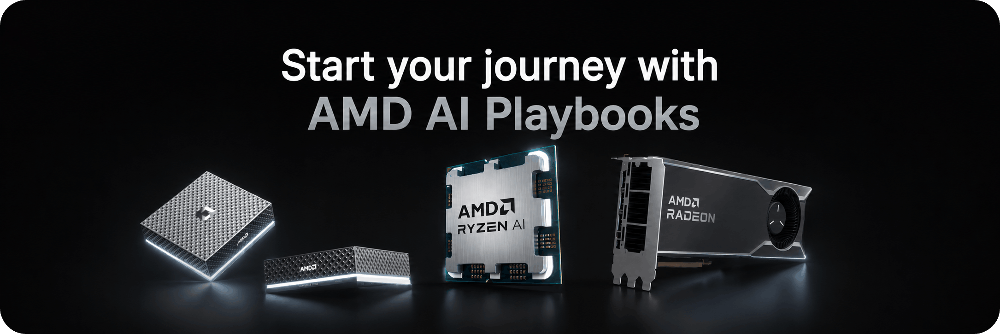

<!--
Copyright Advanced Micro Devices, Inc.

SPDX-License-Identifier: MIT
-->

# AMD Playbooks

Guided developer journeys for AI/ML workloads on AMD devices.

[**Browse Playbooks at amd.com/playbooks →**](https://amd.com/playbooks)

## About

This is AMD's official repository of playbooks for AMD developer platforms. Each playbook is a self-contained, hands-on learning experience that covers prerequisites, step-by-step instructions for Windows and Linux, troubleshooting guidance, and working example code, built to help you grow your AI development skills one project at a time.

## Available Playbooks

| Playbook | Description |
|----------|-------------|
| **Running LLMs with PyTorch and AMD ROCm™ software** | Run powerful language models locally with PyTorch and ROCm |
| **Running and Serving LLMs with LM Studio** | Set up LM Studio to run and serve large language models |
| **Automating Workflows with n8n and Local LLMs** | Build an AI-powered news summarizer using n8n and Lemonade |
| **Local LLM Coding with VS Code and Qwen3-Coder** | Use VS Code with locally-running Qwen3-Coder for private code assistance |
| **Generating Images with ComfyUI and Z Image Turbo** | Create AI-generated images using ComfyUI with Z Image Turbo |
| **Chat with LLMs in Open WebUI** | Set up Open WebUI to chat with local LLMs |
| **Fine-tune LLMs with PyTorch and AMD ROCm™ software** | Fine-tune large language models using PyTorch and ROCm |
| **Using Lemonade Across CPU, GPU, and NPU** | Learn how to use the Lemonade framework across CPU, GPU, and NPU |
| **Optimized Fine-tuning with Unsloth** | Memory-efficient LoRA fine-tuning with Unsloth |
| **Speech-to-Speech Translation** | Build a real-time speech-to-speech translation system |

## Coming Soon

| Playbook | Description |
|----------|-------------|
| **Local Computer Vision with Ryzen™ AI NPU** | Build local perception capabilities using CVML SDK on Ryzen AI and ROCm |
| **Clustering Two Devices with llama.cpp RPC** | Distributed inference using RPC server across two AMD devices with llama.cpp |
| **Getting Started with Ollama** | Install Ollama and run LLMs locally from the terminal, desktop app, or REST API |
| **Getting Started Creating Agents with GAIA** | Build and deploy AI agents using the GAIA framework |
| **Fine-tuning LLMs with LLaMA-Factory** | LoRA fine-tuning of large language models using LLaMA-Factory |
| **Custom GPU Kernels with PyTorch ROCm** | Write and optimize custom GPU kernels using PyTorch and ROCm |
| **Quick Start on vLLM** | Run inference and serving using vLLM |
| **Clustering with RCCL** | Multi-node cluster using two AMD devices with RCCL |

## AMD AI Developer Program

> **[Join the AMD AI Developer Program →](https://www.amd.com/en/developer/ai-dev-program.html)**
>
> Get access to tools, resources, and community support to accelerate your AI development on AMD hardware.

## Additional Resources

- **Playbooks Portal**: [amd.com/playbooks](https://amd.com/playbooks)
- **AMD Developer Hub**: [developer.amd.com](https://developer.amd.com)
- **ROCm Documentation**: [rocm.docs.amd.com](https://rocm.docs.amd.com)
- **AMD AI Developer Program**: [amd.com/ai-dev-program](https://www.amd.com/en/developer/ai-dev-program.html)
- **Community Forum**: [community.amd.com](https://community.amd.com)

## License

This project is licensed under the MIT License. See [LICENSE](LICENSE) for details.
