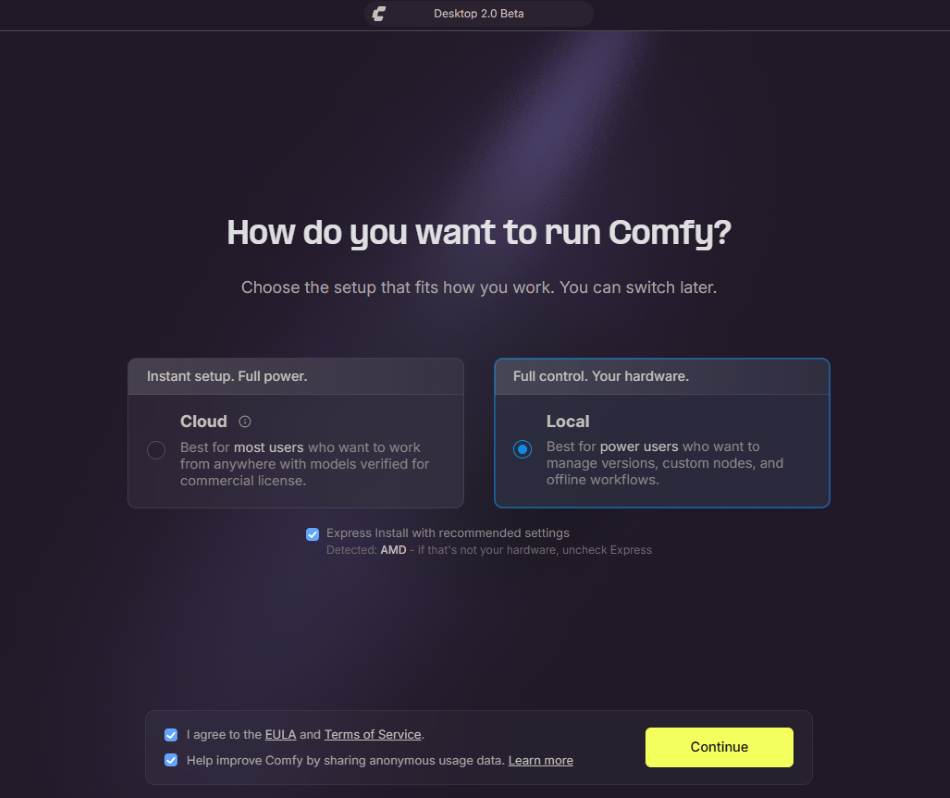
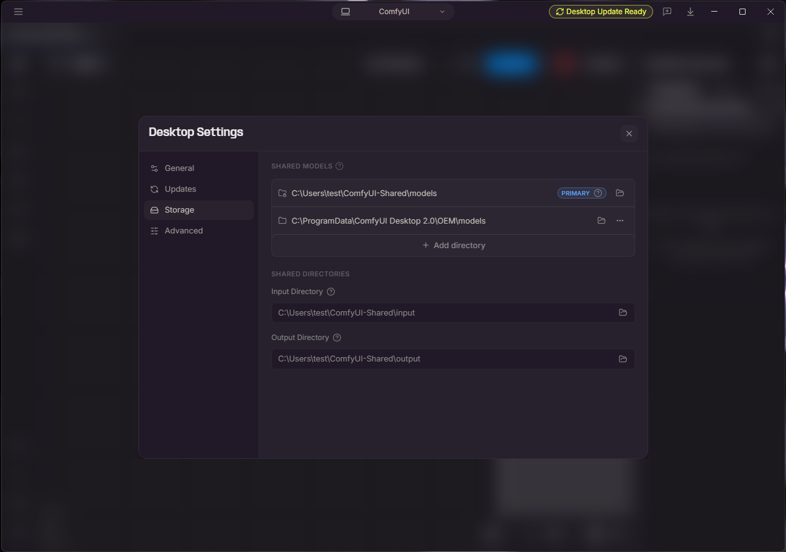
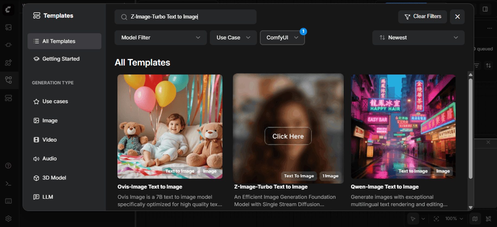
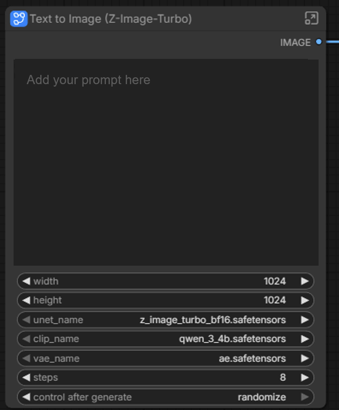
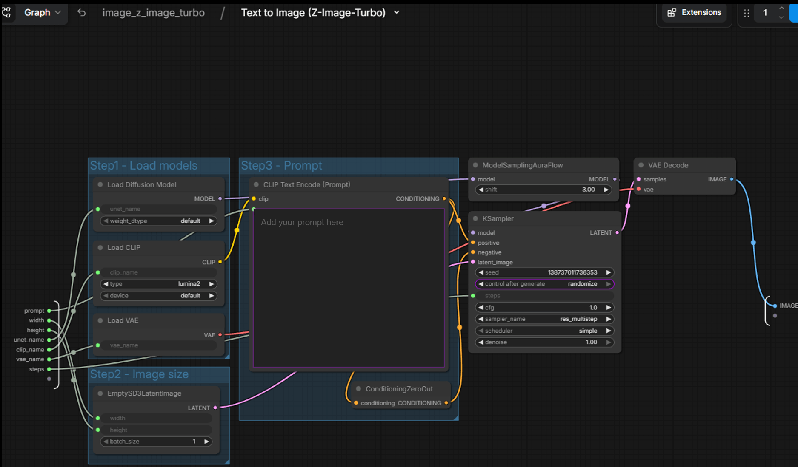

<!--
Copyright Advanced Micro Devices, Inc.

SPDX-License-Identifier: MIT
-->

<!-- @github-only -->
> [!IMPORTANT]
> This playbook uses special tags that GitHub cannot render. Please visit [amd.com/playbooks](https://amd.com/playbooks) to correctly preview this content.
<!-- @github-only:end -->

## Overview

ComfyUI is a powerful, node-based interface for Stable Diffusion and other diffusion models. Unlike traditional text-to-image interfaces with simple prompt boxes, ComfyUI exposes the entire image generation pipeline as a visual graph, giving you fine-grained control over every step from text encoding to latent space manipulation to final decoding.

This tutorial teaches you how to use ComfyUI with the Z Image Turbo model on your GPU to generate high-quality AI images.

## What You'll Learn

- How to launch ComfyUI and load the Z-Image Turbo template
- Understanding diffusion pipeline components
- Generating images and tuning generation parameters
- Saving and sharing workflows

## Setting the Memory Configuration

<!-- @require:memory-config -->

<!-- @device:halo_box -->
## Check for Software Updates

<!-- @require:software-update -->
<!-- @device:end -->

## Installing Software Prerequisites

<!-- @os:windows -->
<!-- @require:driver,comfyui -->
<!-- @os:end -->

<!-- @os:linux -->

<!-- @device:halo,stx,krk,rx7900xt,rx9070xt,r9700 -->
**Grant your user access to GPU devices** (log out and back in for this to take effect):

```bash
sudo usermod -aG render,video $LOGNAME
```

#### Create a Virtual Environment
On Linux, open a terminal in the directory of your choice and run the following prompt to create a venv:

<!-- @test:id=create-venv-linux timeout=300 -->
```bash
sudo apt update
sudo apt install -y python3-venv
python3 -m venv comfyui-env
source comfyui-env/bin/activate
```
<!-- @test:end -->
<!-- @setup:id=activate-venv command="source comfyui-env/bin/activate" -->
<!-- @device:end -->

<!-- @require:driver,pytorch,comfyui -->
<!-- @os:end -->

<!-- @os:windows -->
<!-- @test:id=comfyui-desktop-workspace-present-windows timeout=60 hidden=True -->
```powershell
# The new Comfy Desktop (since June 2026) installs into %LOCALAPPDATA%\Comfy-Desktop\
# Layout: ComfyUI-Installs\<name>\ComfyUI\ holds main.py + .venv
#         ComfyUI-Shared\ holds the shared model library
$instBase  = Join-Path $env:LOCALAPPDATA "Comfy-Desktop\ComfyUI-Installs\ComfyUI"
$comfyRoot = Join-Path $instBase "ComfyUI"
$py        = Join-Path $comfyRoot ".venv\Scripts\python.exe"
$mainPy    = Join-Path $comfyRoot "main.py"
$sharedModels = Join-Path $env:LOCALAPPDATA "Comfy-Desktop\ComfyUI-Shared\models"

if (-not (Test-Path $instBase))     { throw "Comfy Desktop instance not found at: $instBase" }
if (-not (Test-Path $comfyRoot))    { throw "ComfyUI source not found at: $comfyRoot" }
if (-not (Test-Path $py))           { throw "ComfyUI venv python not found: $py" }
if (-not (Test-Path $mainPy))       { throw "ComfyUI main.py not found: $mainPy" }
if (-not (Test-Path $sharedModels)) { throw "Comfy Desktop shared models dir not found: $sharedModels" }

Write-Host "OK: instance root: $instBase"
Write-Host "OK: ComfyUI source: $comfyRoot"
Write-Host "OK: Python: $py"
Write-Host "OK: main.py: $mainPy"
Write-Host "OK: shared models: $sharedModels"
```
<!-- @test:end -->
<!-- @os:end -->

<!-- @os:linux -->
<!-- @test:id=comfyui-clone-linux timeout=300 hidden=True -->
```bash
set -euo pipefail
if [ -d "ComfyUI/.git" ]; then
 (cd ComfyUI && git fetch --all && git reset --hard origin/master)
else
 git clone https://github.com/Comfy-Org/ComfyUI.git
fi
cd ComfyUI
```
<!-- @test:end -->
<!-- @os:end -->

<!-- @os:linux --> 
<!-- @test:id=comfyui-requirements-linux timeout=600 hidden=True setup=activate-venv -->
```bash
set -euo pipefail
python -m pip install --upgrade pip
python -m pip install -r ./ComfyUI/requirements.txt
```
<!-- @test:end --> 
<!-- @os:end -->

<!-- @os:windows -->
<!-- @test:id=comfyui-sync-requirements-windows timeout=600 hidden=True -->
```powershell
$comfyRoot = Join-Path $env:LOCALAPPDATA "Comfy-Desktop\ComfyUI-Installs\ComfyUI\ComfyUI"
$py  = Join-Path $comfyRoot ".venv\Scripts\python.exe"
$req = Join-Path $comfyRoot "requirements.txt"

if (-not (Test-Path $py))  { throw "ComfyUI venv python not found: $py" }
if (-not (Test-Path $req)) { throw "ComfyUI requirements.txt not found: $req" }

& $py -m pip install --upgrade --force-reinstall --no-cache-dir comfyui-frontend-package
if ($LASTEXITCODE -ne 0) { throw "Failed to install comfyui-frontend-package into workspace venv." }

& $py -c "import importlib.metadata as m; print(m.version('comfyui-frontend-package'))"
if ($LASTEXITCODE -ne 0) { throw "comfyui-frontend-package metadata still missing after install." }
```
<!-- @test:end --> 
<!-- @os:end -->

<!-- @os:windows --> 
<!-- @test:id=comfyui-backend-usable-windows timeout=120 hidden=True -->
```powershell
$py = Join-Path $env:LOCALAPPDATA "Comfy-Desktop\ComfyUI-Installs\ComfyUI\ComfyUI\.venv\Scripts\python.exe"
if (-not (Test-Path $py)) { throw "Missing ComfyUI venv python: $py" }

& $py -c "import torch; print('torch', torch.__version__); print('cuda_available', torch.cuda.is_available()); print('hip', getattr(torch.version,'hip',None));"
if ($LASTEXITCODE -ne 0) { throw "Torch import/check failed in ComfyUI venv." }
```
<!-- @test:end --> 
<!-- @os:end -->

<!-- @os:linux -->
<!-- @test:id=comfyui-install-rocm-torch-linux timeout=900 hidden=True setup=activate-venv -->
```bash
set -euo pipefail

python - <<'PY'
import torch
print(f"PyTorch version: {torch.__version__}")
print(f"ROCm/HIP version: {getattr(torch.version, 'hip', None)}")
print(f"CUDA/ROCm available: {torch.cuda.is_available()}")
print("PASS: All imports successful")
PY
```
<!-- @test:end --> 
<!-- @os:end -->

<!-- @os:linux --> 
<!-- @test:id=comfyui-verify-torch-linux timeout=120 hidden=True setup=activate-venv -->
```bash
set -euo pipefail
export LD_LIBRARY_PATH=/opt/rocm/lib:${LD_LIBRARY_PATH:-}
python -c "import torch; print('torch', torch.__version__); print('cuda_available', torch.cuda.is_available()); print('hip', getattr(torch.version,'hip',None));"
```
<!-- @test:end --> 
<!-- @os:end -->


<!-- @os:windows --> 
<!-- @test:id=comfyui-populate-models-from-cache-windows timeout=600 hidden=True -->
```powershell
# The new Comfy Desktop (since June 2026) uses a shared model library separate from the ComfyUI source.
# Models are served from %LOCALAPPDATA%\Comfy-Desktop\ComfyUI-Shared\models\
# as configured in shared_model_paths.yaml.
$modelsRoot = Join-Path $env:LOCALAPPDATA "Comfy-Desktop\ComfyUI-Shared\models"
if (-not (Test-Path $modelsRoot)) { throw "Comfy Desktop shared models dir not found: $modelsRoot" }

$cacheDiff = "C:\ModelCache\ComfyUI\models\diffusion_models\z_image_turbo_bf16.safetensors"
$cacheTE   = "C:\ModelCache\ComfyUI\models\text_encoders\qwen_3_4b.safetensors"
$cacheVAE  = "C:\ModelCache\ComfyUI\models\vae\ae.safetensors"

if (-not (Test-Path $cacheDiff)) { throw "models missing on runner: $cacheDiff" }
if (-not (Test-Path $cacheTE))   { throw "models missing on runner: $cacheTE" }
if (-not (Test-Path $cacheVAE))  { throw "models missing on runner: $cacheVAE" }

New-Item -ItemType Directory -Force -Path (Join-Path $modelsRoot "diffusion_models")
New-Item -ItemType Directory -Force -Path (Join-Path $modelsRoot "text_encoders")
New-Item -ItemType Directory -Force -Path (Join-Path $modelsRoot "vae")

Copy-Item -Force $cacheDiff (Join-Path $modelsRoot "diffusion_models\z_image_turbo_bf16.safetensors")
Copy-Item -Force $cacheTE   (Join-Path $modelsRoot "text_encoders\qwen_3_4b.safetensors")
Copy-Item -Force $cacheVAE  (Join-Path $modelsRoot "vae\ae.safetensors")

Write-Host "OK: models copied into $modelsRoot"
```
<!-- @test:end --> 
<!-- @os:end -->

<!-- @os:linux -->
<!-- @test:id=comfyui-populate-models-from-cache-linux timeout=600 hidden=True -->
```bash
cd ComfyUI
cache_diff="/opt/model_cache/ComfyUI/models/diffusion_models/z_image_turbo_bf16.safetensors"
cache_te="/opt/model_cache/ComfyUI/models/text_encoders/qwen_3_4b.safetensors"
cache_vae="/opt/model_cache/ComfyUI/models/vae/ae.safetensors"
test -f "$cache_diff" || (echo "models missing on runner: $cache_diff" && exit 1)
test -f "$cache_te" || (echo "models missing on runner: $cache_te" && exit 1)
test -f "$cache_vae" || (echo "models missing on runner: $cache_vae" && exit 1)
mkdir -p models/diffusion_models models/text_encoders models/vae
cp -f "$cache_diff" models/diffusion_models/z_image_turbo_bf16.safetensors
cp -f "$cache_te" models/text_encoders/qwen_3_4b.safetensors
cp -f "$cache_vae" models/vae/ae.safetensors
```
<!-- @test:end --> 
<!-- @os:end -->


<!-- @os:windows -->
<!-- @test:id=comfyui-server-up-windows timeout=300 hidden=True -->
```powershell
$comfyRoot   = Join-Path $env:LOCALAPPDATA "Comfy-Desktop\ComfyUI-Installs\ComfyUI\ComfyUI"
$py          = Join-Path $comfyRoot ".venv\Scripts\python.exe"
$mainPy      = Join-Path $comfyRoot "main.py"
$sharedPaths = Join-Path $env:APPDATA "Comfy Desktop\shared_model_paths.yaml"

$proc = Start-Process -FilePath $py `
 -ArgumentList "`"$mainPy`" --listen 127.0.0.1 --port 8188 --extra-model-paths-config `"$sharedPaths`"" `
 -WorkingDirectory $comfyRoot `
 -NoNewWindow -PassThru

try {
 $ok = $false
 for ($i=0; $i -lt 60; $i++) {
   $resp = curl.exe -s --max-time 2 http://127.0.0.1:8188/
   if ($LASTEXITCODE -eq 0 -and $resp) { $ok = $true; break }
   Start-Sleep -Seconds 1
 }
 if (-not $ok) { throw "ComfyUI server not reachable at http://127.0.0.1:8188/" }
 Write-Host "OK: ComfyUI server is reachable!"
} finally {
 Stop-Process -Id $proc.Id -Force -ErrorAction SilentlyContinue
}
```
<!-- @test:end --> 
<!-- @os:end -->

<!-- @os:linux --> 
<!-- @test:id=comfyui-server-up-linux timeout=300 hidden=True setup=activate-venv -->
```bash
set -euo pipefail
export LD_LIBRARY_PATH=/opt/rocm/lib:${LD_LIBRARY_PATH:-}
python ./ComfyUI/main.py --listen 127.0.0.1 --port 8188 >/tmp/comfyui.log 2>&1 &
PID=$!

cleanup() {
 kill -9 "$PID" >/dev/null 2>&1 || true
}
trap cleanup EXIT

ok=0
for i in $(seq 1 60); do
 resp="$(curl -s --max-time 2 http://127.0.0.1:8188/ || true)"
 if [ -n "$resp" ]; then ok=1; break; fi
 sleep 1
done

if [ "$ok" -ne 1 ]; then
 echo "ComfyUI server not reachable at http://127.0.0.1:8188/"
 tail -n 200 /tmp/comfyui.log || true
 exit 1
fi

echo "OK: ComfyUI server is reachable!"
```
<!-- @test:end --> 
<!-- @os:end -->


## Launching ComfyUI

<!-- @device:halo_box -->
<!-- @os:windows -->
To launch ComfyUI on Windows, click the ComfyUI Desktop Launcher which is found on your Desktop. Follow the steps to install the local version with AMD.

<p align="center">
  
</p>

Then, click the ComfyUI button at the top-middle of the app. This will open a settings tab. Open the Storage tab and make sure the paths are set as follows to access the pre-installed models.

<p align="center">
  
</p>


<!-- @os:end -->

<!-- @os:linux -->
To launch ComfyUI on Linux, click the ComfyUI shortcut in the taskbar. It should open by itself in a browser window.
>**Tip**: ComfyUI and its models are stored at `~/.local/share/ComfyUI/models`. This is where you can manually add workflows or new models.


<!-- @os:end -->
<!-- @device:end -->

<!-- @device:halo,stx,krk,rx7900xt,rx9070xt,r9700 -->
<!-- @os:windows -->
To launch ComfyUI on Windows, simply click the ComfyUI shortcut on your Desktop.
<!-- @os:end -->

<!-- @os:linux -->

To launch ComfyUI:

1. Ensure you are within the ComfyUI directory. 
2. Run `python3 main.py --use-pytorch-cross-attention`

ComfyUI starts a local web server. Open your browser to `http://127.0.0.1:8188` to access the interface.

> **Tip**: Keep the terminal window open while using ComfyUI. Closing it will stop the server.
<!-- @os:end -->
<!-- @device:end -->


## Finding the Z-Image Turbo Template

Before generating images, you need to load the Z-Image Turbo template. Here's how to find it:

1. **Look at the far left edge of the screen**—there's a vertical toolbar running from top to bottom on the leftmost side of the app.

2. **Find the folder icon**—in that left toolbar, look for an icon that looks like a folder. When you hover over it, it's labeled "Templates."

<p align="center">
  
</p>

3. **Click the folder icon**—this opens the Templates panel.

4. **Search for "Z-Image Turbo"**—use the search bar or scroll through the available templates to find the Z-Image Turbo Text To Image workflow, then click to load it.

<p align="center">
  
</p>

## Downloading Models

<!-- @require:comfyui-models -->

## Understanding the Interface

When the Z-Image Turbo template loads, you'll see a canvas with 2 main nodes. The first node is called 'Text to Image (Z-Image-Turbo)', and the second node is for viewing the image. 

<p align="center">
  
</p>


On the Z-Image node, click the top right button to expand the Node and see the subgraph.

<p align="center">
  
</p>

### Pipeline Components

The Z-Image Turbo workflow uses four key model components that work together:

| Component | Role |
|-----------|------|
| **Text Encoder** (Qwen 3 4B) | Converts your text prompt into embeddings the diffusion model understands |
| **Diffusion Model** (Z-Image Turbo) | The core neural network that iteratively denoises latent representations into images |
| **VAE** (Variational Autoencoder) | Encodes images to/from latent space (decodes the final latents into pixels) |
| **LoRA** (optional) | Lightweight adapters that modify style or subject without retraining the base model |

Each node in the workflow corresponds to one of these components. Data flows left-to-right: text → embeddings → guided denoising → latents → final image.

## Generating Your First Image

The Z-Image Turbo model is already loaded. To generate an image:

1. **Enter your prompt** in the main Z-Image Node. Be descriptive. Here is an example:
   ```
   A photorealistic red fox sitting in a snowy forest clearing, 
   morning light filtering through pine trees, 
   detailed fur texture, bokeh background
   ```
2. **(Optional)**: Confirm or tweak any other specific settings within the subgraph.
3. **Click the blue "Run Workflow"** in the right corner (or press `Ctrl+Enter`)
4. Watch the nodes highlight as each step executes

The entire workflow execution should complete in less than 30 seconds. Your generated image appears in the **Save Image** node and is saved to the `output/` folder.

<!-- @os:windows -->
<!-- @test:id=comfyui-generate-zimage-windows timeout=1200 hidden=True -->
```powershell
$comfyRoot      = Join-Path $env:LOCALAPPDATA "Comfy-Desktop\ComfyUI-Installs\ComfyUI\ComfyUI"
$py             = Join-Path $comfyRoot ".venv\Scripts\python.exe"
$mainPy         = Join-Path $comfyRoot "main.py"
$sharedPaths    = Join-Path $env:APPDATA "Comfy Desktop\shared_model_paths.yaml"

$proc = Start-Process -FilePath $py `
 -ArgumentList "`"$mainPy`" --listen 127.0.0.1 --port 8188 --extra-model-paths-config `"$sharedPaths`"" `
 -WorkingDirectory $comfyRoot `
 -NoNewWindow -PassThru

try {
 $ok = $false
 for ($i=0; $i -lt 60; $i++) {
   $resp = curl.exe -s --max-time 2 http://127.0.0.1:8188/
   if ($LASTEXITCODE -eq 0 -and $resp) { $ok = $true; break }
   Start-Sleep -Seconds 1
 }
 if (-not $ok) { throw "ComfyUI server not ready on http://127.0.0.1:8188/" }

 # run submit script from assets working dir (where image_z_image_turbo.json should exist)
 @'
import json, time, urllib.request, urllib.error, sys, os
wf_path = "image_z_image_turbo.json"
if not os.path.exists(wf_path):
 raise SystemExit(f"Missing workflow json in working dir: {os.getcwd()} -> {wf_path}")
with open(wf_path, "r", encoding="utf-8") as f:
 workflow = json.load(f)
data = json.dumps({"prompt": workflow}).encode("utf-8")
req = urllib.request.Request(
 "http://127.0.0.1:8188/prompt",
 data=data,
 headers={"Content-Type":"application/json"},
 method="POST",
)
try:
 with urllib.request.urlopen(req, timeout=60) as r:
   prompt_id = json.load(r)["prompt_id"]
except urllib.error.HTTPError as e:
 body = e.read().decode("utf-8", "replace")
 print("HTTPError", e.code, e.reason)
 print(body)
 sys.exit(1)
except Exception as e:
  print("Request failed:", repr(e))
  sys.exit(1)

for _ in range(600):
 with urllib.request.urlopen(f"http://127.0.0.1:8188/history/{prompt_id}", timeout=60) as r:
   hist = json.load(r)
 entry = hist.get(prompt_id, {})
 if entry.get("outputs"):
   print("OK, output image generated!")
   sys.exit(0)
 time.sleep(1)

print("No outputs after waiting.")
sys.exit(1)
'@ | & $py -
 if ($LASTEXITCODE -ne 0) { throw "Workflow submit/generation failed" }

} finally {
 Stop-Process -Id $proc.Id -Force -ErrorAction SilentlyContinue
}
```
<!-- @test:end --> 
<!-- @os:end -->


<!-- @os:linux --> 
<!-- @test:id=comfyui-generate-zimage-linux timeout=1200 hidden=True setup=activate-venv -->
```bash
set -euo pipefail
export LD_LIBRARY_PATH=/opt/rocm/lib:${LD_LIBRARY_PATH:-}
# start server
python ./ComfyUI/main.py --listen 127.0.0.1 --port 8188 >/tmp/comfyui.log 2>&1 &
PID=$!

cleanup() {
 kill -9 "$PID" >/dev/null 2>&1 || true
}
trap cleanup EXIT

# wait ready
ok=0
for i in $(seq 1 60); do
 resp="$(curl -s --max-time 2 http://127.0.0.1:8188/ || true)"
 if [ -n "$resp" ]; then ok=1; break; fi
 sleep 1
done

if [ "$ok" -ne 1 ]; then
 echo "ComfyUI server not ready"
 tail -n 200 /tmp/comfyui.log || true
 exit 1
fi

# submit workflow json from assets folder (one level up from ComfyUI)
python - <<'PY'
import json, time, urllib.request, urllib.error, sys, os

wf_path = "image_z_image_turbo.json"
if not os.path.exists(wf_path):
 raise SystemExit(f"Missing workflow json in working dir: {os.getcwd()} -> {wf_path}")

with open(wf_path, "r", encoding="utf-8") as f:
 workflow = json.load(f)

data = json.dumps({"prompt": workflow}).encode("utf-8")
req = urllib.request.Request(
 "http://127.0.0.1:8188/prompt",
 data=data,
 headers={"Content-Type":"application/json"},
 method="POST",
)

try:
 with urllib.request.urlopen(req, timeout=60) as r:
   prompt_id = json.load(r)["prompt_id"]
except urllib.error.HTTPError as e:
 body = e.read().decode("utf-8", "replace")
 print("HTTPError", e.code, e.reason)
 print(body)
 sys.exit(1)

for _ in range(600):
 with urllib.request.urlopen(f"http://127.0.0.1:8188/history/{prompt_id}", timeout=60) as r:
   hist = json.load(r)
 entry = hist.get(prompt_id, {})
 if entry.get("outputs"):
   print("OK, output image generated!")
   sys.exit(0)
 time.sleep(1)

print("No outputs after waiting.")
sys.exit(1)
PY
```
<!-- @test:end --> 
<!-- @os:end --> 


<!-- @os:windows -->
<!-- @test:id=comfyui-output-exists-windows timeout=60 hidden=True -->
```powershell
$outDir = Join-Path $env:LOCALAPPDATA "Comfy-Desktop\ComfyUI-Installs\ComfyUI\ComfyUI\output"

# ComfyUI saves into date-stamped subdirectories, so recurse to find PNGs
$files = Get-ChildItem -Path $outDir -Filter *.png -File -Recurse -ErrorAction SilentlyContinue
if (-not $files) {
 throw "No PNG files found under: $outDir"
}
$files | Sort-Object LastWriteTime -Descending | Select-Object -First 5 | ForEach-Object { $_.FullName }
```
<!-- @test:end --> 
<!-- @os:end -->

<!-- @os:linux --> 
<!-- @test:id=comfyui-output-exists-linux timeout=60 hidden=True -->
```bash
set -euo pipefail
ls -1 ComfyUI/output/*.png >/dev/null 2>&1 || (echo "No PNG files found in ComfyUI/output" && exit 1)
ls -1t ComfyUI/output/*.png | head -n 5
```
<!-- @test:end --> 
<!-- @os:end -->


## Adjusting Generation Parameters

### KSampler Settings

The KSampler node controls the core diffusion process:

| Parameter | What It Controls | Recommended for Z-Image Turbo |
|-----------|------------------|-------------------------------|
| **steps** | Number of denoising iterations | 4–10 (turbo models are distilled for fewer steps) |
| **cfg** | Classifier-free guidance scale—how closely to follow the prompt | 1.0–2.0 (turbo models use very low guidance) |
| **sampler_name** | Denoising algorithm | `euler` and `res_multistep` work well for turbo models |
| **scheduler** | Noise schedule curve | `normal` or `simple` |
| **seed** | Random seed for reproducibility | Set fixed values to iterate on a composition |

### Image Size

To adjust output dimensions, find the **Empty Latent Image** node and modify **width** and **height**. Keep dimensions at or below 1024 pixels on the longest side for optimal quality.

### ModelSamplingAuraFlow

The **ModelSamplingAuraFlow** node is a specialized sampling modifier that adjusts how the diffusion process handles noise scheduling. You'll see this node connected to the model output in the Z-Image Turbo workflow.

| Parameter | What It Controls | Recommended Values |
|-----------|------------------|-------------------|
| **shift** | Adjusts the noise schedule timing—higher values push more detail refinement to later steps | 1.0–4.0 (default is 3.0) |

When to adjust **shift**:

- **Lower values (1.0–2.0)**: Faster convergence, good for simple compositions
- **Higher values (3.0–4.0)**: More gradual refinement, can improve fine details in complex scenes

The AuraFlow sampling method is specifically designed for flow-matching models like Z-Image Turbo, ensuring proper noise distribution throughout the generation process.

## Working with Workflows

### Saving Workflows

Click the **Save** button in the menu to export your workflow as a JSON file. This captures:

- All nodes and their parameters
- All connections between nodes
- Current prompt text

### Loading Workflows

Drag a workflow JSON file onto the canvas, or use **Load** from the menu. The Z-Image Turbo workflow you see by default is loaded from a saved workflow file.

### Sharing Workflows

Workflows are self-contained—share the JSON file with colleagues, and they can reproduce your exact setup. This makes ComfyUI excellent for collaborative experimentation.

## Next Steps

- **Explore LoRA nodes**: Apply style or subject adapters without retraining
- **Add negative prompts**: Connect a second CLIP Text Encode node to the **negative** conditioning input of KSampler to guide the model away from unwanted features like blur, artifacts, or watermarks
- **Build custom workflows**: Chain multiple generations, add upscaling, or create image variations
- **Browse community workflows**: [ComfyUI Examples](https://github.com/comfyanonymous/ComfyUI_examples) has many ready-to-use workflows

ComfyUI's strength is experimentation: connect nodes differently, adjust parameters, and observe how each change affects the output. This hands-on exploration builds intuition for how diffusion models work.

For more information, check out the [ComfyUI Documentation](https://docs.comfy.org/).
