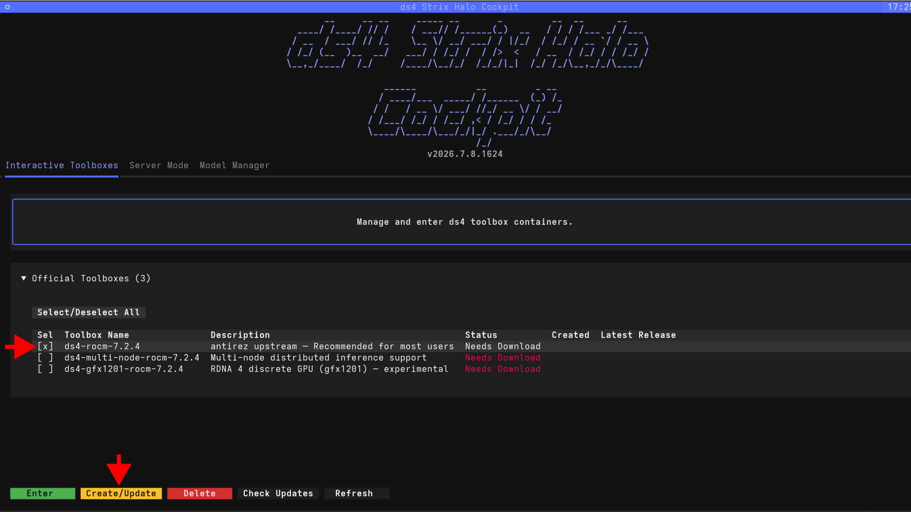
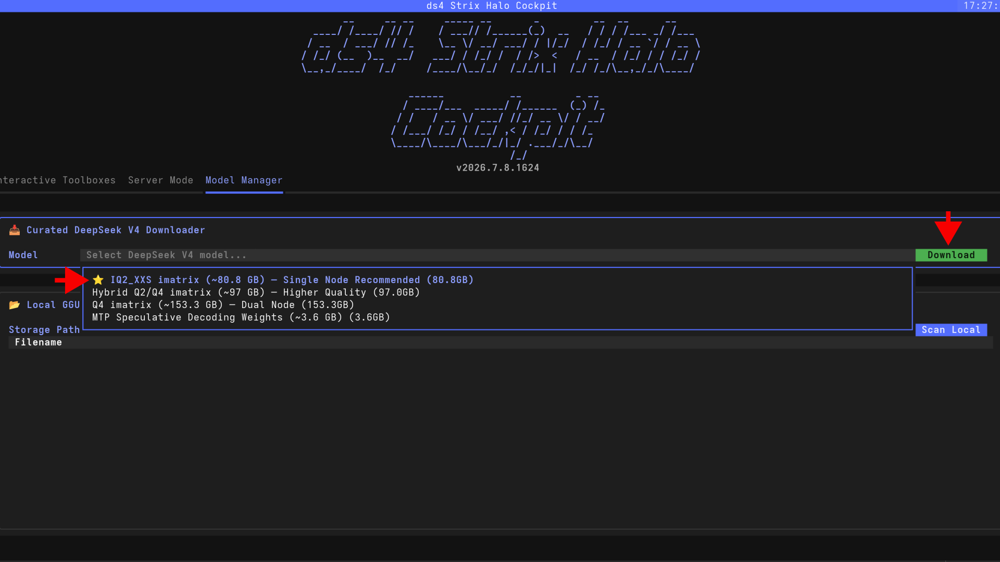
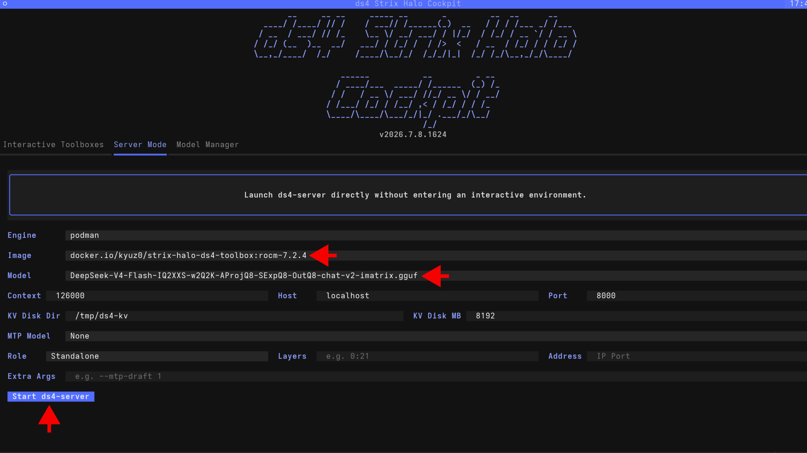

<!--
Copyright Advanced Micro Devices, Inc.

SPDX-License-Identifier: MIT
-->

<!-- @github-only -->
> [!IMPORTANT]
> This playbook uses special tags that GitHub cannot render. Please visit [amd.com/playbooks](https://amd.com/playbooks) to correctly preview this content.
<!-- @github-only:end -->

## Overview

[DeepSeek V4 Flash](https://huggingface.co/deepseek-ai/DeepSeek-V4-Flash) is the efficiency-focused variant of the DeepSeek V4 family — a 284 billion parameter Mixture of Experts model with 13 billion active parameters. According to [DeepSeek's technical report](https://huggingface.co/deepseek-ai/DeepSeek-V4-Flash), it scores 79% on SWE-bench Verified and 91.6% on LiveCodeBench.

[ds4 (Dwarf Star 4)](https://github.com/antirez/ds4) is a dedicated inference engine built specifically for this model architecture. Rather than a general-purpose runtime, ds4 targets the DeepSeek V4 family directly with architecture-specific kernel optimizations for AMD ROCm™ software. It is currently one of the best-performing implementations of DeepSeek V4 Flash on Strix Halo.

This tutorial shows how to use `ds4-cockpit`, a terminal UI, to set up ds4, download model weights, and start serving DeepSeek V4 Flash locally on the AMD Ryzen™ AI Halo Developer Platform.

## What You'll Learn

- How to install and launch the `ds4-cockpit` terminal UI
- How to create the ds4 ROCm toolbox container
- Downloading the recommended quantization for a single Halo node
- Starting the ds4 inference server and exposing an OpenAI-compatible endpoint
- Connecting a Web UI or coding agent to the local server

<!-- @setup:memory_config -->

## Installing Software Prerequisites

ds4-cockpit uses container toolboxes to run the ds4 engine. Install `podman`, `distrobox`, and `pipx`:

<!-- @device:halo,halo_box -->
<!-- @os:linux -->
```bash
sudo apt update
sudo apt install -y podman distrobox pipx
```
<!-- @os:end -->
<!-- @device:end -->

## Available Quantizations

The ds4 author provides several quantized versions of DeepSeek V4 Flash in GGUF format. All models below use importance matrix (imatrix) calibration, which preserves higher precision for the parts of the model that matter most for coding and reasoning tasks.

| Quantization | Size | Description |
|-------------|------|-------------|
| [IQ2_XXS imatrix](https://huggingface.co/antirez/deepseek-v4-gguf) | ~80.8 GB | Recommended for a single 128 GB node |
| [Hybrid Q2/Q4 imatrix](https://huggingface.co/antirez/deepseek-v4-gguf) | ~97 GB | Keeps layers 37–42 at Q4 precision for better accuracy. Fits in 128 GB but leaves less room for context |
| [Q4 imatrix](https://huggingface.co/antirez/deepseek-v4-gguf) | ~153 GB | Higher quality. Requires two Halo nodes via multi-node clustering |
| [MTP Speculative Decoding](https://huggingface.co/antirez/deepseek-v4-gguf) | ~3.6 GB | Optional add-on for speculative decoding to improve generation speed |

The **IQ2_XXS imatrix** model is a good starting point. It fits comfortably on a single node and leaves enough memory for a reasonable context window.

## Installing ds4-cockpit

[ds4-cockpit](https://github.com/kyuz0/strix-halo-ds4-toolbox) is a light terminal UI to make getting up and running with ds4 on Strix Halo easy. It handles creating toolbox containers, downloading model weights, and starting servers. Install it with `pipx`:

<!-- @device:halo,halo_box -->
<!-- @os:linux -->
```bash
pipx install "git+https://github.com/kyuz0/strix-halo-ds4-toolbox.git#subdirectory=ds4-strix-halo-cockpit"
```

Launch the cockpit:
```bash
ds4-cockpit
```
<!-- @os:end -->
<!-- @device:end -->

## Creating the Toolbox

In the **Interactive Toolboxes** tab, select the latest available toolbox (e.g. `ds4-rocm-7.2.4`) and click **Create/Update**. This pulls the container image and creates the toolbox environment.

> **Tip**: The toolbox version will change over time as newer ROCm builds are released. Pick the latest one available in the list.

<p align="center">
  
</p>

## Downloading the Model

Go to the **Model Manager** tab. Select **IQ2_XXS imatrix (~80.8 GB)** from the dropdown and click **Download**. The model files will be saved to `~/ds4` by default (you can change the storage path).

<p align="center">
  
</p>


## Starting the Server

Go to the **Server Mode** tab. Select the downloaded model and the toolbox, then configure the context size (e.g. 126000), host, and port. When ready, click **Start ds4-server**.

<p align="center">
  
</p>

The server will start and listen on port 8000, exposing an OpenAI-compatible API endpoint at `http://localhost:8000/v1`.

**Quick test:**
```bash
curl http://127.0.0.1:8000/v1/chat/completions \
  -H 'Content-Type: application/json' \
  -d '{
    "model": "deepseek-v4-flash",
    "messages": [{"role": "user", "content": "Hello!"}],
    "stream": false
  }'
```

## Connecting a Web UI

You can connect any chat interface that supports the OpenAI API format. For example, to use HuggingFace ChatUI:

```bash
docker run -p 3000:3000 \
  --add-host=host.docker.internal:host-gateway \
  -e OPENAI_BASE_URL=http://host.docker.internal:8000/v1 \
  -e OPENAI_API_KEY=dummy \
  -v chat-ui-data:/data \
  ghcr.io/huggingface/chat-ui-db
```

Open `http://localhost:3000` in your browser to start chatting.

## Connecting a Coding Agent

The ds4 server exposes both OpenAI and Anthropic-compatible endpoints, so most coding agents can connect to it directly. For example, to add it to the `pi` coding agent, add the following block to `~/.pi/agent/models.json`:

```json
"ds4": {
  "name": "ds4.c local",
  "baseUrl": "http://localhost:8000/v1",
  "api": "openai-completions",
  "apiKey": "dsv4-local",
  "compat": {
    "supportsStore": false,
    "supportsDeveloperRole": false,
    "supportsReasoningEffort": true,
    "supportsUsageInStreaming": true,
    "maxTokensField": "max_tokens",
    "supportsStrictMode": false,
    "thinkingFormat": "deepseek",
    "requiresReasoningContentOnAssistantMessages": true
  },
  "models": [
    {
      "id": "deepseek-v4-flash",
      "name": "DeepSeek V4 Flash (ds4.c local)",
      "reasoning": true,
      "thinkingLevelMap": {
        "off": null,
        "minimal": "low",
        "low": "low",
        "medium": "medium",
        "high": "high",
        "xhigh": "xhigh"
      },
      "input": ["text"],
      "contextWindow": 131072,
      "maxTokens": 65536,
      "cost": { "input": 0, "output": 0, "cacheRead": 0, "cacheWrite": 0 }
    }
  ]
}
```

> **Tip**: If your coding agent or Web UI is running on a different machine than the Halo platform, you will need to forward port 8000 via SSH:
> ```bash
> ssh -L 0.0.0.0:8000:localhost:8000 <halo-host-ip>
> ```

## Next Steps

- **Multi-node clustering**: If you have two Halo devices, ds4 supports distributing the Q4 model (~153 GB) across both machines via pipeline parallelism. See the [ds4-toolbox documentation](https://github.com/kyuz0/strix-halo-ds4-toolbox#distributed-inference-pipeline-parallelism) for setup instructions.
- **Speculative decoding (MTP)**: Download the MTP weights (~3.6 GB) and pass `--mtp` to the server for faster generation speed.
- **KV cache disk offloading**: For coding agent workflows, enable `--kv-disk-dir` so that repeated system prompts are restored from SSD instead of being recomputed each time.

For more information, see the [ds4 repository](https://github.com/antirez/ds4) and the [ds4-cockpit toolbox](https://github.com/kyuz0/strix-halo-ds4-toolbox).
