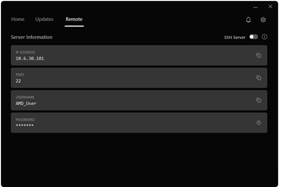
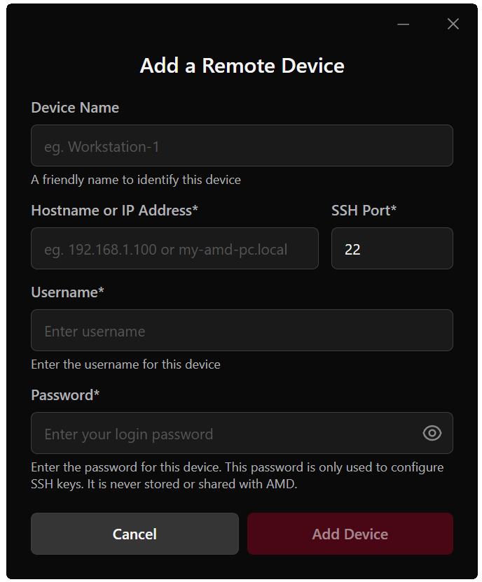
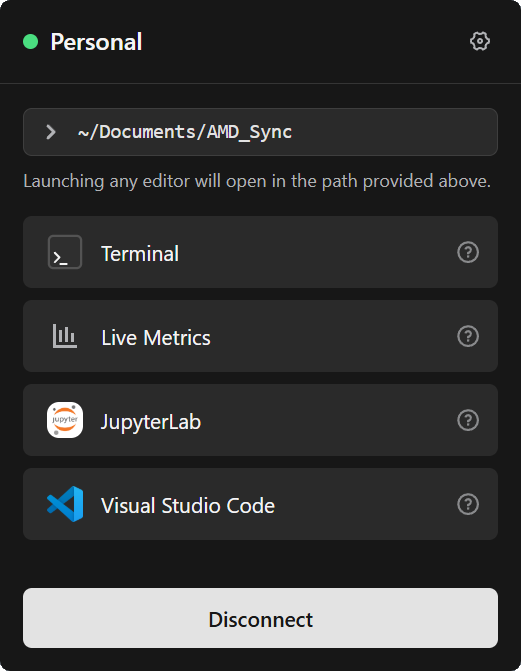
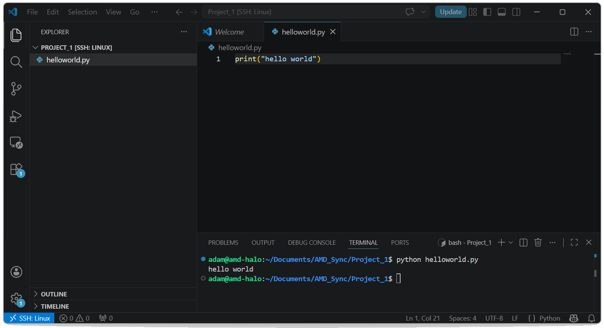
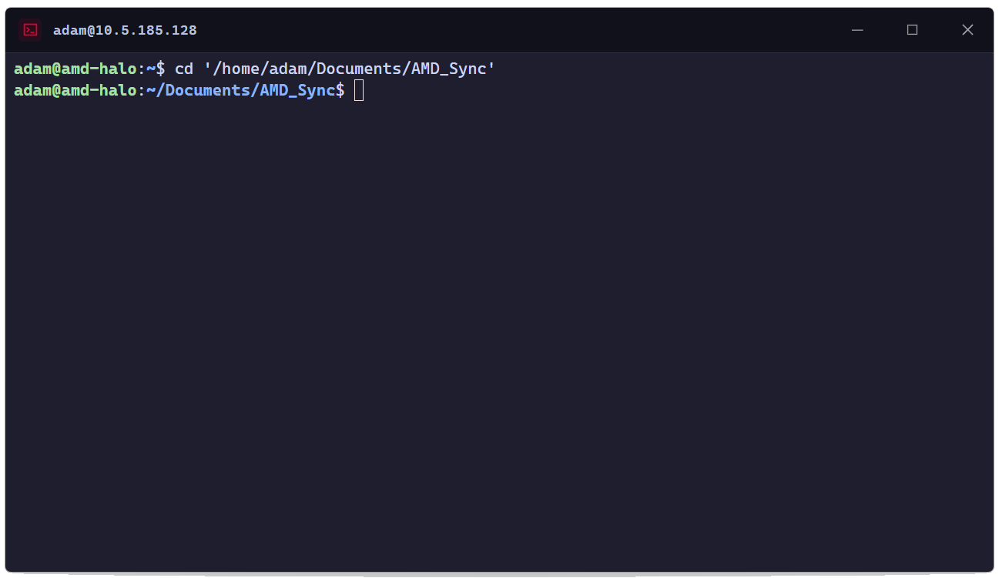
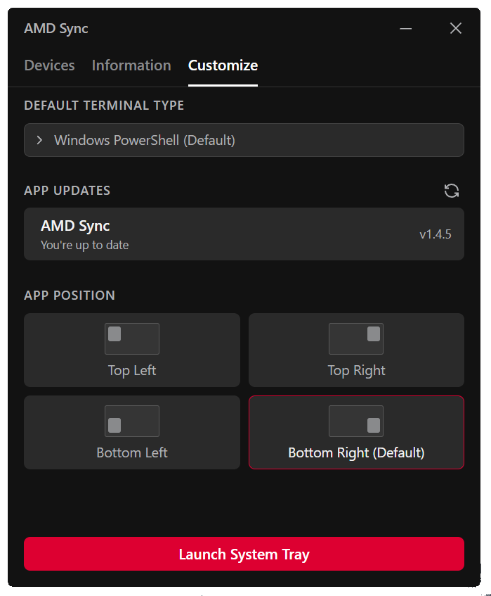

<!--
Copyright Advanced Micro Devices, Inc.

SPDX-License-Identifier: MIT
-->

<!-- @github-only -->
> [!IMPORTANT]
> This playbook uses special tags that GitHub cannot render. Please visit [amd.com/playbooks](https://amd.com/playbooks) to correctly preview this content.
<!-- @github-only:end -->

# Remote Development with AMD Sync

## Overview

**AMD Sync** turns your laptop into a remote cockpit for the AMD Ryzen™ AI Halo. Skip the manual SSH, key, and IDE setup — install AMD Sync and get one-click access to a remote terminal, VS Code, JupyterLab, and a live GPU/CPU/memory dashboard on the Ryzen AI Halo.

Your local machine stays familiar; every command, notebook, and model runs on the Ryzen AI Halo.

> **Tip**: This page will contain any new updates to AMDSync. 

## What You'll Learn

- Enable SSH on the Ryzen AI Halo and connect to it from AMD Sync
- Launch VS Code, Terminal, JupyterLab, and Live Metrics against the Ryzen AI Halo with one click
- Organize remote work using AMD Sync's managed project folders

---

## Core Concepts

AMD Sync has two sides: a **client** (your laptop, running the AMD Sync app) and a **server** (the Ryzen AI Halo, running an SSH server that AMD Sync tunnels into). Everything you launch from AMD Sync — VS Code, a terminal, a notebook — opens locally but executes on the Ryzen AI Halo.

> **Supported clients:** Windows 11 and Linux. macOS is not supported.

---

## Step 1 — Enable SSH on the Ryzen AI Halo

> **Note:** On Windows, the Ryzen AI Halo ships with the SSH server *off by default*. On Linux, it comes with SSH server *on by default*.

1. On the Ryzen AI Halo, open the **AMD Ryzen™ AI Developer Center**.
2. Go to the **Remote** tab.
3. Toggle **SSH Server** on.
4. Note the **IP Address**, **Port**, and **Username** shown under **Server Information** — you'll paste them into AMD Sync.

  

> **Note:** This is the AMD Developer Center for Windows. The Linux one may have different UI, but similar remote functionality.

> **Tip:** AMD Sync asks for the **OS login password** of that user, not a password from the Developer Center.

---

## Step 2 — Install AMD Sync on Your Client

AMD Sync runs on Windows 11 and Linux. Download the installer for your OS, then follow the steps below. After installation, click **Accept & Install** on the **Get Started** screen — AMD Sync launches automatically when it finishes.

### Windows

[Download AMDSyncInstaller.exe](https://developer.amd.com/playbooks/windows/amdsyncinstaller)

1. Double-click `AMDSyncInstaller.exe`.
2. Click **Accept & Install**.

> If Windows Firewall prompts you, allow AMD Sync network access so it can reach the Ryzen AI Halo over SSH.

### Linux

Click the link to download your preferred format:

| Format | Download | Install command |
|--------|----------|-----------------|
| `.deb` | [AMDSyncInstaller.deb](https://drivers.amd.com/drivers/amd-sync/linux/amdsyncinstaller.deb) | `sudo apt install ./amdsyncinstaller.deb` |
| `.rpm` | [AMDSyncInstaller.rpm](https://drivers.amd.com/drivers/amd-sync/linux/amdsyncinstaller.rpm) | `sudo rpm -i ./amdsyncinstaller.rpm` |
| `.AppImage` | [AMDSyncInstaller.AppImage](https://drivers.amd.com/drivers/amd-sync/linux/amdsyncinstaller.AppImage) | `chmod +x ./amdsyncinstaller.AppImage && ./amdsyncinstaller.AppImage` |

> **Note:** Ubuntu App Center may flag a locally opened `.deb` as *"Potentially unsafe."* That's the standard warning for any third-party local installer. If double-clicking the `.deb` fails, use the terminal command above.

---

## Step 3 — Connect to Your Ryzen AI Halo

On first launch, AMD Sync shows the **Add a Remote Device** form. Fill it in using the values from the Developer Center's **Remote** tab.

  

| Field | Notes |
|-------|-------|
| **Device Name** *(optional)* | A friendly label like `Ryzen AI Halo`. Defaults to `Device 1`, `Device 2`, … |
| **Hostname or IP** | From the Remote tab |
| **SSH Port** | From the Remote tab (numbers only) |
| **Username** | Your OS account name on the Ryzen AI Halo |
| **Password** | Your OS login password — masked as you type |

Click **Add Device**. After a brief loading screen, you'll see **"Connection Successful"** and land on the home view, which lives in your system tray. Click off the window to dismiss it; AMD Sync stays running and is one click away.

> **If the connection fails,** AMD Sync returns to the form with your values preserved. The usual causes are SSH being disabled on the Ryzen AI Halo, the wrong password, or the two devices being on different networks.

---

## Step 4 — Launch Your First Remote Tool

The home view gives you five one-click components — all available regardless of which OS the client and Ryzen AI Halo are running.

  

| Component | What it does |
|-----------|--------------|
| **Directory** | Picks the folder on the Ryzen AI Halo that VS Code, Terminal, and JupyterLab will open in. Defaults to a managed `Documents/AMD_Sync` workspace. |
| **VS Code** | Opens VS Code locally with an SSH tunnel into the selected folder. |
| **Terminal** | Opens a local terminal SSH-connected to the Ryzen AI Halo, in the selected folder. |
| **JupyterLab** | Launches a notebook project SSH-connected to the Ryzen AI Halo, scoped to the selected folder. |
| **Live Metrics** | Real-time view of GPU, memory, and CPU utilization on the Ryzen AI Halo. |

### Try VS Code

For your first launch, try **VS Code**.

1. Leave **Directory** on the default `~/Documents/AMD_Sync`.
2. Click **VS Code**.
3. AMD Sync creates `Documents/AMD_Sync/Project_1` on the Ryzen AI Halo and opens VS Code locally, tunneled into it.

You're now editing files that live on the Ryzen AI Halo with your local VS Code setup. Create `helloworld.py`, add `print("hello world")`, open the integrated terminal (`` Ctrl + ` ``), and run it:

  

The status bar reads **SSH: Linux** — proof your code is running on the Ryzen AI Halo, not your laptop.

### Try the Terminal

Click **Terminal** to drop into the same folder over SSH without leaving the keyboard.

  

On Windows, the default terminal is **PowerShell** — switch to **Windows Command Prompt** from the Settings menu if you prefer. On Linux, AMD Sync uses your default system terminal.

---

## How the Directory Works

The **Directory** dropdown is the single most important control in AMD Sync — it decides where every tool you launch lands on the Ryzen AI Halo.

- **`~/Documents/AMD_Sync` (default)** — Launching VS Code or JupyterLab from here creates a fresh project folder automatically (`Project_1`, `Project_2`, … for VS Code; `Notebook_Project_1`, `Notebook_Project_2`, … for JupyterLab).
- **Existing project folders** — Any immediate child of `AMD_Sync` (including folders you create manually on the Ryzen AI Halo) appears in the dropdown. The last folder you used becomes the default next time.
- **Custom paths** — Type any absolute path to open a folder elsewhere on the Ryzen AI Halo. AMD Sync only *opens* it — it won't create folders outside `AMD_Sync`, and custom paths aren't saved between sessions.

If a custom path doesn't work, AMD Sync tells you why: invalid syntax, folder doesn't exist, or the path points to a file.

---

## Live Metrics and JupyterLab

- **Live Metrics** — A live dashboard of GPU, memory, and CPU usage. The fastest way to confirm a remote training run is actually hitting the hardware.
- **JupyterLab** — A full notebook project SSH-connected to the Ryzen AI Halo, with its own integrated terminal for mixing notebook cells and shell commands without leaving the UI.

---

## Settings and Multiple Devices

The **Settings** menu has three tabs:

| Tab | What it covers |
|-----|----------------|
| **Devices** | Lists every Ryzen AI Halo you've connected to successfully. Reconnect, edit credentials, or add a new device. |
| **Information** | Links to documentation and forum support. |
| **Customize** | Reposition the app on your desktop, switch terminal type (Windows only), and check for AMD Sync updates. |

  

- **Terminal type (Windows)** — Choose between **PowerShell** (default) and **Windows Command Prompt**.
- **Terminal type (Linux)** — Only the default system terminal is available.
- **App updates** — This tab is the right place to check for and install new AMD Sync versions from inside the UI; no separate updater is needed.

> A device only appears under **Devices** after a successful first connection, so failed attempts won't clutter the list.

---

## Troubleshooting

- **Connection fails immediately** — Confirm the SSH server is enabled on the Ryzen AI Halo's **Remote** tab in the Developer Center.
- **Wrong password error** — Use your **OS login password** on the Ryzen AI Halo, not passwords taken from the Developer Center.
- **VS Code button does nothing** — Install VS Code on your client machine from [code.visualstudio.com](https://code.visualstudio.com).
- **AMD Sync tray icon missing (Linux/GNOME)** — Install and enable the AppIndicator extension.
- **`.deb` won't open from the file manager** — Use `sudo apt install ./AMDSyncInstaller.deb` from a terminal.

---