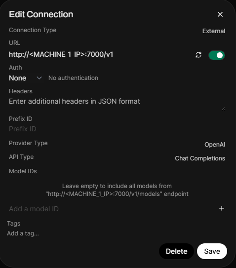
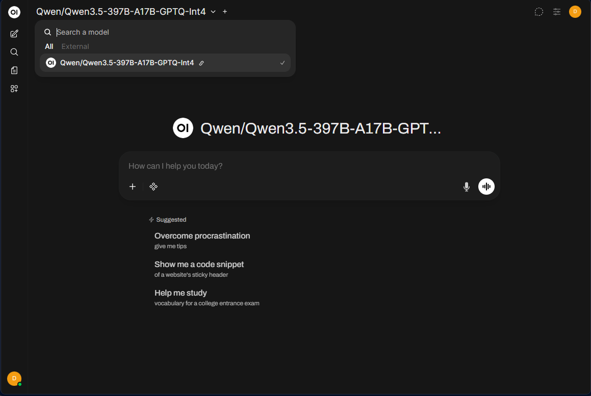

<!--
Copyright Advanced Micro Devices, Inc.

SPDX-License-Identifier: MIT
-->

<!-- @github-only -->
> [!IMPORTANT]
> This playbook uses special tags that GitHub cannot render. Please visit [amd.com/playbooks](https://amd.com/playbooks) to correctly preview this content.
<!-- @github-only:end -->

# Clustering Two Ryzen™ AI Halos with RCCL

## Overview

Your Ryzen™ AI Halo is already capable of running large language models locally. Clustering takes this further by combining the GPU memory of multiple systems over a local network, giving you access to even larger models with stronger reasoning, better code generation, and deeper multilingual understanding, all entirely on your own hardware.

This playbook teaches you how to cluster two Ryzen™ AI Halo systems using RCCL (ROCm Communication Collectives Library) with vLLM and run Qwen3.5-397B, a 397B parameter model, across both machines with ROCm acceleration.

## What You'll Learn

- How to extend VRAM allocation on Ryzen™ AI Halo systems
- Launching vLLM with ROCm support
- Configuring RCCL for multi-node tensor-parallel inference across two Ryzen™ AI Halo systems
- Running a 397B parameter model across two networked Ryzen™ AI Halo systems

## Prerequisites

### Hardware

This playbook requires two Ryzen™ AI Halo units and one Ethernet switch, connected in a star topology with each unit wired directly to the switch.

| Component | Quantity | Description |
|-----------|----------|-------------|
| Ryzen™ AI Halo | 2 | Compute nodes that form the cluster |
| 10Gbps Ethernet switch | 1 | Central switch to allow multi node Ryzen™ AI Halo communication (at least 2 ports) |
| Ethernet cable | 2 | Connects each Halo unit to the switch (Cat 7 or higher recommended) |

> **Note**: Two Ethernet switch ports are required to connect the two Ryzen™ AI Halo units. A third port is required if you access the model from a separate client machine instead of from one of the Halo units.

### Software
<!-- @os:linux -->
```bash
sudo apt install curl
```
<!-- @os:end -->

## Physical Hardware Setup

> **Note**: Complete this step on both Machine 1 and Machine 2.

Connect each Ryzen™ AI Halo unit to the Ethernet switch using a Cat 7 (or higher) cable. This establishes the 10Gbps link used for high-speed communication between the nodes.

### 1. Determine Network Interfaces

On each machine, find the name of its network interface and note it down (it will be referred to in the rest of the instructions as `IFNAME`). Run:

```bash
ip route get 1.1.1.1 | grep -oP 'dev \K\S+'
```

This prints the interface name directly, for example:

```bash
enp191s0
```

### 2. Verify Network Link Speeds

Confirm the link is active and running at full speed by checking the speed of your interface:

```bash
sudo ethtool <IFNAME> | grep Speed
```

> **Note**: Replace `<IFNAME>` with the output interface name from [1. Determine Network Interfaces](#1-determine-network-interfaces)

You should see a speed of `10000Mb/s`:

```bash
	Speed: 10000Mb/s
```

> **Note**: If the speed is lower than `10000Mb/s` or the link does not come up, check the cable connection and confirm the switch port is set to 10Gbps. Some switches require auto-negotiation to be disabled and the link speed set manually; refer to your switch's documentation.

## Extending VRAM Allocation

> **Note**: Complete this step on both Machine 1 and Machine 2.

### Memory Configuration for Running Large Models

On Linux, ROCm utilizes a shared system memory pool, and this pool is configured by default to half the system memory.

This amount can be increased by changing the kernel's Translation Table Manager (TTM) page setting, with the following instructions. AMD recommends setting the minimum dedicated VRAM in the BIOS (0.5 GB).

* Install the pipx utility and add the path for pipx installed wheels into the system search path.

  ```bash
  sudo apt install pipx
  pipx ensurepath
  ```

* Install the amd-debug-tools wheel from PyPI.
  ```bash
  pipx install amd-debug-tools
  ```

* Run the amd-ttm tool to query the current settings for shared memory.
  ```bash
  amd-ttm
  ```

* Reconfigure shared memory settings to **120 GB**:
  ```bash
  amd-ttm --set 120
  ```

* Reboot the system for changes to take effect.

## vLLM Container Initialization

> **Note**: Complete this step on both Machine 1 and Machine 2.

Your Ryzen™ AI Halo ships with vLLM packaged inside a prebuilt container image, which you run using Podman, a free and open source container tool.

### 1. Create the Model Download Directory

When you serve the Qwen3.5-397B model in this playbook, vLLM will automatically download the model weights to your system. To make sure those weights are accessible from inside the container, first create a models directory that the container can mount:

```bash
mkdir -p ~/.local/share/vLLM/models
```

### 2. Launch the vLLM Container

The command below launches the container and drops you into an interactive shell. It mounts the models directory you just created and passes your `IFNAME` to `NCCL_SOCKET_IFNAME` and `GLOO_SOCKET_IFNAME`, telling RCCL (the library vLLM uses to coordinate GPUs across the cluster) which interface to use.

Start the container with:

```bash
sudo podman run -it --name vllm_cluster --replace --pull missing --network=host --device /dev/kfd --device /dev/dri -v ~/.local/share/vLLM/models:/opt/vLLM/models --env HF_HOME=/opt/vLLM/models --entrypoint="bin/bash" --shm-size=64g -e NCCL_SOCKET_IFNAME=<IFNAME> -e GLOO_SOCKET_IFNAME=<IFNAME> oci-registry.ryai.dev/ryai-vllm:latest
```

> **Note**: Replace `<IFNAME>` with the output interface name from [1. Determine Network Interfaces](#1-determine-network-interfaces)

## Running the Model on the Cluster

vLLM uses Ray to orchestrate the cluster and RCCL to handle GPU-to-GPU communication across nodes. One machine acts as the **head node** (Machine 1), coordinating inference. The other joins as a **worker node** (Machine 2), contributing its GPU memory and compute.

> **Note**: Ray is an optional dependency for vLLM and is only available from within the preconfigured Podman container.

At launch, vLLM shards the model across both nodes using tensor parallelism. Once loaded, inference proceeds as if running on a single accelerator.

### Step 1: Start the Ray Head Node (Machine 1)

On Machine 1, start the Ray head node to initialize the cluster:

```bash
ray start --head --port=6379 --node-ip-address=<MACHINE_1_IP> --num-gpus=1
```

> **Finding `<MACHINE_1_IP>`**: On Machine 1, run `hostname -I | awk '{print $1}'` to find its local IP address.

### Step 2: Join the Cluster (Machine 2)

On Machine 2, connect to the head node to form the cluster:

```bash
ray start --address=<MACHINE_1_IP>:6379 --node-ip-address=<MACHINE_2_IP> --num-gpus=1
```

> **Finding `<MACHINE_2_IP>`**: On Machine 2, run `hostname -I | awk '{print $1}'` to find its local IP address.

### Step 3: Serve the Model (Machine 1)

On Machine 1, launch the vLLM server. This will automatically download the model and begin serving it across both nodes:

```bash
vllm serve Qwen/Qwen3.5-397B-A17B-GPTQ-Int4 \
  --port 7000 \
  --host 0.0.0.0 \
  --max-model-len 32768 \
  --gpu-memory-utilization 0.9 \
  --dtype float16 \
  --tensor-parallel-size 2 \
  --distributed-executor-backend ray \
  --enforce-eager \
  --language-model-only \
  --reasoning-parser qwen3
```

#### Parameter Reference

| Flag | Purpose |
|------|---------|
| `--port` | Port to serve the HTTP API on |
| `--host` | IP address to bind the server to (`0.0.0.0` for all interfaces) |
| `--max-model-len` | Maximum context length in tokens |
| `--gpu-memory-utilization` | Fraction of GPU memory to allocate (0.0–1.0) |
| `--dtype` | Data type for model weights |
| `--tensor-parallel-size` | Number of GPUs to shard the model across (set to total GPUs in the cluster) |
| `--distributed-executor-backend` | Backend for multi-node execution (`ray` for cluster deployments) |
| `--enforce-eager` | Disables CUDA graph compilation for compatibility |
| `--language-model-only` | Skips loading auxiliary model components (e.g., vision encoder) |
| `--reasoning-parser` | Enables structured reasoning output parsing for the model |

For full parameter usage, refer to the [vLLM documentation](https://docs.vllm.ai/en/latest/configuration/engine_args/).

## Accessing the Model

vLLM exposes an OpenAI-compatible API, so you can connect any compatible client or interface to your cluster. One popular option is [Open WebUI](https://github.com/open-webui/open-webui), which provides a browser-based chat interface.

To connect Open WebUI to your vLLM endpoint:

1. Open **Settings** > **Admin Panel** > **Connections**
2. Click the **+** on **Manage OpenAI API Connections**
3. Set the **Connection Type** to **External**
4. Set the **URL** to `http://<MACHINE_1_IP>:7000/v1`
5. Under **Auth**, select **None** from the dropdown
6. Leave **Model IDs** empty to automatically discover all models from the endpoint

> **Finding `<MACHINE_1_IP>`**: On Machine 1, run `hostname -I | awk '{print $1}'` to find its local IP address. If accessing Open WebUI from Machine 1 itself, you can use `http://localhost:7000/v1`.



Once connected, select the model from the model dropdown in Open WebUI and start chatting. The model is now running across both of your Ryzen™ AI Halo nodes:



## Next Steps

- **Explore other models**: Discover new models on [Hugging Face](https://huggingface.co/models?&sort=trending) that fit within your cluster's combined GPU memory
- **Scale to four nodes**: Add two more Ryzen™ AI Halo systems as additional Ray workers to shard models across even more GPUs. This requires an Ethernet switch with at least four ports, one for each node. Follow [Step 2: Join the Cluster](#step-2-join-the-cluster-machine-2) on each additional worker and increase `--tensor-parallel-size` accordingly
- **Try other parallelism strategies**: vLLM supports [expert parallel](https://docs.vllm.ai/en/latest/serving/expert_parallel_deployment/) for mixture-of-experts models and [data parallel](https://docs.vllm.ai/en/latest/serving/data_parallel_deployment/) for higher throughput. Experiment with `--enable-expert-parallel` and `--data-parallel-size` to find the best configuration for your workload
