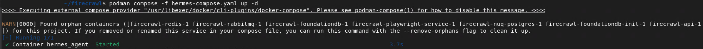
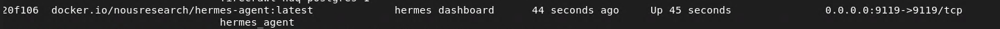
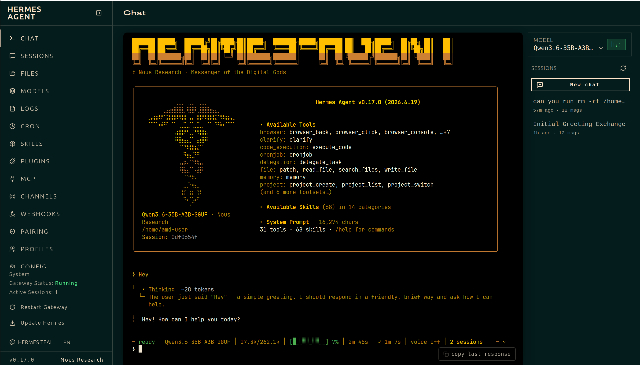
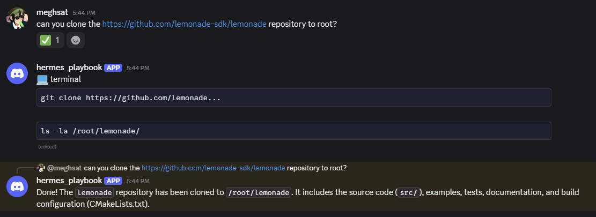

<!--
Copyright Advanced Micro Devices, Inc.
SPDX-License-Identifier: MIT
-->
# Run Hermes Agent with Lemonade Server as the backend

## Overview

[**Hermes Agent**](https://hermes-agent.nousresearch.com/) is a self-improving AI agent built by Nous Research. It has a built-in learning loop, it creates skills from experience, builds a persistent memory of who you are across sessions, and can run scheduled automations on your behalf. Unlike a simple chat assistant, Hermes takes real actions: running shell commands, writing files, browsing the web, and delegating parallel workstreams to subagents.

[**Lemonade Server**](https://lemonade-server.ai/) is the local inference backend that powers it. It is an open-source server that runs GenAI models directly on your AMD hardware and exposes them through the industry-standard OpenAI API.

Together they form a fully local AI agent stack: Lemonade handles model inference on your GPU, and Hermes provides the agent loop, memory, skills, and messaging gateway.

> **Before you continue:** Hermes Agent is a highly autonomous AI agent. Giving any AI agent access to your system may result in unpredictable or unintended outcomes. Proceed only if you understand the risks and are comfortable with autonomous software acting on your behalf.

---

## What You'll Learn

By the end of this playbook you will be able to:

- **Install Hermes Agent** and point it at **Lemonade Server** as its AI backend.
- **(Recommended) Enable Docker sandboxing** to isolate the agent's actions from your host.
- **Start the Hermes gateway** and confirm your agent is ready.
- **Connect a communication channel** (Discord or Telegram) so you can chat with your agent from any device.

---

## Setting the Memory Configuration

<!-- @require:memory-config -->

<!-- @device:halo_box -->
## Check for Software Updates

<!-- @require:software-update -->
<!-- @device:end -->

## Installing Software Prerequisites

<!-- @os:linux -->
- A PC running **Ubuntu 24.04+** or a compatible Debian-based Linux distribution with `apt-get`
- At least **12 GB of RAM** (64 GB+ recommended for larger models)
- **~10–30 GB of free disk space** for model weights
<!-- @device:halo_box -->
- Podman (pre-installed on Halo Box - no setup required)
<!-- @device:end -->
- [Podman](https://podman.io/docs/installation) (Optional, for sandboxing Hermes Agent - `sudo apt-get install -y podman`)
<!-- @os:end -->
<!-- @os:windows -->
- A PC running **Windows 10/11**
- At least **12 GB of RAM** (64 GB+ recommended for larger models)
- **~10–30 GB of free disk space** for model weights
- Podman (Optional, for sandboxing Hermes Agent - install inside WSL: `sudo apt-get install -y podman`)
<!-- @os:end -->

<!-- @require:lemonade -->

<!-- @var:id=hermes_model value="Qwen3.6-35B-A3B-GGUF" -->

<!-- @test:id=lemonade-version timeout=60 hidden=True -->
```bash
lemonade --version
```
<!-- @test:end -->

---

## Pull and Load the Recommended Model

The recommended model for this playbook is **Qwen3.6-35B-A3B-GGUF** from Unsloth, a strong MoE model with a 263k-token context window that is well-suited to agent workloads. This model uses UD-Q4_K_XL quantization. Pull it now:

```bash
lemonade pull Qwen3.6-35B-A3B-GGUF
```

Then load it with a large context window and save that setting for future runs:

<!-- @test:id=lemonade-model-load timeout=900 -->
```bash
lemonade unload
lemonade load Qwen3.6-35B-A3B-GGUF --ctx-size 262144 --save-options
```
<!-- @test:end -->

The model has a default context length of 262,144 tokens. If you encounter out-of-memory (OOM) errors, consider reducing the context window.

> **Tip: Disable thinking for faster agent responses:** Qwen3.6-35B-A3B runs in thinking mode by default, which adds latency before each response. For agent loops this overhead accumulates quickly. The [lemonade-sdk/recipes](https://github.com/lemonade-sdk/recipes/blob/main/coding-agents/Qwen3.6-35B-A3B-NoThinking.json) repo provides a ready-made config that disables thinking. To use it, download the file and import it:
>
> ```bash
> curl -LO https://raw.githubusercontent.com/lemonade-sdk/recipes/main/coding-agents/Qwen3.6-35B-A3B-NoThinking.json
> lemonade import Qwen3.6-35B-A3B-NoThinking.json
> ```

---

<!-- @os:windows -->
<!-- @test:id=lemonade-chat-windows timeout=1200 hidden=True -->
```powershell
$ErrorActionPreference = "Stop"

$modelsJson = $null
for ($i = 0; $i -lt 120; $i++) {
  $modelsJson = curl.exe -s --max-time 2 http://127.0.0.1:13305/api/v1/models
  if ($modelsJson) { break }
  Start-Sleep -Seconds 1
}

if (-not $modelsJson) {throw "Lemonade server not ready on http://127.0.0.1:13305"}
Write-Host "OK: Lemonade server is responding"

$parsed = $modelsJson | ConvertFrom-Json
$entry = $parsed.data | Where-Object { $_.id -eq "${hermes_model}" } | Select-Object -First 1

if (-not $entry) {throw "Model ${hermes_model} is not present in Lemonade /api/v1/models."}
if (-not $entry.downloaded) {throw "Model ${hermes_model} is present but not downloaded in Lemonade. Please download it before running CI."}
Write-Host "OK: ${hermes_model} model is downloaded in Lemonade"

if ($entry.recipe_options.ctx_size -ne 262144) {
  throw "Model ${hermes_model} is not saved with ctx_size=262144. Run: lemonade load ${hermes_model} --ctx-size 262144 --save-options"
}
Write-Host "OK: ${hermes_model} is saved with ctx_size=262144"

$body = @{
  model = "${hermes_model}"
  messages = @(
    @{
      role = "user"
      content = "Reply with exactly: OK"
    }
  )
  temperature = 0
  max_tokens = 32
} | ConvertTo-Json -Depth 5

$tmpBody = Join-Path $env:TEMP "hermes-lemonade-chat-body.json"
[System.IO.File]::WriteAllText($tmpBody, $body, [System.Text.UTF8Encoding]::new($false))

try {
  $out = curl.exe -sS --fail-with-body --max-time 300 http://127.0.0.1:13305/api/v1/chat/completions `
    -H "Content-Type: application/json" `
    --data-binary "@$tmpBody"
  if (-not $out) {throw "Empty response from Lemonade chat/completions"}
  Write-Host "OK: Lemonade chat/completions returned a response"
}
finally {
  Remove-Item $tmpBody -Force -ErrorAction SilentlyContinue
}
```
<!-- @test:end -->
<!-- @os:end -->

<!-- @os:linux -->
<!-- @test:id=lemonade-chat-linux timeout=1200 hidden=True -->
```bash
set -euo pipefail

models_json=""
for i in $(seq 1 120); do
  models_json="$(curl -s --max-time 2 http://127.0.0.1:13305/api/v1/models || true)"
  if [ -n "$models_json" ]; then
    break
  fi
  sleep 1
done

if [ -z "$models_json" ]; then
  echo "Lemonade server not ready on http://127.0.0.1:13305"
  exit 1
fi
echo "OK: Lemonade server is responding"

export MODELS_JSON="$models_json"

python3 - <<'PY'
import json
import os
import sys

data = json.loads(os.environ["MODELS_JSON"])
model_id = "${hermes_model}"

entry = None
for item in data.get("data", []):
    if item.get("id") == model_id:
        entry = item
        break

if entry is None:
    print(f"Model {model_id} is not present in Lemonade /api/v1/models.")
    sys.exit(1)

if not entry.get("downloaded", False):
    print(f"Model {model_id} is present but not downloaded in Lemonade. Please download it before running CI.")
    sys.exit(1)

print(f"OK: {model_id} model is downloaded in Lemonade")

ctx_size = entry.get("recipe_options", {}).get("ctx_size")
if ctx_size != 262144:
    print(f"Model {model_id} is not saved with ctx_size=262144. Run: lemonade load {model_id} --ctx-size 262144 --save-options")
    sys.exit(1)
print(f"OK: {model_id} is saved with ctx_size=262144")
PY

body='{
  "model": "${hermes_model}",
  "messages": [{"role": "user", "content": "Reply with exactly: OK"}],
  "temperature": 0,
  "max_tokens": 32
}'

out="$(curl -sS --fail-with-body --max-time 300 http://127.0.0.1:13305/api/v1/chat/completions \
  -H "Content-Type: application/json" \
  -d "$body")"

if [ -z "$out" ]; then
  echo "Empty response from Lemonade chat/completions"
  exit 1
fi

echo "OK: Lemonade chat/completions returned a response"
```
<!-- @test:end -->
<!-- @os:end -->

<!-- @os:windows -->

## Set Up WSL

We run Hermes Agent inside WSL and connect it to Lemonade running natively on Windows. This gives you a Linux shell environment for Hermes while keeping Lemonade's GPU acceleration on the Windows side.

### Install WSL and Ubuntu

Open PowerShell as Administrator and install the WSL kernel:

```powershell
wsl --install --no-distribution
```

Then install Ubuntu:

```powershell
wsl --install -d Ubuntu-24.04
```

### Enable systemd in WSL

Run this inside the Ubuntu terminal:

```bash
sudo tee /etc/wsl.conf > /dev/null <<'EOF'
[boot]
systemd=true
EOF
```

Restart WSL:

```powershell
wsl --shutdown
wsl
```

### Bridge Lemonade from Windows into WSL

WSL2 runs in a virtual network. Lemonade on Windows binds to `127.0.0.1`, which WSL cannot reach directly. A Windows port proxy forwards traffic from the WSL gateway IP to Windows localhost.

**Find your WSL gateway IP** (run inside WSL):

```bash
ip route show default | awk '{print $3}' | head -1
```

**Add the port proxy** (run in PowerShell as Administrator, replacing `<WSL-Gateway-IP>` with your WSL gateway IP):

```powershell
netsh interface portproxy add v4tov4 listenaddress=<WSL-Gateway-IP> listenport=13305 connectaddress=127.0.0.1 connectport=13305
```

**Add a firewall rule** (same elevated PowerShell):

```powershell
New-NetFirewallRule -DisplayName "Lemonade-WSL" -Direction Inbound -Protocol TCP -LocalPort 13305 -Action Allow
```

**Verify from WSL**:

```bash
WINDOWS_HOST=$(ip route show default | awk '{print $3}' | head -1)
curl -s "http://$WINDOWS_HOST:13305/api/v1/models"
```

If you've already loaded the Qwen3.6-35B-A3B-GGUF model in the previous step, you should see JSON output listing your loaded model.

```json
{
  "data": [
    {
      "checkpoint": "unsloth/Qwen3.6-35B-A3B-GGUF:UD-Q4_K_XL",
      "checkpoints": {
        "main": "unsloth/Qwen3.6-35B-A3B-GGUF:UD-Q4_K_XL"
      },
      "mmproj": "unsloth/Qwen3.6-35B-A3B-GGUF:mmproj-F16.gguf",
      ....
    }
  ],
  "object": "list"
}
```

> The `netsh portproxy` rule survives reboots but the WSL gateway IP can change after `wsl --shutdown`. If Lemonade becomes unreachable from WSL after a restart, get the updated gateway IP and update the proxy with this new IP.

<!-- @test:id=wsl-lemonade-bridge-windows timeout=300 hidden=True -->
```powershell
$ErrorActionPreference = "Stop"

$script = @'
set -euo pipefail
export PATH="$HOME/.local/bin:/usr/local/sbin:/usr/local/bin:/usr/sbin:/usr/bin:/sbin:/bin:$PATH"
WINDOWS_HOST="$(ip route show default | awk '{print $3}' | head -1)"

if [ -z "$WINDOWS_HOST" ]; then
  echo "Could not determine WSL gateway IP"
  exit 1
fi

echo "WSL gateway IP: $WINDOWS_HOST"

models_json="$(curl -fsS --max-time 5 "http://$WINDOWS_HOST:13305/api/v1/models")"

if [ -z "$models_json" ]; then
  echo "Could not reach Lemonade from WSL at http://$WINDOWS_HOST:13305/api/v1/models"
  echo "Check the Windows netsh portproxy and firewall rule from the README."
  exit 1
fi

echo "$models_json" | python3 -m json.tool >/dev/null
echo "OK: WSL can reach native Windows Lemonade through the bridge"
'@

$script = $script -replace "`r`n", "`n"

$tmp = Join-Path $env:TEMP "wsl-lemonade-bridge-windows.sh"
[System.IO.File]::WriteAllText($tmp, $script, [System.Text.UTF8Encoding]::new($false))

try {
  $full = [System.IO.Path]::GetFullPath($tmp)
  $drive = $full.Substring(0,1).ToLower()
  $rest = $full.Substring(2).Replace('\','/')
  $wslTmp = "/mnt/$drive$rest"

  wsl -d Ubuntu-24.04 -- bash "$wslTmp"

  if ($LASTEXITCODE -ne 0) {
    throw "WSL Lemonade bridge test failed"
  }
}
finally {
  Remove-Item $tmp -Force -ErrorAction SilentlyContinue
}
```
<!-- @test:end -->

---
<!-- @os:end -->

## Install Hermes Agent

<!-- @os:windows -->
> Run the commands in this section inside your **WSL terminal** unless noted otherwise.
<!-- @os:end -->

```bash
curl -fsSL https://hermes-agent.nousresearch.com/install.sh | bash -s -- --skip-setup
```

The `--skip-setup` flag skips the interactive setup wizard so you can configure the model backend manually in the next step.

Reload your shell:

```bash
source ~/.bashrc
```

Confirm the installation:

```bash
hermes --version
```

Run a self-diagnostic to check all dependencies:

```bash
hermes doctor
```

> **Tip:** If you see `command not found` after installation, add Hermes to your PATH:
> ```bash
> export PATH="$HOME/.local/bin:$PATH"
> ```
> To make this permanent, add the line above to your `~/.bashrc` or `~/.zshrc`.

<!-- @os:linux -->
<!-- @test:id=hermes-install-linux timeout=300 hidden=True -->
```bash
set -euo pipefail
export PATH="$HOME/.local/bin:/usr/local/sbin:/usr/local/bin:/usr/sbin:/usr/bin:/sbin:/bin:$PATH"
curl -fsSL https://hermes-agent.nousresearch.com/install.sh | bash -s -- --skip-setup
source ~/.bashrc || true
export PATH="$HOME/.local/bin:$PATH"
hermes --version
hermes doctor
```
<!-- @test:end -->
<!-- @os:end -->

<!-- @os:windows -->
```powershell
$ErrorActionPreference = "Stop"

$script = @'
set -euo pipefail
export PATH="$HOME/.local/bin:/usr/local/sbin:/usr/local/bin:/usr/sbin:/usr/bin:/sbin:/bin:$PATH"
hermes --version
hermes doctor
'@

$script = $script -replace "`r`n", "`n"

$tmp = Join-Path $env:TEMP "hermes-install-windows.sh"
[System.IO.File]::WriteAllText($tmp, $script, [System.Text.UTF8Encoding]::new($false))

try {
  $full = [System.IO.Path]::GetFullPath($tmp)
  $drive = $full.Substring(0,1).ToLower()
  $rest = $full.Substring(2).Replace('\','/')
  $wslTmp = "/mnt/$drive$rest"

  wsl -d Ubuntu-24.04 -- bash "$wslTmp"

  if ($LASTEXITCODE -ne 0) {
    throw "Hermes install check failed inside WSL"
  }
}
finally {
  Remove-Item $tmp -Force -ErrorAction SilentlyContinue
}
```
<!-- @os:end -->

---

## Configure Hermes to Use Lemonade

Hermes stores its model configuration in `~/.hermes/config.yaml`. You can either use the interactive `hermes model` picker or can write the config directly.

### Option 1: Interactive picker

<!-- @os:windows -->
> Run the following inside your **WSL terminal**.
<!-- @os:end -->

<!-- @os:linux -->
```bash
hermes model
```
<!-- @os:end -->
<!-- @os:windows -->
```bash
hermes model
```
<!-- @os:end -->

When prompted:

1. Select **Custom endpoint (enter URL manually)**
<!-- @os:linux -->
2. **API base URL:** `http://127.0.0.1:13305/api/v1`
<!-- @os:end -->
<!-- @os:windows -->
2. **API base URL:** use the WSL gateway IP: run `ip route show default | awk '{print $3}' | head -1` inside WSL to get it, then enter `http://<WSL-Gateway-IP>:13305/api/v1`
<!-- @os:end -->
3. **API key:** `lemonade`
4. **API compatibility mode:** `1` (Auto-detect)
5. **Select model:** choose `Qwen3.6-35B-A3B-GGUF` from the list
6. **Context length in tokens:** `262144`
7. **Display name:** `local-lemonade` (or any name you prefer)

`hermes model` saves both the active model selection and a named `custom_providers` entry that stores the context length alongside the endpoint. The result in `~/.hermes/config.yaml` looks like this:

```yaml
model:
  default: Qwen3.6-35B-A3B-GGUF
  provider: custom
  base_url: http://127.0.0.1:13305/api/v1
  api_key: lemonade
custom_providers:
  - name: local-lemonade
    base_url: http://127.0.0.1:13305/api/v1
    api_key: lemonade
    model: Qwen3.6-35B-A3B-GGUF
    models:
      Qwen3.6-35B-A3B-GGUF:
        context_length: 262144
```

### Option 2: Write config directly

<!-- @os:linux -->

```bash
mkdir -p ~/.hermes
cat >> ~/.hermes/config.yaml <<'EOF'
model:
  default: Qwen3.6-35B-A3B-GGUF
  provider: custom
  base_url: http://127.0.0.1:13305/api/v1
  api_key: lemonade
custom_providers:
  - name: local-lemonade
    base_url: http://127.0.0.1:13305/api/v1
    api_key: lemonade
    model: Qwen3.6-35B-A3B-GGUF
    models:
      Qwen3.6-35B-A3B-GGUF:
        context_length: 262144
EOF
```

```bash
set -euo pipefail
export PATH="$HOME/.local/bin:/usr/local/sbin:/usr/local/bin:/usr/sbin:/usr/bin:/sbin:/bin:$PATH"

config="$HOME/.hermes/config.yaml"

if [ ! -f "$config" ]; then
  echo "Missing $config. Run the Hermes install step first."
  exit 1
fi

grep -q "provider: custom" "$config"
grep -q "Qwen3.6-35B-A3B-GGUF" "$config"
grep -q "13305" "$config"
grep -q "context_length: 262144" "$config"

echo "OK: Hermes config.yaml contains Lemonade model configuration"
```
<!-- @os:end -->

<!-- @os:windows -->

Inside your WSL terminal, get the Windows host IP and write the config:

```bash
WINDOWS_HOST=$(ip route show default | awk '{print $3}' | head -1)

mkdir -p ~/.hermes
cat >> ~/.hermes/config.yaml <<EOF
model:
  default: Qwen3.6-35B-A3B-GGUF
  provider: custom
  base_url: http://$WINDOWS_HOST:13305/api/v1
  api_key: lemonade
custom_providers:
  - name: local-lemonade
    base_url: http://$WINDOWS_HOST:13305/api/v1
    api_key: lemonade
    model: Qwen3.6-35B-A3B-GGUF
    models:
      Qwen3.6-35B-A3B-GGUF:
        context_length: 262144
EOF
```

```powershell
$ErrorActionPreference = "Stop"

$script = @'
set -euo pipefail
export PATH="$HOME/.local/bin:/usr/local/sbin:/usr/local/bin:/usr/sbin:/usr/bin:/sbin:/bin:$PATH"

config="$HOME/.hermes/config.yaml"

if [ ! -f "$config" ]; then
  echo "Missing $config. Run the Hermes install and config steps first."
  exit 1
fi

grep -q "provider: custom" "$config"
grep -q "Qwen3.6-35B-A3B-GGUF" "$config"
grep -q "13305" "$config"
grep -q "context_length: 262144" "$config"

echo "OK: Hermes config.yaml contains Lemonade model configuration (Windows host)"
'@

$script = $script -replace "`r`n", "`n"

$tmp = Join-Path $env:TEMP "hermes-lemonade-config-windows.sh"
[System.IO.File]::WriteAllText($tmp, $script, [System.Text.UTF8Encoding]::new($false))

try {
  $full = [System.IO.Path]::GetFullPath($tmp)
  $drive = $full.Substring(0,1).ToLower()
  $rest = $full.Substring(2).Replace('\','/')
  $wslTmp = "/mnt/$drive$rest"

  wsl -d Ubuntu-24.04 -- bash "$wslTmp"

  if ($LASTEXITCODE -ne 0) {
    throw "Hermes Lemonade config check failed inside WSL"
  }
}
finally {
  Remove-Item $tmp -Force -ErrorAction SilentlyContinue
}
```
<!-- @os:end -->

---

## (Recommended) Enable Podman Sandboxing

Hermes Agent can route all agent shell and file operations through an isolated container rather than running them directly on your host. This limits the blast radius of any unintended action to the sandbox, leaving your host filesystem and network untouched.

Build a lightweight sandbox image:

<!-- @os:linux -->
```bash
podman build -t hermes-sandbox:bookworm-slim - <<'DOCKERFILE'
FROM debian:bookworm-slim
ENV DEBIAN_FRONTEND=noninteractive
RUN apt-get update && apt-get install -y --no-install-recommends \
  bash ca-certificates curl git jq python3 ripgrep \
  && rm -rf /var/lib/apt/lists/*
RUN useradd --create-home --shell /bin/bash sandbox
USER sandbox
WORKDIR /home/sandbox
CMD ["sleep", "infinity"]
DOCKERFILE
```
<!-- @os:end -->

<!-- @os:windows -->
```powershell
# Run inside your WSL terminal
podman build -t hermes-sandbox:bookworm-slim - <<'DOCKERFILE'
FROM debian:bookworm-slim
ENV DEBIAN_FRONTEND=noninteractive
RUN apt-get update && apt-get install -y --no-install-recommends \
  bash ca-certificates curl git jq python3 ripgrep \
  && rm -rf /var/lib/apt/lists/*
RUN useradd --create-home --shell /bin/bash sandbox
USER sandbox
WORKDIR /home/sandbox
CMD ["sleep", "infinity"]
DOCKERFILE
```
<!-- @os:end -->

<!-- @os:linux -->
<!-- @test:id=hermes-sandbox-image-linux timeout=1800 hidden=True -->
```bash
set -euo pipefail

podman version

podman build -t hermes-sandbox:bookworm-slim - <<'DOCKERFILE'
FROM debian:bookworm-slim
ENV DEBIAN_FRONTEND=noninteractive
RUN apt-get update && apt-get install -y --no-install-recommends \
  bash ca-certificates curl git jq python3 ripgrep \
  && rm -rf /var/lib/apt/lists/*
RUN useradd --create-home --shell /bin/bash sandbox
USER sandbox
WORKDIR /home/sandbox
CMD ["sleep", "infinity"]
DOCKERFILE

podman image inspect hermes-sandbox:bookworm-slim >/dev/null

echo "OK: Hermes sandbox Podman image is available"
```
<!-- @test:end -->
<!-- @os:end -->

<!-- @os:windows -->
```powershell
$ErrorActionPreference = "Stop"

$script = @'
set -euo pipefail

podman version

podman build -t hermes-sandbox:bookworm-slim - <<'DOCKERFILE'
FROM debian:bookworm-slim
ENV DEBIAN_FRONTEND=noninteractive
RUN apt-get update && apt-get install -y --no-install-recommends \
  bash ca-certificates curl git jq python3 ripgrep \
  && rm -rf /var/lib/apt/lists/*
RUN useradd --create-home --shell /bin/bash sandbox
USER sandbox
WORKDIR /home/sandbox
CMD ["sleep", "infinity"]
DOCKERFILE

podman image inspect hermes-sandbox:bookworm-slim >/dev/null

echo "OK: Hermes sandbox Podman image is available inside WSL"
'@

$script = $script -replace "`r`n", "`n"

$tmp = Join-Path $env:TEMP "hermes-sandbox-image-windows.sh"
[System.IO.File]::WriteAllText($tmp, $script, [System.Text.UTF8Encoding]::new($false))

try {
  $full = [System.IO.Path]::GetFullPath($tmp)
  $drive = $full.Substring(0,1).ToLower()
  $rest = $full.Substring(2).Replace('\','/')
  $wslTmp = "/mnt/$drive$rest"

  wsl -d Ubuntu-24.04 -- bash "$wslTmp"
  if ($LASTEXITCODE -ne 0) { throw "Hermes sandbox image build failed inside WSL" }
}
finally {
  Remove-Item $tmp -Force -ErrorAction SilentlyContinue
}
```
<!-- @os:end -->

Then configure Hermes to use Podman as the container runtime and set the terminal backend:

```bash
echo "HERMES_DOCKER_BINARY=/usr/bin/podman" >> ~/.hermes/.env

cat >> ~/.hermes/config.yaml <<'EOF'
terminal:
  backend: docker
  docker_image: hermes-sandbox:bookworm-slim
EOF
```

> The `terminal.backend` is still `docker` - `HERMES_DOCKER_BINARY` is what tells Hermes to use Podman as the runtime instead.

Hermes will now spin up a persistent sandbox container and route all `terminal` and file-tool calls through it. The container shares the life of the Hermes process, is reused across all tool calls, and is destroyed when Hermes exits.

> **Verify the sandbox is working:** Start Hermes (`hermes`) and ask it to `run hostname` - you should see a short container ID instead of your machine's hostname. You can also ask it to `rm -rf <path-to-a-dummy-file/folder>`: Hermes will confirm the deletion, but the folder will still be on your host. The command ran inside the container's isolated `$HOME`, not yours.

> **Need stronger isolation?** Hermes also provides an official Docker image (`nousresearch/hermes-agent`) that runs the entire agent process inside a container - gateway, tools, and all. See the [Hermes Docker documentation](https://hermes-agent.nousresearch.com/docs/user-guide/docker) for setup details.

---

<!-- @os:linux -->
<!-- @device:halo_box -->
## (Recommended) Hermes Integration with Firecrawl Services

Hermes can browse and extract content from websites using its built-in web tools. However, many modern websites use bot-detection systems, which block simple HTTP requests and return challenge pages instead of the actual content. As a result, Hermes may be unable to reliably extract information from these sites.

To overcome this limitation, [Firecrawl](https://docs.firecrawl.dev/introduction) provides a self-hosted web crawling and content extraction service that can bypass these challenges and unlock the full potential of Hermes automation. 

In this setup, Firecrawl runs as a set of Docker containers managed with Podman. To simplify lifecycle management and automatic startup, we register Firecrawl as a user-level `systemd` service that orchetrates the underlying Podman Compose stack. This allows Hermes to start, stop, and verify the Firecrawl service using standard `systemctl --user` commands instead of interacting with containers directly.

To keep things simple, we've broken the whole process into four steps:

---

### 1. Register the system service
Navigate to the systemd user configuration directory:
```bash
cd ~/.config/systemd/user
```
Create and open a new file called `firecrawl.service`.
```bash
sudo nano firecrawl.service
```
Copy and paste the following configuration:
```bash
[Unit]
Description=Firecrawl
After=podman.service
Requires=podman.service

[Service]
Type=oneshot
RemainAfterExit=yes
WorkingDirectory=${HOME}/firecrawl

# Optional: Validate config before starting
ExecStartPre=/usr/bin/podman -f hermes-compose.yaml config --quiet

# Start containers in detached mode
ExecStart=/usr/bin/podman compose -f hermes-compose.yaml up -d --remove-orphans

# Stop containers when the service stops
ExecStop=/usr/bin/podman compose -f hermes-compose.yaml down

[Install]
WantedBy=default.target

```
At this point, the service has been defined but not yet registered with `systemd`. 
Make sure the filename matches exactly what you created above, then run:
```bash
systemctl --user daemon-reload
systemctl --user enable firecrawl.service
```
If successful, you should see the following output:

> **Created symlink '\~/.config/systemd/user/default.target.wants/firecrawl.service' → '\~/.config/systemd/user/firecrawl.service'.**

 `default.target.wants/` contains symbolic links to services that are configured to start automatically.

### 2. Configure Firecrawl for your Service

[SELF-HOST Firecrawl](https://github.com/firecrawl/firecrawl/blob/main/SELF_HOST.md) is ideal for those who need full control over their scraping and data processing environments but comes with the trade-off of additional maintenance and configuration efforts.

Start by cloning the repository:
```bash
git clone https://github.com/firecrawl/firecrawl.git
```
Create `.env` in the root `/firecrawl` directory:
```bash
# ===== Required ENVS ======
PORT=3002
HOST=0.0.0.0

# ===== Firecrawl =====
# FIRECRAWL_API_KEY=""

# ===== Proxy =====
# PROXY_SERVER can be a full URL (e.g. http://0.1.2.3:1234) or just an IP and port combo (e.g. 0.1.2.3:1234)
# Do not uncomment PROXY_USERNAME and PROXY_PASSWORD if your proxy is unauthenticated
# PROXY_SERVER=
# PROXY_USERNAME=
# PROXY_PASSWORD=

# This key lets you access the queue admin panel. Change this if your deployment is publicly accessible.
BULL_AUTH_KEY=CHANGEME

# ===== System Resource Configuration =====
# Maximum CPU usage threshold (0.0-1.0). Worker will reject new jobs when CPU usage exceeds this value.
# Default: 0.8 (80%)
# MAX_CPU=0.8

# Maximum RAM usage threshold (0.0-1.0). Worker will reject new jobs when memory usage exceeds this value.
# Default: 0.8 (80%)
# MAX_RAM=0.8
```
> Set `BULL_AUTH_KEY` to a strong secret, especially on any deployment reachable from untrusted networks.

### 3. Deploying Hermes via Compose

Before moving on, make sure you have pulled the latest Hermes Docker image:
```bash
podman pull docker.io/nousresearch/hermes-agent:latest
```
Once that is done, download the Hermes Compose file [hermes-compose.yaml](assets/hermes-compose.yaml) and place it in the root `/firecrawl` directory:

> This convention is required for `systemd` to locate and start the service correctly as specified in `WorkingDirectory=${HOME}/firecrawl`.

> You can always expand the stack by adding additional Firecrawl services as needed. The full list of available services can be found in the official [Firecrawl docker-compose.yaml](https://github.com/firecrawl/firecrawl/blob/main/docker-compose.yaml).

### 4. Launch Hermes service through Firecrawl 

Before handing control over to `systemd`, validate that everything works correctly by running the stack manually:
```bash
podman compose -f hermes-compose.yaml up -d
```
If everything is configured correctly, you should see the Hermes container come up and your command line output should look similar to this:
<p align="center">
  
</p>

Once verified, bring the stack back down before proceeding:
```bash
podman compose -f hermes-compose.yaml down
```
Now that everything is validated, start the service through `systemd`:
```bash
systemctl --user start firecrawl.service
```
[The Hermes API](https://docs.firecrawl.dev/api-reference/v2-introduction) is accessible from within the interactive container, and the Web Dashboard is available on same host and port at http://127.0.0.1:9119.
<p align="center">
  
</p>

To stop the service, run:
```bash
systemctl --user stop firecrawl.service
```
<!-- @device:end -->
<!-- @os:end -->
---

## Hermes Native

Start an interactive CLI session directly: 

```bash
hermes
```

<!-- @os:linux -->
```bash
set -euo pipefail

export PATH="$HOME/.local/bin:/usr/local/sbin:/usr/local/bin:/usr/sbin:/usr/bin:/sbin:/bin:$PATH"

config="$HOME/.hermes/config.yaml"
if [ ! -f "$config" ]; then
  echo "Missing $config. Run the Hermes config step first."
  exit 1
fi

log="/tmp/hermes-gateway-ci.log"

cleanup() {
  if [ -n "${gateway_pid:-}" ] && kill -0 "$gateway_pid" 2>/dev/null; then
    kill "$gateway_pid" 2>/dev/null || true
    sleep 2
    kill -9 "$gateway_pid" 2>/dev/null || true
  fi
}
trap cleanup EXIT

rm -f "$log"

hermes gateway run >"$log" 2>&1 &
gateway_pid=$!

ok=false
for i in $(seq 1 60); do
  if grep -q "Gateway started\|Listening\|ready" "$log" 2>/dev/null; then
    ok=true
    break
  fi
  sleep 1
done

if [ "$ok" != "true" ]; then
  echo "Hermes gateway did not start within 60 seconds"
  echo "---- Gateway log ----"
  cat "$log" || true
  exit 1
fi

echo "OK: Hermes gateway started successfully"
```
<!-- @os:end -->

<!-- @os:windows -->
```powershell
$ErrorActionPreference = "Stop"

$script = @'
set -euo pipefail

export PATH="$HOME/.local/bin:/usr/local/sbin:/usr/local/bin:/usr/sbin:/usr/bin:/sbin:/bin:$PATH"

config="$HOME/.hermes/config.yaml"
if [ ! -f "$config" ]; then
  echo "Missing $config. Run the Hermes config step first."
  exit 1
fi

log="/tmp/hermes-gateway-ci.log"

cleanup() {
  if [ -n "${gateway_pid:-}" ] && kill -0 "$gateway_pid" 2>/dev/null; then
    kill "$gateway_pid" 2>/dev/null || true
    sleep 2
    kill -9 "$gateway_pid" 2>/dev/null || true
  fi
}
trap cleanup EXIT

rm -f "$log"

hermes gateway run >"$log" 2>&1 &
gateway_pid=$!

ok=false
for i in $(seq 1 60); do
  if grep -q "Gateway started\|Listening\|ready" "$log" 2>/dev/null; then
    ok=true
    break
  fi
  sleep 1
done

if [ "$ok" != "true" ]; then
  echo "Hermes gateway did not start within 60 seconds"
  echo "---- Gateway log ----"
  cat "$log" || true
  exit 1
fi

echo "OK: Hermes gateway started inside WSL"
'@

$script = $script -replace "`r`n", "`n"

$tmp = Join-Path $env:TEMP "hermes-gateway-windows.sh"
[System.IO.File]::WriteAllText($tmp, $script, [System.Text.UTF8Encoding]::new($false))

try {
  $full = [System.IO.Path]::GetFullPath($tmp)
  $drive = $full.Substring(0,1).ToLower()
  $rest = $full.Substring(2).Replace('\','/')
  $wslTmp = "/mnt/$drive$rest"

  wsl -d Ubuntu-24.04 -- bash "$wslTmp"

  if ($LASTEXITCODE -ne 0) {
    throw "Hermes gateway test failed inside WSL"
  }
}
finally {
  Remove-Item $tmp -Force -ErrorAction SilentlyContinue
}
```
<!-- @os:end -->

**Congratulations, you've built a fully local AI agent stack.**

### Web Dashboard

Hermes includes a browser-based UI for managing config, API keys, models, sessions, memory, and cron jobs. Open a second terminal while the gateway or CLI is running and launch it with:

```bash
hermes dashboard
```

This starts a local server and opens `http://127.0.0.1:9119` in your browser. See the [dashboard documentation](https://hermes-agent.nousresearch.com/docs/user-guide/features/web-dashboard) for the full feature reference.
<p align="center">
  
</p>

---

## Optional: Connect a Communication Channel

Once the gateway is running you can reach your local agent from any device. Hermes supports [Discord](https://hermes-agent.nousresearch.com/docs/user-guide/messaging/discord), [Telegram](https://hermes-agent.nousresearch.com/docs/user-guide/messaging/telegram), and others

---

### Discord

Discord requires a server where **you have administrator access** to add a bot. If you share servers but don't own one, use Telegram instead.

#### Create a Discord application and bot

1. Go to the [Discord Developer Portal](https://discord.com/developers/applications) and click **New Application**. Give it a name (e.g. "hermes-bot").
2. In the sidebar, click **Bot**. Set a username for the bot.
3. Still on the Bot page, scroll to **Privileged Gateway Intents** and enable:
   - **Message Content Intent** (required)
   - **Server Members Intent** (recommended)
4. Scroll back up and click **Reset Token** to generate your bot token. Copy it.

#### Add the bot to your server

1. In the sidebar, click **OAuth2 / URL Generator**.
2. Under **Scopes**, enable `bot` and `applications.commands`.
3. Under **Bot Permissions**, enable: View Channels, Send Messages, Read Message History, Embed Links, Attach Files.
4. Copy the generated URL, paste it in your browser, select your server, and confirm.

#### Collect your IDs and allow DMs

Enable Developer Mode in Discord (**User Settings / Advanced / Developer Mode**), then:
- Right-click your server icon: **Copy Server ID**
- Right-click your own avatar: **Copy User ID**

Right-click your server icon / **Privacy Settings** / toggle on **Direct Messages**. This is required for the pairing step.

#### Configure Hermes for Discord

Add the following to `~/.hermes/.env`:

```bash
# Required
DISCORD_BOT_TOKEN=your-bot-token
DISCORD_ALLOWED_USERS=your-discord-user-id
```

Then start the gateway:

```bash
hermes gateway
```

The bot should come online in Discord within a few seconds. Send it a message, either a DM or in a channel it can see.

<p align="center">
  
</p>


---

### Telegram

#### Create a Telegram bot

1. Open Telegram and message **@BotFather**.
2. Send `/newbot` and follow the prompts. Save the bot token it gives you.

#### Configure Hermes for Telegram

Add the following to `~/.hermes/.env`:

```bash
TELEGRAM_BOT_TOKEN=your-bot-token
TELEGRAM_ALLOWED_USERS=your-telegram-user-id   # comma-separated for multiple users
```

> **Don't know your Telegram user ID?** Message [@userinfobot](https://t.me/userinfobot) in Telegram,  it will reply with your numeric ID.

Then start the gateway:

```bash
hermes gateway
```

Send your bot any message in Telegram to test. You can now chat with your agent via Telegram DM. See the [full Telegram setup guide](https://hermes-agent.nousresearch.com/docs/user-guide/messaging/telegram) for webhook mode and advanced options.

---

## Next Steps

Now that your agent can receive commands from your phone and act on your local machine, here are three directions worth exploring:

1. **Automated research digest**: Schedule Hermes to search the web for topics you care about each morning, summarize the findings with your local model, and push a digest to your phone via Telegram or Discord, all running on your own hardware with no cloud costs.

2. **Code review on demand**: Point Hermes at a GitHub repository, ask it to review open pull requests, and have it post comments or a summary back to your chat. With the Docker terminal backend, all git operations run inside the sandbox, keeping your host clean.

3. **Local file assistant**: Give Hermes access to a working directory and ask it to organize, rename, summarize, or transform files on demand from your phone. Because the Docker terminal backend confines all writes to the sandbox workspace, accidental destructive operations are contained.
