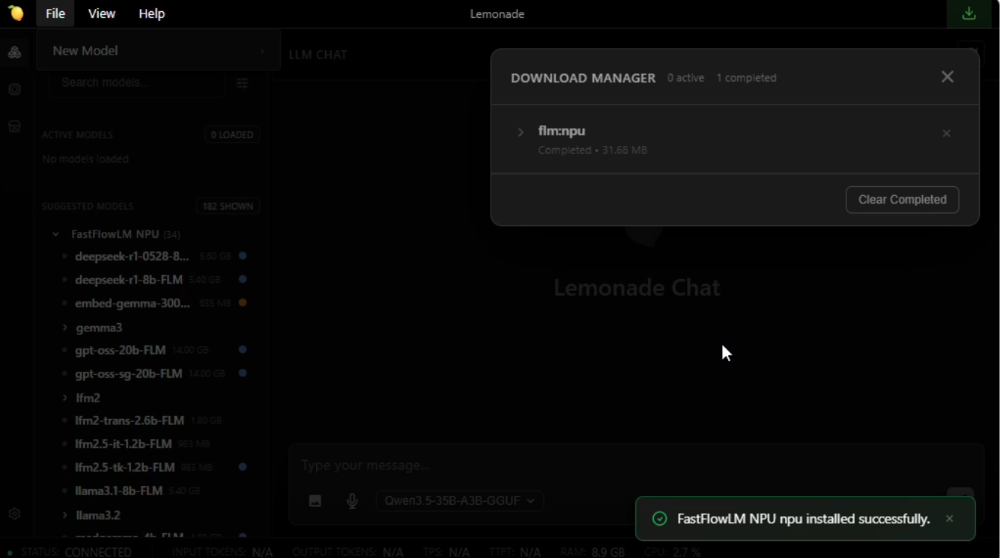

<!--
Copyright Advanced Micro Devices, Inc.

SPDX-License-Identifier: MIT
-->

<!-- @github-only -->
> [!IMPORTANT]
> This playbook uses special tags that GitHub cannot render. Please visit [amd.com/playbooks](https://amd.com/playbooks) to correctly preview this content.
<!-- @github-only:end -->

## Overview

🍋 **Lemonade** is an open-source local AI server that lets you run large language models (LLMs), image generators, and audio models directly on your own hardware. It exposes the models through the industry-standard **OpenAI API**, so any app that works with OpenAI can instantly work with Lemonade. By the end of the playbook, you'll be using Lemonade to run models locally on your machine.

## What You'll Learn

By the end of this playbook you will be able to:

* **Install Lemonade Server** and verify it is running.
* **Download and chat with an LLM** using a single command.
* **Explore the web UI** and try different modalities such as vision, speech-to-text, and image generation.
* **Switch GPU backends** between Vulkan and AMD ROCm™ software.
* **Build a Python app** powered by a local LLM using the OpenAI-compatible API.
* **Run models on the AMD Neural Processing Unit (NPU)** using Hybrid and FLM execution modes on AMD Ryzen™ AI hardware.

## Setting the Memory Configuration

<!-- @require:memory-config -->

<!-- @device:halo_box -->
## Check for Software Updates

<!-- @require:software-update -->
<!-- @device:end -->

## Installing Software Prerequisites

Before you begin, make sure you have:

- A PC running **Windows 11** or a supported **Linux** distribution (Ubuntu 24.04+, Fedora, Debian)
- **16 GB of RAM** is recommended for the runtime model used in Steps 1–7 (`Gemma-4-E2B-it-GGUF`, ~3 GB). **32 GB+** is recommended if you want to use the larger code-generation model in Step 6 (`Qwen3.5-35B-A3B-GGUF`, ~20 GB).
- **~4–30 GB of free disk space**, depending on the models you download. The largest model in this guide is about 20 GB.
- **Python 3.10–3.13** (used in the Python app section)
- An internet connection (wired or wireless)
- [Optional] An AMD XDNA 2 NPU (Ryzen AI 300/400/Max 300 series or Z2 Extreme) with the latest driver installed from [Ryzen AI Software Installation Instructions](https://ryzenai.docs.amd.com/en/latest/inst.html#install-npu-drivers) if you want to run a model on the NPU.

<!-- @require:lemonade -->

<!-- @test:id=lemonade-version timeout=60 hidden=True -->
```bash
lemonade --version
```
<!-- @test:end -->

<!-- @os:windows -->
<!-- @test:id=lemonade-chat-gemma-windows timeout=1200 hidden=True -->
```powershell

# Wait for server to come up
$modelsJson = $null
for ($i=0; $i -lt 120; $i++) {
  $modelsJson = curl.exe -s --max-time 2 http://127.0.0.1:13305/api/v1/models
  if ($modelsJson) { break }
  Start-Sleep -Seconds 1
}
if (-not $modelsJson) { throw "Lemonade server not ready on http://127.0.0.1:13305" }
Write-Host "OK: Lemonade server is responding"

# Now that the server is responding, check if model is downloaded in Lemonade(robust JSON parse)
$parsed = $modelsJson | ConvertFrom-Json
$entry  = $parsed.data | Where-Object { $_.id -eq "Gemma-4-E2B-it-GGUF" } | Select-Object -First 1
if (-not $entry) { throw "Model Gemma-4-E2B-it-GGUF is not present in Lemonade /api/v1/models." }
if (-not $entry.downloaded) { throw "Model Gemma-4-E2B-it-GGUF is present but not downloaded in Lemonade. Please download it." }
Write-Host "OK: Gemma-4-E2B-it-GGUF model is downloaded in Lemonade"

# Model chat test
$body = @{
  model = "Gemma-4-E2B-it-GGUF"
  messages = @(@{ role = "user"; content = "Reply with exactly: OK" })
  temperature = 0
  max_tokens = 500
} | ConvertTo-Json -Depth 5
$out = curl.exe -s --max-time 300 http://127.0.0.1:13305/api/v1/chat/completions -H "Content-Type: application/json" -d $body
if (-not $out) { throw "Empty response from Lemonade chat/completions" }
Write-Host "OK: Model Gemma-4-E2B-it-GGUF responded"
```
<!-- @test:end -->
<!-- @os:end -->


<!-- @os:linux -->
<!-- @test:id=lemonade-chat-gemma-linux timeout=1200 hidden=True -->
```bash
set -euo pipefail

models_json=""
for i in $(seq 1 120); do
  models_json="$(curl -s --max-time 2 http://127.0.0.1:13305/api/v1/models || true)"
  if [ -n "$models_json" ]; then
    break
  fi
  sleep 1
done

if [ -z "$models_json" ]; then
  echo "Lemonade server not ready on http://127.0.0.1:13305"
  exit 1
fi
echo "OK: Lemonade server is responding"

export MODELS_JSON="$models_json"
python3 - <<'PY'
import json
import os
import sys

data = json.loads(os.environ["MODELS_JSON"])
entry = None
for item in data.get("data", []):
    if item.get("id") == "Gemma-4-E2B-it-GGUF":
        entry = item
        break

if entry is None:
    print("Model Gemma-4-E2B-it-GGUF is not present in Lemonade /api/v1/models.")
    sys.exit(1)

if not entry.get("downloaded", False):
    print("Model Gemma-4-E2B-it-GGUF is present but not downloaded in Lemonade. Please download it.")
    sys.exit(1)

print("OK: Gemma-4-E2B-it-GGUF model is downloaded in Lemonade")
PY

body='{
  "model": "Gemma-4-E2B-it-GGUF",
  "messages": [{"role": "user", "content": "Reply with exactly: OK"}],
  "temperature": 0,
  "max_tokens": 500
}'

out="$(curl -s --max-time 300 http://127.0.0.1:13305/api/v1/chat/completions \
  -H "Content-Type: application/json" \
  -d "$body" || true)"

if [ -z "$out" ]; then
  echo "Empty response from Lemonade chat/completions"
  exit 1
fi

echo "OK: Model Gemma-4-E2B-it-GGUF responded"
```
<!-- @test:end -->
<!-- @os:end -->

---

## Core Concepts — How Local AI Servers Work

Before we run a model, it is worth understanding *why* things are set up this way. Lemonade is a **local model server**, a process that loads AI models into memory and exposes them to applications over HTTP, just like a cloud AI service would.

### Why a Server?

| Benefit | What It Means for You |
|---------|----------------------|
| **Simplified integration** | Apps talk to one HTTP API instead of dealing with hardware-specific C++ or Python libraries. |
| **Shared models** | A single loaded model can serve multiple apps at once, no duplicate copies eating your RAM. |
| **Cloud-to-local portability** | Code written for OpenAI's cloud API works with Lemonade by changing one URL. |
| **Separation of concerns** | Model management, streaming, and fault tolerance are handled by the server so developers can focus on their app. |

### The OpenAI API Standard

Lemonade implements the **OpenAI API**, the same interface used by ChatGPT, Azure OpenAI, and dozens of other services. The conversation model is simple:

| Role | Who Is Talking |
|------|---------------|
| **system** | Instructions to the model (persona, constraints, available tools) |
| **user** | Messages from the human (or application) to the model |
| **assistant** | Responses generated by the model |

This means any library or app that supports OpenAI can talk to Lemonade by pointing it at `http://localhost:13305/api/v1` while Lemonade Server is running.

## Main Activity — Your First Local AI Chat

Let's download an LLM and have a conversation with it, running the AI entirely on your own machine.

### Step 1: Download and Run a Model

Lemonade ships with a curated model library. Let's start with **Gemma-4-E2B-it**, a capable and compact model that includes vision support. Open a terminal and run:

```
lemonade run Gemma-4-E2B-it-GGUF
```

This single command does three things:

1. **Downloads** the model (~3 GB) from Hugging Face, if it is not already downloaded. (May take some time)
2. **Starts** the Lemonade Server process on port 13305.
3. **Opens Lemonade App** so you can start chatting with the model.


<!-- @os:windows -->
On Windows, the Lemonade App launches automatically and you can begin chatting immediately. If you installed the `minimal.msi` package, the app is not included. To start chatting, open your web browser and go to `http://localhost:13305`.
<!-- @os:end -->

<!-- @os:linux -->
On Linux, open your browser and navigate to `http://localhost:13305` to access the web app.
<!-- @os:end -->

Try typing a question:

```
What are three fun facts about lemons?
```

The model will respond directly in the chat window. **Congratulations! You are running a large language model locally.**


In the Server Logs pane in the Lemonade App, you can find telemetry data about the model's performance after each response. For example:

```
 === Telemetry ===
Input tokens:  24
Output tokens: 527
TTFT (s):      0.052
TPS:           95.99
=================
```

### Step 2: Explore the Web Interface and Different Modalities

Lemonade includes a built-in web interface where you can:

- **Interact** with the loaded model in a familiar chat window
- **Browse models** in the Model Manager tab
- **Download new models** with one click

Try switching between different modalities using the **Model Manager** tab in the web UI where you can browse models by Recipe or by Category:

1. **Vision:** The `Gemma-4-E2B-it-GGUF` model you already have loaded supports vision. Paste an image into the chat box and ask the model to describe it.
2. **Image generation:** In the Image category, download an image model such as `SDXL-Turbo` from the Model Manager, then use the Lemonade Image Generator to type a prompt and generate an image locally.
3. **Audio:** In the Audio category, download an audio model such as `Whisper-Tiny`, which can do speech-to-text. Provide a recording of audio to transcribe it locally. For text-to-speech, try one of the models in the Speech category, such as `kokoro-v1`.


### Step 3: Try a Model with a Different Backend

If you hover over a model in the Lemonade App, you'll see a gear icon. Clicking this allows you to select options for the model, including choosing your desired backend.

By default, Lemonade uses Vulkan for GPU acceleration. If you have a supported AMD discrete GPU, you can switch to ROCm.


To manage your installed backends, click the backend button in the leftmost column.

Alternatively, you can specify the backend using the following command:

```
lemonade run Gemma-4-E2B-it-GGUF --llamacpp rocm
```

You can also set your default backend using the environment variable `LEMONADE_LLAMACPP` with the values: `vulkan`, `rocm`, or `cpu`.

---

## Going Deeper — Build an AI-Powered App with Python

The real power of a local AI server is that any application can connect to it using just a few lines of code. To prove it, let's build a small but functional **study flashcard generator** where you give it a topic, it generates flashcards, and you can quiz yourself interactively.

### Step 4: Start the Server

Verify that the Lemonade server is running. It typically starts automatically in the background after installation. To verify, run:

```
lemonade status
```

You should see a message like: `Server is running on port 13305`.

If the server isn't running, start it by opening the Lemonade app. Use the default port **13305** (you can confirm or select this from the tray icon).

### Step 5: Install the OpenAI Python Client

In a terminal, create a venv and install the OpenAI Python Client using the following commands:
<!-- @os:linux -->
```bash
# Your specific version of Linux may have different commands
sudo apt update
sudo apt install -y python3-venv
python3 -m venv lemonade-env
source lemonade-env/bin/activate
pip install openai
```
<!-- @os:end -->
<!-- @os:windows -->
```powershell
python -m venv lemonade-env
lemonade-env\Scripts\activate
pip install openai
```
<!-- @os:end -->


<!-- @os:windows -->
<!-- @test:id=env-check-windows timeout=300 hidden=True -->
```powershell
python --version
where.exe python
where.exe pip
python -c "import sys; print(sys.executable)"
python -m pip --version
```
<!-- @test:end -->
<!-- @os:end -->

<!-- @os:linux -->
<!-- @test:id=env-check-linux timeout=300 hidden=True -->
```bash
python3 --version
which python3
which pip3
python3 -c "import sys; print(sys.executable)"
python3 -m pip --version
```
<!-- @test:end -->
<!-- @os:end -->

<!-- @os:windows -->
<!-- @test:id=pip-install-openai-windows timeout=300 hidden=True -->
```powershell
python -m pip install openai
```
<!-- @test:end -->
<!-- @os:end -->

<!-- @os:linux -->
<!-- @test:id=pip-install-openai-linux timeout=300 hidden=True -->
```bash
python3 -m pip install openai
```
<!-- @test:end -->
<!-- @os:end -->

<!-- @os:windows -->
<!-- @test:id=python-openai-import-windows timeout=120 hidden=True -->
```powershell
python -m pip show openai
python -c "from openai import OpenAI; print('OK')"
```
<!-- @test:end -->
<!-- @os:end -->

<!-- @os:linux -->
<!-- @test:id=python-openai-import-linux timeout=120 hidden=True -->
```bash
python3 -m pip show openai
python3 -c "from openai import OpenAI; print('OK')"
```
<!-- @test:end -->
<!-- @os:end -->

### Step 6: Build the Flashcard App

Let's download a different model to generate code: `Qwen3.5-35B-A3B-GGUF`. This is a large (~20 GB) and performant model best suited to systems with 32 GB+ of RAM. If you have less RAM available, try `Qwen3.5-9B-GGUF` (~6 GB) instead.

You can download it from the UI or run the following:
```
lemonade run Qwen3.5-35B-A3B-GGUF
```

Feed the following prompt into Lemonade Chat UI to generate code for a simple Flashcard app. 

We'll use Qwen3.5-35B-A3B-GGUF (a larger model better at writing code) to generate our Python app, and the app itself will call Gemma-4-E2B-it-GGUF (the smaller model you already downloaded) at runtime. The code can then be copied to a file of your choice to be run in Python.

```
Generate a Python script that uses the OpenAI Python library to call a local LLM and create an interactive flashcard study tool.

Connection details:
- Base URL: http://localhost:13305/api/v1
- API key: "lemonade"
- Model to use: "Gemma-4-E2B-it-GGUF"

Structure:

1. A `generate_flashcards(topic, count=5)` function that:
   - Sends a system message instructing the LLM to return ONLY a JSON array of objects with "question" and "answer" fields.
   - Handles malformed JSON gracefully.
   - Returns the parsed list of cards, or an empty list if parsing fails.

2. A `quiz(cards)` function that shuffles the cards and, for each card:
   - Prints `--- Card i/N ---`.
   - Prints `Q: <question>`.
   - Waits for the user to press Enter ("Press Enter to reveal the answer...").
   - Prints `A: <answer>`.
   - Asks "Did you get it right? (y/n): " and tracks the score.
   - At the end, prints `🏆 Score: <score>/<total>`.

3. A main loop that:
   - Prints a `🍋 Lemonade Flashcard Generator` banner on startup.
   - Asks the user for a topic (typing "quit" exits).
   - Prints `✨ Generating N flashcards on: <topic>`.
   - Calls `generate_flashcards` and lists the generated questions as an indented numbered list (`  1. ...`).
   - Offers to start the quiz.
```

> **Tip**: We have followed standard engineering practices through thorough prompt creation and by using a two-model system to optimize resources and speed.

For your convenience, we have provided sample output in [`flashcards.py`](assets/flashcards.py). Feel free to download it to your directory. Either way, you should now have a Python file that can be run.

<!-- @os:windows -->
<!-- @test:id=lemonade-python-smoke-windows timeout=900 hidden=True -->
```powershell
# Wait for server to come up
$modelsJson = $null
for ($i=0; $i -lt 120; $i++) {
  $modelsJson = curl.exe -s --max-time 2 http://127.0.0.1:13305/api/v1/models
  if ($modelsJson) { break }
  Start-Sleep -Seconds 1
}
if (-not $modelsJson) { throw "Lemonade server not ready on http://127.0.0.1:13305" }
Write-Host "OK: Lemonade server is responding"

Start-Sleep -Seconds 5
python lemonade_python_smoke.py
```
<!-- @test:end -->
<!-- @os:end -->


<!-- @os:linux -->
<!-- @test:id=lemonade-python-smoke-linux timeout=600 hidden=True -->
```bash
set -euo pipefail

models_json=""
for i in $(seq 1 120); do
  models_json="$(curl -s --max-time 2 http://127.0.0.1:13305/api/v1/models || true)"
  if [ -n "$models_json" ]; then
    break
  fi
  sleep 1
done

if [ -z "$models_json" ]; then
  echo "Lemonade server not ready on http://127.0.0.1:13305"
  exit 1
fi
echo "OK: Lemonade server is responding"

sleep 5
python3 lemonade_python_smoke.py
```
<!-- @test:end -->
<!-- @os:end -->


### Step 7: Run The Generated Code

```bash
# Ensure the virtual environment is running
python flashcards.py # replace with your file name
```

**Here's what you should see:**

```
🍋 Lemonade Flashcard Generator
================================
Powered by a local LLM running on your own hardware.

Enter a topic (or "quit" to exit): the solar system

✨ Generating 5 flashcards on: the solar system

Generated 5 cards!

  1. Which planet is closest to the Sun?
  2. What is the largest planet in our solar system?
  3. Which planet is known as the "Red Planet"?
  4. How many moons does Earth have?
  5. What separates the inner planets from the outer planets?

Start quiz? (y/n): y

--- Card 1/5 ---
Q: What is the largest planet in our solar system?

Press Enter to reveal the answer...
A: Jupiter is the largest planet, with a diameter of about 139,820 km.

Did you get it right? (y/n): y

...

🏆 Score: 4/5
```

In about 150 lines of code you have built a fully functional study tool powered by a local LLM. There is no API key to manage, no usage costs, and no data ever leaves your machine.

> **Key insight:** Notice the `client = OpenAI(base_url=...) ` line is the *only* thing tying this app to Lemonade instead of OpenAI's cloud. The rest of the code is identical to what you would write against any OpenAI-compatible service. If you have ever used the OpenAI Python library, you already know how to build apps with Lemonade.

### What This Demonstrates

This small app exercises several real-world integration patterns:

| Pattern | Where It Appears |
|---------|-----------------|
| **System prompts** | The `"system"` message tells the LLM to output structured JSON |
| **Structured output** | The app parses the LLM's response as JSON to build flashcards |
| **Stateless requests** | Each `generate_flashcards()` call is independent |
| **Error handling** | The `try/except` gracefully handles cases where the LLM's output is not valid JSON |

These same patterns scale to any application such as chatbots, code assistants, content generators, automation tools.

#### Bonus Challenge

* For an added challenge, try updating the app to have the flashcards read to the user by referencing the example provided [here](https://github.com/lemonade-sdk/lemonade/blob/main/examples/api_text_to_speech.py).

---

## Running Models on the NPU (Optional)

If you have a Ryzen AI 300/400/Max 300 series or Z2 Extreme, your device has a built-in **Neural Processing Unit (NPU)**, a dedicated chip designed specifically for AI workloads. Running models on the NPU is more power-efficient than using the GPU, which makes it ideal for background AI tasks, longer sessions, and battery-powered use.

Lemonade supports three NPU execution modes, all transparent behind the same OpenAI API:

| Mode | How It Works | Recipe | Example Models |
|------|-------------|--------|----------------|
| **Hybrid (NPU + iGPU)** | NPU processes the prompt, iGPU generates tokens | OGA (`oga-hybrid`) | Qwen3-4B-Hybrid |
| **NPU-only** | Entire inference runs on the NPU | Ryzen AI LLM (`ryzenai-llm`) | Qwen-2.5-7B-Instruct-NPU |
| **FLM** | Uses FastFlowLM engine on the NPU, optimized for AMD XDNA2 | FLM (`flm`) | qwen3.5-4b-FLM |

### Requirements

- **AMD Ryzen AI 300/400 series or Z2 series** processor
- For **FLM** models: The FLM runtime can be installed from within the Lemonade app or Lemonade will automatically install the FLM runtime when running an FLM model. To learn more about FastFlowLM, see [here](https://fastflowlm.com/docs/).


### Step 8: Run a Hybrid Model

Hybrid models split work between the NPU and iGPU for a good balance of speed and efficiency. In the Lemonade App, select a model from the `Ryzen AI LLM` list, for example, `Qwen3-4B-Hybrid`, or run it using the following command:

```
lemonade run Qwen3-4B-Hybrid
```

Lemonade detects your NPU automatically and installs the **Ryzen AI LLM** backend.

> **What is happening under the hood?** When you send a message, the NPU processes your entire prompt in parallel (this is called "prefill"). Then, the iGPU takes over to generate the response one token at a time (this is called "decode"). This hybrid approach plays to each chip's strengths.

### Step 9: Run an FLM Model

FastFlowLM (FLM) models are specifically optimized for AMD's XDNA2 NPU architecture and can be very fast for their size. For example, select `qwen3.5-4b-FLM` from the `FastFlowLM NPU` list or use the following command:

<!-- @os:windows -->
To enable `FastFlowLM` on Windows:

* Open the `Backends Manager` menu.
* Locate `FastFlowLM NPU` backend category.
* Click Install NPU.
* Once installation is complete, ~36 defaults models will be available under the FFLM dropdown menu.
<!-- @os:end -->

<!-- @os:linux -->
When the `Lemonade` App is launched for the first time, the `FastFlowNPU` backend is not enabled by default. 
The local app will open the installation page to guide you through setup.

To enable `FastFlowLM` on Linux:

* Open the `Lemonade` App.
* Visit the [official FLM](https://lemonade-server.ai/flm_npu_linux.html) documentation and follow the installation steps for FLM by selecting your Linux distribution.
* Enable backports as instructed on the installation page.
* Download the latest `v0.9.x` release from the [tags page](https://github.com/FastFlowLM/FastFlowLM/tags).
<!-- @device:halo_box -->
>[!Note]
For AMD Halo Developer Platform, make sure to choose Debian 13.
```
fastflowlm_0.9.X_debian13_amd64.deb
```
<!-- @device:end -->

<!-- @device:halo,sx,krk,rx7900xt,rx9070xt -->
```
fastflowlm_0.9.X_ubuntuY.Z_amd64.deb
```
<!-- @device:end -->
* Install the downloaded `.deb` package.
* Recommended: Quit the `Lemonade App` and open it again so the changes are detected.
* Recommended: Open `Backends Manager` and click Install `FastFlowNPU` Backend.
<!-- @os:end -->

After a successful installation, you should see that `flm:npu` completed in the **Download Manager** inside the **Lemonade Desktop App**.
<p align="center">
  
</p>
You can then select any of the available FFLM models and start using the NPU backend.

For specific model, download desired model from [models page](https://fastflowlm.com/docs/models/qwen/) and validate it using the Shell command provided in the documentation.
```
flm run qwen3.5-4b-FLM
```
or via 
```
lemonade run qwen3.5-4b-FLM
```

FLM models include some of the most popular architectures (Gemma 3, Qwen 3, Llama 3, and DeepSeek R1) and range from under 1 GB to over 13 GB.
Lemonade detects your NPU automatically and installs the **FastFlowLM NPU** backend.

<!-- @os:windows -->
> **Tip:** For best NPU performance, enable turbo mode:
> ```
> cd C:\Windows\System32\AMD
> .\xrt-smi configure --pmode turbo
> ```
<!-- @os:end -->

### Switching Models

The flashcard app from Step 6 works on NPU models too, just change the model name:

```python
# In flashcards.py, swap the model to run on NPU instead of GPU
response = client.chat.completions.create(
    model="Qwen3-4B-Hybrid",  # swap in any NPU/Hybrid/FLM model
    messages=messages,
)
```

## Next Steps

You have a local AI server running on your own hardware, here is where to go next:

1. **Connect your favorite apps**: Lemonade works out of the box with [VS Code Copilot](https://marketplace.visualstudio.com/items?itemName=lemonade-sdk.lemonade-sdk), [Open WebUI](https://lemonade-server.ai/docs/server/apps/open-webui/), [Continue](https://lemonade-server.ai/docs/server/apps/continue/), [n8n](https://n8n.io/integrations/lemonade-model/), and [many more](https://lemonade-server.ai/marketplace).

2. **Browse more models**: Explore the full [model library](https://lemonade-server.ai/docs/server/server_models/) to find models optimized for coding, reasoning, vision, and more. Use the Lemonade App or `lemonade list` to see what is available.

3. **Unlock ROCm GPU acceleration**: If you have a supported AMD GPU, switch to the ROCm backend: `lemonade config set llamacpp.backend=rocm`. See [supported AMD GPUs](https://github.com/lemonade-sdk/lemonade?tab=readme-ov-file#supported-configurations).

4. **Read the full API spec**: Lemonade supports chat completions, embeddings, audio transcription, image generation, text-to-speech, and more. See the [Server Spec](https://lemonade-server.ai/docs/server/server_spec/) for every endpoint.

5. **Contribute**: Lemonade is open source. Check out the [contribution guide](https://github.com/lemonade-sdk/lemonade/blob/main/docs/contribute.md) and look for [Good First Issues](https://github.com/lemonade-sdk/lemonade/issues?q=is%3Aissue+is%3Aopen+label%3A%22good+first+issue%22).
