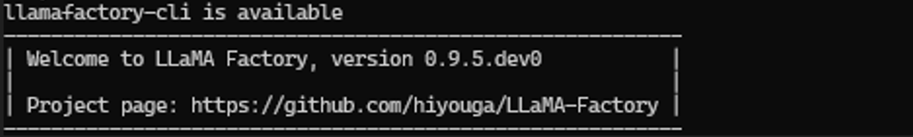

# LLM Fine-Tuning with LLaMA Factory

## Overview

Efficient fine-tuning is vital for adapting large language models (LLMs) to downstream tasks. LLaMA Factory is an open-source and user-friendly platform that streamlines the training and fine-tuning of large language models and multimodal models. It allows users to customize hundreds of pre-trained models locally with minimal coding.

This playbook teaches you how to fine-tune LLMs using LLaMA Factory on your local AMD hardware.

## What you'll learn

- How to set up LLaMA Factory with AMD ROCm™ software
- How to configure LLM fine-tuning parameters (using Qwen/Qwen3-4B-Instruct-2507 as an example)
- How to run LLaMA Factory fine-tuning
- How to run inference with the fine-tuned model
- How to export the fine-tuned model 

## Estimated Time

- Duration: It will take about 60 minutes to run this playbook (depending on your model/dataset size and network speed).
- View the [LLaMA Factory GitHub](https://github.com/hiyouga/LlamaFactory) for more information.

## Setting up the Environment

<!-- @os:linux -->
<!-- @test:id=python-prereqs-check timeout=120 hidden=True -->
```bash
python3 --version
pip --version
```
<!-- @test:end -->
<!-- @os:end -->

<!-- @os:windows -->
<!-- @test:id=python-prereqs-check timeout=120 hidden=True -->
```powershell
python --version
pip --version
```
<!-- @test:end -->
<!-- @os:end -->

<!-- @device:halo,stx,krk,rx7900xt,rx9070xt -->
#### Create a Virtual Environment

<!-- @os:linux -->
<!-- @test:id=create-venv timeout=120 -->
```bash
sudo apt update
sudo apt install -y python3-venv
python3 -m venv venv
source venv/bin/activate
```
<!-- @test:end --> 
<!-- @setup:id=activate-venv command="source venv/bin/activate" -->
<!-- @os:end -->

<!-- @os:windows -->
<!-- @test:id=create-venv timeout=120 -->
```powershell
python -m venv venv
venv\Scripts\activate
```
<!-- @test:end --> 
<!-- @setup:id=activate-venv command="venv\Scripts\activate" --> 
<!-- @os:end -->
<!-- @device:end -->

### Installing Basic Dependencies

<!-- @os:linux -->
<!-- @require:rocm,pytorch,driver -->
<!-- @os:end -->
<!-- @os:windows -->
<!-- @require:pytorch,driver -->
<!-- @os:end -->
 
### Installing Additional Dependencies

- **Python**: ensure minimum version is 3.11
<!-- @device:halo_box -->
```bash
pip install huggingface_hub --break-system-packages
```
<!-- @device:end -->

<!-- @device:halo,stx,krk,rx7900xt,rx9070xt -->
```bash
pip install huggingface_hub 
```
<!-- @device:end -->

<!-- @os:linux -->
<!-- @test:id=install-deps timeout=300 hidden=True setup=activate-venv -->
```bash
python3 -m pip install --upgrade pip
python3 -m pip install huggingface_hub
```
<!-- @test:end -->
<!-- @os:end -->

<!-- @os:windows -->
<!-- @test:id=install-deps timeout=300 hidden=True setup=activate-venv -->
```powershell
python -m pip install --upgrade pip
python -m pip install huggingface_hub
```
<!-- @test:end --> 
<!-- @os:end -->

### Install LLaMA Factory

LLaMA Factory depends on PyTorch. You should already have it installed per the above requirements.

Download the source code from [LLaMA Factory official GitHub repository](https://github.com/hiyouga/LlamaFactory), and install its dependencies.

<!-- @device:halo_box -->
<!-- @test:id=install-llamafactory timeout=900 setup=activate-venv -->
```bash
git clone --depth 1 https://github.com/hiyouga/LlamaFactory.git
cd LlamaFactory
pip install setuptools --break-system-packages
pip install -e . --break-system-packages
pip install -r requirements/metrics.txt --break-system-packages
```
<!-- @test:end --> 
<!-- @device:end -->

<!-- @device:halo,stx,krk,rx7900xt,rx9070xt -->
<!-- @test:id=install-llamafactory timeout=900 setup=activate-venv -->
```bash
git clone --depth 1 https://github.com/hiyouga/LlamaFactory.git
cd LlamaFactory
pip install -e .
pip install -r requirements/metrics.txt 
```
<!-- @test:end --> 
<!-- @device:end -->

Verify if `llamafactory-cli` is executable.

<!-- @os:linux -->
<!-- @test:id=verify-llamafactory-cli timeout=60 hidden=False setup=activate-venv -->
```bash
cd LlamaFactory
llamafactory-cli version || python -m llamafactory.cli version || true
echo "llamafactory-cli is available"
command -v llamafactory-cli
```
<!-- @test:end --> 
<!-- @os:end -->

<!-- @os:windows -->
<!-- @test:id=verify-llamafactory-cli timeout=60 hidden=False setup=activate-venv -->
```powershell
cd LlamaFactory
if (Get-Command llamafactory-cli -ErrorAction SilentlyContinue) {
    llamafactory-cli version
    Write-Host "llamafactory-cli is available"
} else {
    Write-Host "llamafactory-cli is not available"
}
```
<!-- @test:end --> 
<!-- @os:end -->

Example output:

<p align="center">
  
</p>

Having successfully installed LLaMA Factory, let's run fine-tuning on it.

## Using LLaMA Factory CLI for Fine Tuning 

This section will cover how to prepare fine-tuning datasets, configure LoRA/QLoRA parameters, and run LoRA fine-tuning.

### Dataset Preparation

LLaMA Factory supports fine-tuning datasets in the Alpaca format and ShareGPT format. All the available datasets have been defined in the [dataset_info.json](https://github.com/hiyouga/LlamaFactory/blob/main/data/dataset_info.json). If you are using a custom dataset, please make sure to add a dataset description in `dataset_info.json` and specify the dataset name before training. Details can be found in their docs [here](https://llamafactory.readthedocs.io/en/latest/getting_started/data_preparation.html).

In this playbook, we will use the identity and alpaca_en_demo datasets as an example, and configure the dataset information in the next step.


### Fine-tuning parameter configuration

LLaMA Factory supports multiple fine-tuning schemes.

| Fine-Tuning schemes | LLaMA Factory Examples |
|-----------|------|
| Full-Parameter    | [examples/train_full](https://github.com/hiyouga/LlamaFactory/tree/main/examples/train_full) |
| LoRA fine-tuning  | [examples/train_lora](https://github.com/hiyouga/LlamaFactory/tree/main/examples/train_lora) |
| QLoRA fine-tuning | [examples/train_qlora](https://github.com/hiyouga/LlamaFactory/tree/main/examples/train_qlora) |

<!-- @test:id=verify-llamafactory-files timeout=60 hidden=True setup=activate-venv -->
```python
import os
import sys

base = "LlamaFactory"
required = [
    "examples/train_lora/qwen3_lora_sft.yaml",
    "examples/inference/qwen3_lora_sft.yaml",
    "examples/merge_lora/qwen3_lora_sft.yaml",
]

missing = [p for p in required if not os.path.exists(os.path.join(base, p))]
if missing:
    print(f"FAIL: Missing required files: {missing}")
    sys.exit(1)

print("PASS: Required LLaMA Factory example files exist")
```
<!-- @test:end -->

These example configuration files have specified model parameters, fine-tuning method parameters, dataset parameters, evaluation parameters, and more. You can configure them according to your own needs. In this playbook, we will use [qwen3_lora_sft.yaml](https://github.com/hiyouga/LlamaFactory/blob/main/examples/train_lora/qwen3_lora_sft.yaml). 

**Key parameters explained:**
- `model_name_or_path` - HuggingFace Model name or local model file path.
- `stage` - Training stage. Options: rm (reward modeling), pt (pretrain), sft (Supervised Fine-Tuning), PPO, DPO, KTO, ORPO.
- `do_train` - true for training, false for evaluation
- `finetuning_type` - Fine-tuning method. Options: freeze, lora, full
- `lora_rank` - The dimensionality of the low-rank matrix used in LoRA, typical values: 4, 6, 8, 16 (smaller values = fewer parameters = faster fine-tuning; larger values = better task adaptation but higher resource usage).
- `lora_target` - Target modules for LoRA method. Default: all.
- `dataset` - Dataset(s) to use. Use “,” to separate multiple datasets
- `output_dir` - Fine-tuning Output path
- `logging_steps` - Logging interval in steps
- `save_steps` - Model checkpoint saving interval.
- `overwrite_output_dir` - Whether to allow overwriting the output directory.
- `per_device_train_batch_size` - Training batch size per device.
- `gradient_accumulation_steps` - Number of gradient accumulation steps.
- `learning_rate` - Learning rate
- `num_train_epochs` - Number of training epochs
- `lr_scheduler_type` - Learning rate schedule. Options: linear, cosine, polynomial, constant, etc.
- `warmup_ratio` - Learning rate warmup ratio

<!-- @os:linux -->
We will modify the default value of `lora_rank` to run fine-tuning on AMD Ryzen™ & AMD Radeon™ GPUs.
```bash
sed -i.bak 's/lora_rank: 8/lora_rank: 6/g' examples/train_lora/qwen3_lora_sft.yaml
```
<!-- @os:end -->

<!-- @os:windows -->
We will update the default LoRA fine-tuning configuration for better compatibility with AMD Ryzen™ and AMD Radeon™ GPUs:
- Set `lora_rank` from `8` to `6` to reduce memory usage during fine-tuning.
- Use `fp16` instead of `bf16` for broader AMD GPU compatibility and lower memory usage.
- Set `dataloader_num_workers` to `0` on Windows to avoid `"Can't pickle local object<>"` errors caused by multiprocessing data loading.

```powershell
$filePath = "examples/train_lora/qwen3_lora_sft.yaml"

# Create a backup before modifying the YAML file
Copy-Item -Path $filePath -Destination "$filePath.bak" -Force

# Read the file and update the training settings
$content = Get-Content -Path $filePath -Raw

$newContent = $content `
  -replace 'lora_rank: 8', 'lora_rank: 6' `
  -replace 'bf16: true', 'fp16: true' `
  -replace 'dataloader_num_workers: 4', 'dataloader_num_workers: 0'

Set-Content -Path $filePath -Value $newContent
```
<!-- @os:end -->

### Run LLaMA Factory Fine-Tuning 

**llamafactory-cli** is the official command-line interface (CLI) tool for LLaMA Factory, developed to simplify end-to-end LLM workflows (data preparation → fine-tuning → evaluation → deployment) without writing complex code.

For training/fine-tuning, **llamafactory-cli train** is the core subcommand of the LLaMA Factory CLI. It abstracts fine-tuning workflows (data preprocessing, hyperparameter tuning, hardware optimization) into a single CLI command, supporting multiple fine-tuning paradigms (LoRA/QLoRA/Full Fine-Tuning) and is optimized for low-resource GPUs (e.g., QLoRA on 16GB VRAM).

You can run LLaMA Factory fine-tuning using the following command, which is based on the modified configuration file of Qwen3 LoRA fine-tuning.

```bash
llamafactory-cli train examples/train_lora/qwen3_lora_sft.yaml
```

<!-- @os:linux -->
<!-- @test:id=quick-train-llamafactory-lora timeout=3600 hidden=True setup=activate-venv -->
```bash
cd LlamaFactory

cp examples/train_lora/qwen3_lora_sft.yaml examples/train_lora/qwen3_lora_sft_ci.yaml

sed -i 's/lora_rank: 8/lora_rank: 6/g' examples/train_lora/qwen3_lora_sft_ci.yaml || true
sed -i 's|output_dir: .*|output_dir: saves/qwen3_lora_sft_ci|g' examples/train_lora/qwen3_lora_sft_ci.yaml || true
sed -i 's/overwrite_output_dir: false/overwrite_output_dir: true/g' examples/train_lora/qwen3_lora_sft_ci.yaml || true
sed -i 's/per_device_train_batch_size: .*/per_device_train_batch_size: 1/g' examples/train_lora/qwen3_lora_sft_ci.yaml || true
sed -i 's/gradient_accumulation_steps: .*/gradient_accumulation_steps: 1/g' examples/train_lora/qwen3_lora_sft_ci.yaml || true
sed -i 's/num_train_epochs: .*/num_train_epochs: 1/g' examples/train_lora/qwen3_lora_sft_ci.yaml || true
sed -i 's/logging_steps: .*/logging_steps: 1/g' examples/train_lora/qwen3_lora_sft_ci.yaml || true
sed -i 's/save_steps: .*/save_steps: 5/g' examples/train_lora/qwen3_lora_sft_ci.yaml || true

llamafactory-cli train examples/train_lora/qwen3_lora_sft_ci.yaml
```
<!-- @test:end --> 
<!-- @os:end -->

<!-- @os:windows -->
<!-- @test:id=quick-train-llamafactory-lora timeout=3600 hidden=True setup=activate-venv -->
```powershell
Set-Location -Path "LlamaFactory"

Copy-Item -Path "examples/train_lora/qwen3_lora_sft.yaml" -Destination "examples/train_lora/qwen3_lora_sft_ci.yaml"

$filePath = "examples/train_lora/qwen3_lora_sft_ci.yaml"
(Get-Content -Path $filePath) -replace 'lora_rank: 8', 'lora_rank: 6' | Set-Content -Path $filePath
(Get-Content -Path $filePath) -replace 'bf16:\s*true', 'fp16: true' | Set-Content -Path $filePath
(Get-Content -Path $filePath) -replace 'dataloader_num_workers:\s*4', 'dataloader_num_workers: 0' | Set-Content -Path $filePath
(Get-Content -Path $filePath) -replace 'output_dir: .*', 'output_dir: saves/qwen3_lora_sft_ci' | Set-Content -Path $filePath
(Get-Content -Path $filePath) -replace 'overwrite_output_dir: false', 'overwrite_output_dir: true' | Set-Content -Path $filePath
(Get-Content -Path $filePath) -replace 'per_device_train_batch_size: .*', 'per_device_train_batch_size: 1' | Set-Content -Path $filePath
(Get-Content -Path $filePath) -replace 'gradient_accumulation_steps: .*', 'gradient_accumulation_steps: 1' | Set-Content -Path $filePath
(Get-Content -Path $filePath) -replace 'num_train_epochs: .*', 'num_train_epochs: 1' | Set-Content -Path $filePath
(Get-Content -Path $filePath) -replace 'logging_steps: .*', 'logging_steps: 1' | Set-Content -Path $filePath
(Get-Content -Path $filePath) -replace 'save_steps: .*', 'save_steps: 5' | Set-Content -Path $filePath

llamafactory-cli train examples/train_lora/qwen3_lora_sft_ci.yaml
```
<!-- @test:end --> 
<!-- @os:end -->

After running LLM finetuning, all generated outputs are stored in the "output_dir", including model checkpoint files, configuration files, and training metrics.

<p align="center">
  
</p>

<!-- @test:id=verify-llamafactory-train-output timeout=120 hidden=True setup=activate-venv -->
```python
import os
import sys
import glob

out_dir = "LlamaFactory/saves/qwen3_lora_sft_ci"
if not os.path.isdir(out_dir):
    print(f"FAIL: Missing output directory: {out_dir}")
    sys.exit(1)

required = [
    "adapter_config.json",
    "trainer_state.json",
    "training_args.bin",
]
missing = [f for f in required if not os.path.exists(os.path.join(out_dir, f))]
if missing:
    print(f"FAIL: Missing required files: {missing}")
    sys.exit(1)

adapter_weights = glob.glob(os.path.join(out_dir, "adapter_model*.safetensors")) + glob.glob(os.path.join(out_dir, "adapter_model*.bin"))
if not adapter_weights:
    print("FAIL: Missing adapter weights")
    sys.exit(1)

print("PASS: LLaMA Factory training output looks correct")
print(f"Found adapter weights: {adapter_weights}")
```
<!-- @test:end --> 

### Test the fine-tuned model 

**llamafactory-cli chat** is designed for interactive chat/inference with LLMs (both base models and LoRA-fine-tuned models). LLaMA Factory provides the sample configuration to run inference of fine-tuned models in [examples/inference](https://github.com/hiyouga/LlamaFactory/tree/main/examples/inference). You can also modify this sample configuration to change the settings, such as the inference backend.

Use the following command to test Qwen3 fine-tuned model:

```bash
llamafactory-cli chat examples/inference/qwen3_lora_sft.yaml
```
An example chat using the fine-tuned model is shown below:

<p align="center">
  
</p>


### Export the fine-tuned model

For production use-cases, the pre-trained model and the LoRA adapter need to be merged and exported into a single model. This merged model can be used as a normal Hugging Face model file. LLaMA Factory provides the sample configurations in [examples/merge_lora](https://github.com/hiyouga/LlamaFactory/tree/main/examples/merge_lora).

Use the following command to export Qwen3 fine-tuned model:

```bash
llamafactory-cli export examples/merge_lora/qwen3_lora_sft.yaml
```
The result of exporting the fine-tuned model is shown below.

<p align="center">
  
</p>

<!-- @os:linux -->
<!-- @test:id=export-llamafactory-model timeout=1800 hidden=True setup=activate-venv -->
```bash
cd LlamaFactory
pip install pyyaml

python - <<'PY'
import yaml
from pathlib import Path

src = Path("examples/merge_lora/qwen3_lora_sft.yaml")
dst = Path("examples/merge_lora/qwen3_lora_sft_ci.yaml")

cfg = yaml.safe_load(src.read_text())

cfg["adapter_name_or_path"] = "saves/qwen3_lora_sft_ci"
cfg["export_dir"] = "saves/qwen3_lora_sft_ci_merged"

dst.write_text(yaml.safe_dump(cfg, sort_keys=False))
print(f"Wrote {dst}")
PY

llamafactory-cli export examples/merge_lora/qwen3_lora_sft_ci.yaml
```
<!-- @test:end --> 
<!-- @os:end -->


<!-- @os:windows -->
<!-- @test:id=export-llamafactory-model timeout=1800 hidden=True setup=activate-venv -->
```powershell
Set-Location -Path "LlamaFactory"
pip install pyyaml

$script = @'
import yaml
from pathlib import Path

src = Path("examples/merge_lora/qwen3_lora_sft.yaml")
dst = Path("examples/merge_lora/qwen3_lora_sft_ci.yaml")

cfg = yaml.safe_load(src.read_text())

cfg["adapter_name_or_path"] = "saves/qwen3_lora_sft_ci"
cfg["export_dir"] = "saves/qwen3_lora_sft_ci_merged"

dst.write_text(yaml.safe_dump(cfg, sort_keys=False))
print(f"Wrote {dst}")
'@

$tempPy = Join-Path $env:TEMP "write_llamafactory_export_config.py"
Set-Content -Path $tempPy -Value $script -Encoding UTF8

python $tempPy
if ($LASTEXITCODE -ne 0) {
    Remove-Item $tempPy -Force -ErrorAction SilentlyContinue
    throw "FAIL: Could not create qwen3_lora_sft_ci.yaml"
}
Remove-Item $tempPy -Force -ErrorAction SilentlyContinue

if (-not (Test-Path "examples/merge_lora/qwen3_lora_sft_ci.yaml")) {throw "FAIL: examples/merge_lora/qwen3_lora_sft_ci.yaml was not created"}

llamafactory-cli export examples/merge_lora/qwen3_lora_sft_ci.yaml
if ($LASTEXITCODE -ne 0) {throw "FAIL: llamafactory-cli export failed"}
```
<!-- @test:end --> 
<!-- @os:end -->

<!-- @test:id=verify-llamafactory-export-output timeout=120 hidden=True setup=activate-venv -->
```python
import os
import sys
import glob

out_dir = "LlamaFactory/saves/qwen3_lora_sft_ci_merged"
if not os.path.isdir(out_dir):
    print(f"FAIL: Missing export directory: {out_dir}")
    sys.exit(1)

required = ["config.json",]
missing = [f for f in required if not os.path.exists(os.path.join(out_dir, f))]
if missing:
    print(f"FAIL: Missing required export files: {missing}")
    sys.exit(1)

model_files = (
    glob.glob(os.path.join(out_dir, "*.safetensors")) +
    glob.glob(os.path.join(out_dir, "pytorch_model*.bin"))
)
if not model_files:
    print("FAIL: Missing merged model weights")
    sys.exit(1)

print("PASS: Exported merged model output looks correct")
```
<!-- @test:end --> 

## Using LLaMA Factory GUI

`LLaMA-Factory` also supports zero-code fine-tuning of LLMs through a web UI in the browser.

Use the following command to open it:

```bash
llamafactory-cli webui
```
The `LlamaFactory Web UI` offers a streamlined interface for managing machine learning workflows, including training, evaluation, prediction, chatting, and exporting models. Here's a brief introduction to each tab:

* **Train**: This tab allows you to select a model and dataset, configure training parameters, and initiate the training process. It's essential to understand the mandatory and optional parameters to optimize the training setup.
* **Evaluate & Predict**: After training, you can evaluate the model's performance and make predictions using this tab. It provides insights into the model's accuracy and effectiveness on new data.
* **Chat**: Once training is complete, load the model in the Chat tab to interact with it and see the results of your work. This feature enables real-time communication with the trained model.
* **Export**: This tab facilitates the export of trained models for deployment or further use. You can save your models in various formats suitable for different applications.

For detailed guidance, we encourage you to refer to the official documentation on the [LlamaFactory GitHub repository](https://github.com/hiyouga/LlamaFactory#fine-tuning-with-llama-board-gui-powered-by-gradio) and the [LlamaFactory ReadTheDocs](https://llamafactory.readthedocs.io/en/latest). Additionally, the [Wiki LLaMA Board Web UI](https://deepwiki.com/xtong-zhang/Chain-of-Focus/3.2-llama-board-web-ui) provides valuable insights into the interface and its functionalities.

## Next Steps
- Try different models such as `gpt-oss` and other state of the art models.
- Experiment with different backends on the fine-tuned model
 
For more documentation, please visit: https://llamafactory.readthedocs.io/en/latest/ 
