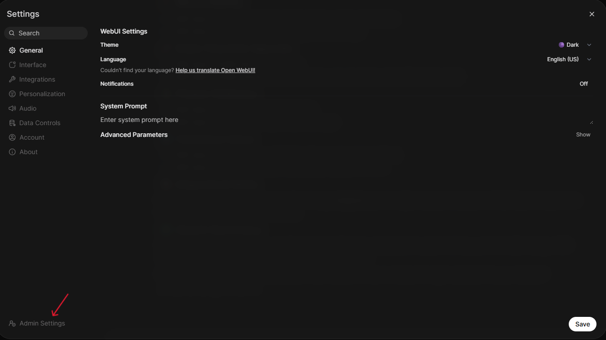
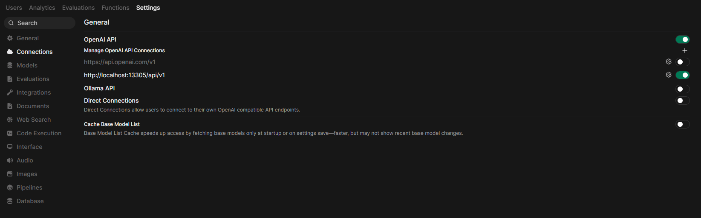
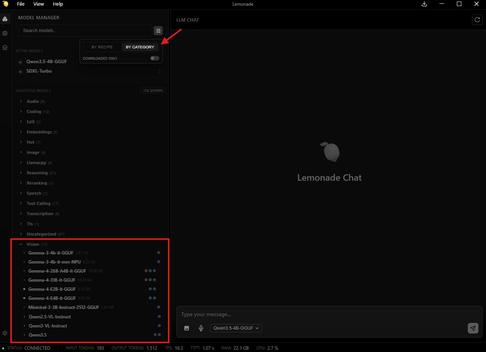

<!--
Copyright Advanced Micro Devices, Inc.

SPDX-License-Identifier: MIT
-->

<!-- @github-only -->
> [!IMPORTANT]
> This playbook uses special tags that GitHub cannot render. Please visit [amd.com/playbooks](https://amd.com/playbooks) to correctly preview this content.
<!-- @github-only:end -->

<!-- @device:stx,krk -->
> [!NOTE]
> This playbook requires a minimum of **32GB** of system memory.
<!-- @device:end -->

## Overview

[Open WebUI](https://docs.openwebui.com) is a self-hosted, browser-based interface that provides a familiar chatbot experience while acting as a frontend for one or more AI model servers. Instead of being tied to one provider, Open WebUI can connect to **any backend that exposes an OpenAI-compatible API**, so you can swap models and capabilities without switching UIs.

In this playbook, we use [**Lemonade**](https://lemonade-server.ai) as the backend because it exposes a **unified OpenAI-compatible endpoint** supporting multiple modalities:
- **Large Language Models (LLMs)** for text generation
- **Vision models** for image understanding
- **Stable Diffusion** for image generation
- **Audio transcription models** for speech-to-text

This setup enables you to explore the **complete multimodal workflow end-to-end**.

---

## What You’ll Learn

By the end, you’ll be able to:

- Connect Open WebUI to a local OpenAI-compatible backend (Lemonade)
- Chat with a local LLM from your browser
- Upload an image and ask a vision model questions about it
- Generate images from text prompts using Stable Diffusion models (SDXL-Turbo / SDXL)
- Understand the mental model so you can use other backends (Ollama, vLLM, llama.cpp server, etc.)

---

## Core Concepts (Mental Model)

### The Three Components

| Piece | What it does | Examples |
|---|---|---|
| Frontend (UI) | The web app you interact with | Open WebUI |
| Backend (Model Server) | Hosts models and exposes HTTP endpoints | Lemonade, Ollama, vLLM, llama.cpp server, OpenAI-compatible servers |
| Models | The actual LLM / Vision / Diffusion / Audio models | CodeLlama, DeepSeek, Gemma-MM, SDXL, SD-Turbo, Whisper |

#### Why “OpenAI-compatible API” matters

Open WebUI is built around standard OpenAI-style endpoints, like:
  - Chat: `/chat/completions`
  - Models list: `/models`
  - Image generation: `/images/generations`
  - Audio transcription: `/audio/transcriptions`

Lemonade exposes these under `http://localhost:13305/api/v1/...`

If a backend supports those endpoints, Open WebUI can talk to it with minimal setup. That’s why we can switch backends without changing our workflow.

#### Two services, two ports

Throughout this playbook you’ll work with two separate services:

| Service | URL | What you do there |
|---|---|---|
| **Lemonade** (GUI) | `http://localhost:13305` | Browse, download, and manage models |
| **Open WebUI** | `http://localhost:8080` | Chat, upload images, generate images — the user-facing UI |

Lemonade runs the models; Open WebUI is the interface you interact with. Use the Lemonade GUI to download your models first, then use them from Open WebUI.

---

## Installing Software Prerequisites

This playbook needs Lemonade running as the backend and, on Linux, a container engine (Podman) to run Open WebUI. Set these up before installing Open WebUI.

<!-- @os:windows -->
<!-- @require:lemonade -->
---
<!-- @os:end -->

<!-- @os:linux -->
<!-- @require:lemonade,podman -->
<!-- @device:halo,stx,krk,rx7900xt,rx9070xt -->
---
<!-- @device:end -->
<!-- @os:end -->

<!-- @test:id=lemonade-cli-verify timeout=30 hidden=True -->
```bash
lemonade --version
```
<!-- @test:end --> 

## Downloading Models in Lemonade

Before installing Open WebUI, make sure the models you want to use are downloaded and ready in Lemonade.

1. Open the Lemonade GUI at `http://localhost:13305`.
2. Browse the available models and download the ones you want to use (e.g., an LLM for chat, a vision model, and/or a Stable Diffusion model for image generation).
3. Confirm the API is reachable by visiting `http://localhost:13305/api/v1/models` in your browser — you should see your downloaded models listed.

> Models must be downloaded in **Lemonade** (`localhost:13305`) before they can appear in **Open WebUI** (`localhost:8080`). If a model isn’t showing up in Open WebUI later, come back here and check Lemonade first.


<!-- @os:windows -->
<!-- @test:id=openwebui-lemonade-multimodal-smoke-windows timeout=1800 hidden=True -->
```powershell
$ErrorActionPreference = "Stop"

$tmpChat = $null
$tmpVision = $null
$tmpImg = $null

try {
  # Wait for /models
  $modelsJson = $null
  for ($i=0; $i -lt 120; $i++) {
    $modelsJson = curl.exe -s --max-time 2 http://127.0.0.1:13305/api/v1/models
    if ($modelsJson) { break }
    Start-Sleep -Seconds 1
  }
  if (-not $modelsJson) { throw "Lemonade server not ready on http://127.0.0.1:13305" }
  Write-Host "OK: Lemonade server is responding"
  
  # Verify required models are present + downloaded
  $parsed = $modelsJson | ConvertFrom-Json
  $required = @(
    "Qwen3-4B-Hybrid",
    "Qwen3.5-4B-GGUF",
    "SDXL-Turbo"
  )
  foreach ($mid in $required) {
    $entry = $parsed.data | Where-Object { $_.id -eq $mid } | Select-Object -First 1
    if (-not $entry) { throw "Model $mid is not present in /api/v1/models. Please download it." }
    if (-not $entry.downloaded) { throw "Model $mid is present but not downloaded. Please download it." }
    Write-Host "OK: $mid is downloaded"
  }

  # Chat completion smoke test (LLM)
  $chatBody = @{
    model = "Qwen3-4B-Hybrid"
    messages = @(@{ role = "user"; content = "Reply with exactly: OK" })
    temperature = 0
    max_tokens = 500
    stream = $false
  } | ConvertTo-Json -Depth 6
  $tmpChat = Join-Path $env:TEMP "chat-body.json"
  [System.IO.File]::WriteAllText($tmpChat, $chatBody, [System.Text.UTF8Encoding]::new($false))
  $chatOut = curl.exe -sS --fail-with-body --max-time 300 http://127.0.0.1:13305/api/v1/chat/completions `
    -H "Content-Type: application/json" `
    -H "Authorization: Bearer -" `
    --data-binary "@$tmpChat"
  if (-not $chatOut) { throw "Empty response from chat/completions" }
  $chatParsed = $chatOut | ConvertFrom-Json
  $chatText = $chatParsed.choices[0].message.content
  if ($chatText -notmatch "\bOK\b") { throw "LLM chat test failed. Got: $chatText" }
  Write-Host "OK: LLM chat works"

  # Vision smoke test (OpenAI-style image_url)
  $png1x1 = "iVBORw0KGgoAAAANSUhEUgAAAAEAAAABCAQAAAC1HAwCAAAAC0lEQVR42mP8/x8AAwMCAO8p+S4AAAAASUVORK5CYII="
  $dataUrl = "data:image/png;base64,$png1x1"
  $visionBody = @{
    model = "Qwen3.5-4B-GGUF"
    messages = @(@{
      role = "user"
      content = @(
        @{ type = "text"; text = "If you can see an image input, reply with exactly: OK" },
        @{ type = "image_url"; image_url = @{ url = $dataUrl } }
      )
    })
    temperature = 0
    max_tokens = 256
  } | ConvertTo-Json -Depth 10
  $tmpVision = Join-Path $env:TEMP "vision-body.json"
  [System.IO.File]::WriteAllText($tmpVision, $visionBody, [System.Text.UTF8Encoding]::new($false))
  $visionOut = curl.exe -sS --fail-with-body --max-time 300 http://127.0.0.1:13305/api/v1/chat/completions `
    -H "Content-Type: application/json" `
    -H "Authorization: Bearer -" `
    --data-binary "@$tmpVision"
  if (-not $visionOut) { throw "Empty response from vision chat/completions" }
  $visionParsed = $visionOut | ConvertFrom-Json
  if (-not $visionParsed.choices -or $visionParsed.choices.Count -lt 1) { throw "Unexpected vision response (no choices). Raw response: $visionOut" }
  $visionText = $visionParsed.choices[0].message.content
  if ([string]::IsNullOrWhiteSpace($visionText)) { throw "Vision returned empty content. Raw response: $visionOut" }
  if ($visionText -notmatch "\bOK\b") { throw "Vision test failed. Got: $visionText. Raw response: $visionOut" }
  Write-Host "OK: Vision chat works"

  # Image generation smoke test
  $imgBody = @{
    model  = "SDXL-Turbo"
    prompt = "A simple red cube on a white table, studio lighting"
    size   = "256x256"
    steps  = 4
    response_format = "b64_json"
  } | ConvertTo-Json -Depth 6
  $tmpImg = Join-Path $env:TEMP "img-body.json"
  [System.IO.File]::WriteAllText($tmpImg, $imgBody, [System.Text.UTF8Encoding]::new($false))
  $imgOut = curl.exe -sS --fail-with-body --max-time 900 http://127.0.0.1:13305/api/v1/images/generations `
    -H "Content-Type: application/json" `
    -H "Authorization: Bearer -" `
    --data-binary "@$tmpImg"
  if (-not $imgOut) { throw "Empty response from images/generations" }
  $imgParsed = $imgOut | ConvertFrom-Json
  if (-not $imgParsed.data -or -not $imgParsed.data[0].b64_json) { throw "Image generation did not return data[0].b64_json. Raw response: $imgOut" }
  Write-Host "OK: Image generation works"
}
finally {
  @($tmpChat, $tmpVision, $tmpImg) |
  Where-Object { $_ } |
  ForEach-Object { Remove-Item $_ -Force -ErrorAction SilentlyContinue }
}
```
<!-- @test:end --> 
<!-- @os:end --> 

<!-- @os:linux --> 
<!-- @test:id=openwebui-lemonade-multimodal-smoke-linux timeout=1800 hidden=True -->
```bash
set -euo pipefail

models_json=""
for i in $(seq 1 120); do
  models_json="$(curl -s --max-time 2 http://127.0.0.1:13305/api/v1/models || true)"
  if [ -n "$models_json" ]; then
    break
  fi
  sleep 1
done

if [ -z "$models_json" ]; then
  echo "Lemonade server not ready on http://127.0.0.1:13305"
  exit 1
fi
echo "OK: Lemonade server is responding"

export MODELS_JSON="$models_json"
python3 - <<'PY'
import base64, json, os, sys, urllib.request

data = json.loads(os.environ["MODELS_JSON"])
required = [
  "Qwen3.5-4B-GGUF",
  "SDXL-Turbo",
]

by_id = {m.get("id"): m for m in data.get("data", [])}
for mid in required:
  m = by_id.get(mid)
  if not m:
    print(f"Model {mid} is not present in /api/v1/models. Please download it.")
    sys.exit(1)
  if not m.get("downloaded", False):
    print(f"Model {mid} is present but not downloaded. Please download it.")
    sys.exit(1)
  print(f"OK: {mid} is downloaded")

def post_json(url, payload, timeout=300):
  req = urllib.request.Request(
    url,
    data=json.dumps(payload).encode("utf-8"),
    headers={
      "Content-Type": "application/json",
      "Authorization": "Bearer -",
    },
    method="POST",
  )
  try:
    with urllib.request.urlopen(req, timeout=timeout) as r:
      return json.loads(r.read().decode("utf-8"))
  except urllib.error.HTTPError as e:
    body = e.read().decode("utf-8", errors="replace")
    raise SystemExit(f"POST {url} failed with HTTP {e.code}. Response body:\n{body}")

# LLM chat smoke test
chat = post_json("http://127.0.0.1:13305/api/v1/chat/completions", {
  "model": "Qwen3.5-4B-GGUF",
  "messages": [{"role": "user", "content": "Reply with exactly: OK"}],
  "temperature": 0,
  "max_tokens": 500,
  "stream": False,
}, timeout=300)
text = chat["choices"][0]["message"]["content"]
if "OK" not in text:
  raise SystemExit(f"LLM chat test failed. Got: {text}")
print("OK: LLM chat works")

# Vision smoke test (OpenAI image_url format)
png1x1 = "iVBORw0KGgoAAAANSUhEUgAAAAEAAAABCAQAAAC1HAwCAAAAC0lEQVR42mP8/x8AAwMCAO8p+S4AAAAASUVORK5CYII="
data_url = "data:image/png;base64," + png1x1
vision = post_json("http://127.0.0.1:13305/api/v1/chat/completions", {
  "model": "Qwen3.5-4B-GGUF",
  "messages": [{
    "role": "user",
    "content": [
      {"type": "text", "text": "If you can see an image input, reply with exactly: OK"},
      {"type": "image_url", "image_url": {"url": data_url}},
    ],
  }],
  "temperature": 0,
  "max_tokens": 256,
}, timeout=300)
if not vision.get("choices"):
  raise SystemExit(f"Unexpected vision response (no choices). Raw response:\n{json.dumps(vision, indent=2)}")
vtext = vision["choices"][0]["message"].get("content", "")
if not vtext.strip():
  raise SystemExit(f"Vision returned empty content. Raw response:\n{json.dumps(vision, indent=2)}")
if "OK" not in vtext:
  raise SystemExit(f"Vision test failed. Got: {vtext}\nRaw response:\n{json.dumps(vision, indent=2)}")
print("OK: Vision chat works")

# Image generation smoke test
img = post_json("http://127.0.0.1:13305/api/v1/images/generations", {
  "model": "SDXL-Turbo",
  "prompt": "A simple red cube on a white table, studio lighting",
  "size": "256x256",
  "steps": 4,
  "response_format": "b64_json",
}, timeout=900)
b64 = img.get("data", [{}])[0].get("b64_json")
if not b64:
  raise SystemExit("Image generation did not return data[0].b64_json")
print("OK: Image generation works")
PY
```
<!-- @test:end --> 
<!-- @os:end --> 

## Installing Open WebUI

<!-- @os:windows -->
### 1. Install Python 3.12

Open WebUI requires **Python 3.12** — it does not install on Python 3.13+. The Windows Python Launcher (`py`) lets you install 3.12 side by side with any existing Python version without conflicts.

```powershell
winget install Python.Python.3.12
```

Close and reopen your terminal after installing, then verify:

```powershell
py -3.12 --version
# Python 3.12.x
```

<!-- @device:halo_box -->
> **Note:** Your system comes with Python 3.13 pre-installed. Installing 3.12 does not affect it — `python` continues to use 3.13, and `py -3.12` targets 3.12 only when you need it.
<!-- @device:end -->

<!-- @test:id=python-env-check-windows timeout=1200 hidden=True -->
```powershell
$ErrorActionPreference = "Stop"

$v = (& py -3.12 --version) 2>&1
if ($LASTEXITCODE -ne 0) { throw "Python 3.12 was not found. Install it with: winget install Python.Python.3.12" }
if ($v -notmatch "Python 3\.12\.") { throw "Expected Python 3.12.x but got: $v" }

Write-Host "OK: $v"
```
<!-- @test:end --> 

### 2. Create a virtual environment and install Open WebUI

```powershell
mkdir openwebui
cd openwebui
py -3.12 -m venv openwebui-venv
.\openwebui-venv\Scripts\activate
pip install open-webui beautifulsoup4
```

<!-- @test:id=openwebui-install-venv-windows timeout=1200 hidden=True -->
```powershell
$ErrorActionPreference = "Stop"

$work = Join-Path (Get-Location) "openwebui"
if (Test-Path $work) { Remove-Item -Recurse -Force $work }
New-Item -ItemType Directory -Force -Path $work | Out-Null

Push-Location $work
try {
  py -3.12 -m venv openwebui-venv
  $py = Join-Path $work "openwebui-venv\Scripts\python.exe"

  & $py -m pip install --upgrade pip
  if ($LASTEXITCODE -ne 0) { throw "pip upgrade failed" }

  & $py -m pip install open-webui beautifulsoup4
  if ($LASTEXITCODE -ne 0) { throw "pip install open-webui beautifulsoup4 failed" }

  Write-Host "OK: open-webui installed in venv"
}
finally {
  Pop-Location
}
```
<!-- @test:end --> 

<!-- @test:id=openwebui-install-check-windows timeout=1200 hidden=True -->
```powershell
$ErrorActionPreference = "Stop"

$work = Join-Path (Get-Location) "openwebui"
$venv = Join-Path $work "openwebui-venv"
$py = Join-Path $venv "Scripts\python.exe"

& $py -c "import open_webui; print('OK: import open_webui')"
& $py -c "import bs4; print('OK: bs4 import')"
```
<!-- @test:end --> 

<!-- @test:id=openwebui-cli-windows timeout=1200 hidden=True -->
```powershell
$ErrorActionPreference = "Stop"

$work = Join-Path (Get-Location) "openwebui"
$venv = Join-Path $work "openwebui-venv"
$ow = Join-Path $venv "Scripts\open-webui.exe"

if (-not (Test-Path $ow)) { throw "open-webui.exe not found at $ow" }

& $ow --help | Out-Null
Write-Host "OK: open-webui CLI is available"
```
<!-- @test:end --> 
<!-- @os:end -->

<!-- @os:linux -->
We are now going to use Podman service to containerize our Open WebUI installation.

Please download the following into a directory of your choice: [compose.yml](assets/compose.yml)

In that directory, run the following command:

```bash
podman compose up -d
```

This pulls the Open WebUI image and writes to persistent storage.

Launch Open WebUI by typing `localhost:8080` into your browser address bar.

<!-- @test:id=openwebui-podman-prereq-linux timeout=300 hidden=True -->
```bash
set -euo pipefail

export PODMAN_COMPOSE_PROVIDER="$(command -v podman-compose)"
export PODMAN_COMPOSE_WARNING_LOGS=false

podman --version
podman compose version
podman info >/dev/null

if [ ! -f compose.yml ]; then
  echo "compose.yml not found in current working directory (playbooks/supplemental/open-webui-chat/assets)"
  exit 1
fi

echo "OK: Podman, Podman Compose, and compose.yml are available"
```
<!-- @test:end -->

<!-- @test:id=openwebui-compose-validate-linux timeout=300 hidden=True -->
```bash
set -euo pipefail

python3 - <<'PY'
from pathlib import Path
import sys
import yaml

path = Path("compose.yml")
if not path.exists():
    raise SystemExit("compose.yml not found")

data = yaml.safe_load(path.read_text())
svc = data.get("services", {}).get("open-webui")
if not svc:
    raise SystemExit("compose.yml does not define services.open-webui")

expected_image = "ghcr.io/open-webui/open-webui:main"
if svc.get("image") != expected_image:
    raise SystemExit(f"Expected image {expected_image}, got {svc.get('image')}")

if svc.get("container_name") != "open-webui":
    raise SystemExit("Expected container_name: open-webui")

if svc.get("network_mode") != "host":
    raise SystemExit("Expected network_mode: host")

volumes = svc.get("volumes", [])
if "open_webui_data:/app/backend/data" not in volumes:
    raise SystemExit("Expected open_webui_data:/app/backend/data volume mount")

if "open_webui_data" not in data.get("volumes", {}):
    raise SystemExit("Expected top-level open_webui_data volume")

print("OK: compose.yml matches the Open WebUI Podman setup")
PY

podman compose -f compose.yml config >/dev/null

echo "OK: podman compose can parse compose.yml"
```
<!-- @test:end -->
<!-- @os:end -->

> **Tip**: Open WebUI also provides other installation options on their [GitHub](https://github.com/open-webui/open-webui).

## Starting Open WebUI Server

<!-- @os:windows -->
- Run the following command to launch the Open WebUI HTTP server:
```bash
open-webui serve
```
<!-- @os:end -->

- In a browser, navigate to `http://localhost:8080`.
- Open WebUI will ask you to create a local administrator account. Once you are signed in, you will see the chat interface.

<p align="center">
  
</p>

<!-- @os:windows -->
> Keep the terminal window open. Closing it stops Open WebUI.
<!-- @os:end -->

<!-- @os:linux -->
> The container runs in the background. From the directory containing `compose.yml`, manage it with `podman compose down` (stop) and `podman compose up -d` (start). Your accounts and settings persist in the `open_webui_data` volume.
<!-- @os:end -->


<!-- @os:windows -->
<!-- @test:id=openwebui-server-smoke-windows timeout=900 hidden=True -->
```powershell
$ErrorActionPreference = "Stop"

$work = Join-Path (Get-Location) "openwebui"
$venv = Join-Path $work "openwebui-venv"
$ow = Join-Path $venv "Scripts\open-webui.exe"
if (-not (Test-Path $ow)) { throw "open-webui not found. Run openwebui-install-venv-windows first." }

# Fresh data dir so auth mode/config isn't polluted by previous runs
$dataDir = Join-Path $work "openwebui-data-ci"
if (Test-Path $dataDir) { Remove-Item -Recurse -Force $dataDir }
New-Item -ItemType Directory -Force -Path $dataDir | Out-Null

$env:DATA_DIR = $dataDir
$env:WEBUI_AUTH = "False" # Disable auth for CI
$env:ENABLE_PERSISTENT_CONFIG = "False" # Ensure environment-variable config applies for the run and isn't overridden by persistent settings

$logOut = Join-Path $work "openwebui-ci-out.log"
$logErr = Join-Path $work "openwebui-ci-err.log"
$p = Start-Process -FilePath $ow -ArgumentList "serve --port 8080" -NoNewWindow -PassThru -RedirectStandardOutput $logOut -RedirectStandardError $logErr
try {
  $ok = $false
  for ($i=0; $i -lt 90; $i++) {
    $health = curl.exe -s --max-time 2 http://127.0.0.1:8080/health
    if ($health) { $ok = $true; break }
    Start-Sleep -Seconds 1
  }
  if (-not $ok) { throw "Open WebUI not ready on http://127.0.0.1:8080" }
  Write-Host "OK: Open WebUI is responding on /health"
}
finally {
  if ($p -and -not $p.HasExited) { Stop-Process -Id $p.Id -Force -ErrorAction SilentlyContinue }
}
```
<!-- @test:end --> 
<!-- @os:end --> 

<!-- @os:linux -->
<!-- @test:id=openwebui-podman-server-smoke-linux timeout=1200 hidden=True -->
```bash
set -euo pipefail

export PODMAN_COMPOSE_PROVIDER="$(command -v podman-compose)"
export PODMAN_COMPOSE_WARNING_LOGS=false

cleanup() {
  podman compose -f compose.yml down >/dev/null 2>&1 || true
}
trap cleanup EXIT

# Clean up a stale container from a previous failed run.
podman rm -f open-webui >/dev/null 2>&1 || true

podman compose -f compose.yml up -d

health=""
for i in $(seq 1 180); do
  health="$(curl -fsS --max-time 2 http://127.0.0.1:8080/health || true)"
  if [ -n "$health" ]; then
    break
  fi
  sleep 1
done

if [ -z "$health" ]; then
  echo "Open WebUI did not become ready on http://127.0.0.1:8080/health"
  echo "Container status:"
  podman ps -a || true
  echo "Open WebUI logs:"
  podman logs --tail 200 open-webui || true
  exit 1
fi

echo "OK: Open WebUI container is responding on /health"

# Verify that the Open WebUI container can reach Lemonade through host networking.
podman exec open-webui sh -lc 'python -c "import json, urllib.request; data=json.load(urllib.request.urlopen(\"http://127.0.0.1:13305/api/v1/models\", timeout=10)); assert \"data\" in data; print(\"OK: Open WebUI container can reach Lemonade models endpoint\")"'
```
<!-- @test:end --> 
<!-- @os:end --> 

## Connecting Open WebUI to Lemonade

Now that both services are running — Lemonade on `localhost:13305` and Open WebUI on `localhost:8080` — connect them so Open WebUI can use Lemonade's models.

In Open WebUI:

1. Click the **user profile icon** in the top-right corner, then select **Settings**.

   <p align="center">
     
   </p>

2. In the Settings panel, click **Admin Settings** at the bottom-left.

   <p align="center">
     
   </p>

3. In the Admin Settings sidebar, click **Connections** (or navigate directly to `http://localhost:8080/admin/settings/connections`).

   <p align="center">
     
   </p>

4. Under **OpenAI API**, add a new connection:
   - **Base URL:** `http://localhost:13305/api/v1`
   - **API Key:** `-` (a single dash works for local)

   <p align="center">
     
   </p>

5. Ensure that under **"Manage OpenAI API Connections"**, only `http://localhost:13305/api/v1` is enabled. Disable any other connections (e.g., the default OpenAI one).

   <p align="center">
     
   </p>

6. Click **Save**.

7. **(Recommended)** Disable automatic generation features to keep Open WebUI responsive with local LLMs. Go to **Admin Settings → Settings → Interface** and turn off:
   - Title Generation
   - Follow Up Generation
   - Tags Generation

   <p align="center">
     
   </p>

8. Click **Save**, then return to `http://localhost:8080`.
9. Click the model dropdown — you should see the models you downloaded from Lemonade.

---

## Main Activities

Now, you’re all set up. Let's look at three interesting things to do.

---

### Activity 1: Chat with a Local LLM
<!-- @os:windows -->
1. Click the dropdown menu in the top-left of the interface. This will display the Lemonade models you have installed. Select one to proceed. (example: `Qwen3-4B-Hybrid`).
<p align="center">
  
</p>

2. Enter a message to the LLM and click send (or hit Enter). The LLM will take a few seconds to load into memory and then you will see the response stream in.
<p align="center">
  
  
</p>

3. The model will respond in the chat.

4. At this time, open `Task Manager` on your system. You will see **high GPU or NPU utilization** based on whether the model you selected is **Hybrid** or **NPU** respectively. Using the task manager, you can confirm that you’re running the model locally.
<p align="center">
  
</p>
<!-- @os:end -->

<!-- @os:linux -->
1. Click the dropdown menu in the top-left of the interface. This will display the Lemonade models you have installed. Select one to proceed. (example: `Qwen3.5-4B-GGUF`).

   <p align="center">
     
   </p>

2. Enter a message to the LLM and click send (or hit Enter). The LLM will take a few seconds to load into memory and then you will see the response stream in.

   <p align="center">
     
     
   </p>

3. The model will respond in the chat.
<!-- @os:end -->

This validates that Open WebUI can send requests to Lemonade using the OpenAI-compatible chat endpoint.

---

### Activity 2: Upload an Image and Ask Questions (Vision)

This requires a model that supports image input (a Vision or Multimodal model).

1. Click the filter icon, select “By Category,” then choose a model from the **Vision** section (e.g., `Qwen3.5-4B-GGUF`)

   <p align="center">
     
   </p>

2. Click the **`+`** button in the message box and upload an image
3. Ask something that forces true image understanding: `Do you think this is a well-designed GUI?`

   <p align="center">
     
     
   </p>

4. The model answers based on the image content, not generic text.

This demonstrates that Open WebUI can send multimodal requests (text + image) through the backend (Lemonade) to a vision model.

---

### Activity 3: Generate an Image from a Text Prompt (Stable Diffusion)

Stable Diffusion models don't support text generation, they only generate images through the Images API. 

#### Step 1: Configure Image Generation in Open WebUI

1. In the Lemonade GUI (`http://localhost:13305`), search for `SDXL-Turbo` (fast) or `SDXL-Base-1.0` (higher quality) and download it.
2. Go to **Admin Settings → Images** (http://localhost:8080/admin/settings/images)
3. Set:
   - **Image Generation:** ON
   - **Image Generation Engine:** Default (OpenAI)
   - **OpenAI API Base URL:** `http://localhost:13305/api/v1`
   - **OpenAI API Key:** `-`
   - **Model:** `SDXL-Turbo` or `SDXL-Base-1.0`
4. If you want to add more parameters, add them to the text field as JSON. For example: `{ "steps": 4, "cfg_scale": 1 }`. See available parameters at [Image Generation (Stable Diffusion CPP)](https://lemonade-server.ai/models.html).

   <p align="center">
     
   </p>

5. Save


#### Step 2: Allow Image Generation for the model
This step ensures that you enable Image Generation as a capability for your model.
1. Go to **Admin Settings → Models** (http://localhost:8080/admin/settings/models) and choose your model
2. Turn on `Image Generation`

   <p align="center">
     
     
   </p>

#### Step 3: Generate an image from the chat screen

1. Go back to chat at `http://localhost:8080`.
2. Select a **Text Generation LLM** in the model dropdown (example: Qwen, Llama). **Do not select a Stable Diffusion model** as this is a chat model selector.
3. In the message area, click on **Integrations**, and toggle **Image** ON.
4. Use a prompt like: `A cinematic photo of heavy traffic at sunset, ultra detailed`.
5. An image is generated and appears in the chat.

   <p align="center">
     
     
   </p>

This establishes that Open WebUI can coordinate a “two-part” workflow:
  - The LLM helps refine the prompt
  - The image is generated via Lemonade’s Images endpoint using Stable Diffusion

---

## Troubleshooting

### “No models show up in Open WebUI”
- First, check Lemonade: open `http://localhost:13305/api/v1/models` in a browser and confirm your models are listed and downloaded
- Then, check the Open WebUI connection: go to **Admin Settings → Connections** at `http://localhost:8080/admin/settings/connections` and verify the Base URL is `http://localhost:13305/api/v1`

### “This model does not support chat completion” error message
- You selected an image model (SDXL-Turbo / SDXL-Base-1.0) in the chat model dropdown.
- **Fix**: select an LLM for chat, and use the Image toggle + Images settings for generation.
<p align="center">
  
</p>

### Image generation errors/timeouts
- Start with `SDXL-Turbo` first (fast, fewer steps)
- Once working, switch the image model to `SDXL-Base-1.0` for quality

---

## Next Steps

You now have a working **“local AI stack”**, a single UI controlling multiple model types through a standard API.

Here are three expansions that unlock entirely new workflows:

### 1. Speech-to-Text with Whisper

Try turning audio into text using a Whisper model, then feed it into an LLM for summarization, action items, or rewriting. This is the foundation for meeting notes and voice-driven assistants.

### 2. Python Coding inside Open WebUI

Use Open WebUI’s built-in code execution experience to run Python snippets, inspect outputs, and iterate faster—without leaving the UI. [Reference](https://lemonade-server.ai/docs/server/apps/open-webui/#python-coding)

### 3. HTML Rendering inside Open WebUI

Render HTML outputs directly in the interface. This is surprisingly powerful for building quick prototypes, formatted reports, and interactive snippets. [Reference](https://lemonade-server.ai/docs/server/apps/open-webui/#html-rendering)

---

## References

- [Open WebUI (GitHub)](https://github.com/open-webui/open-webui)
- [Lemonade (GitHub)](https://github.com/lemonade-sdk/lemonade)
- [Lemonade Server docs](https://lemonade-server.ai/docs)
- [Lemonade Server CLI](https://lemonade-server.ai/docs/lemonade-cli/)
- [Lemonade ↔ Open WebUI integration guide](https://lemonade-server.ai/docs/server/apps/open-webui)
- [Lemonade Server API spec (endpoints)](https://lemonade-server.ai/docs/server/server_spec)
- [Video walkthrough (Lemonade)](https://www.youtube.com/watch?v=mcf7dDybUco)
- [Video walkthrough (Open WebUI + Lemonade)](https://www.youtube.com/watch?v=yZs-Yzl736E)
