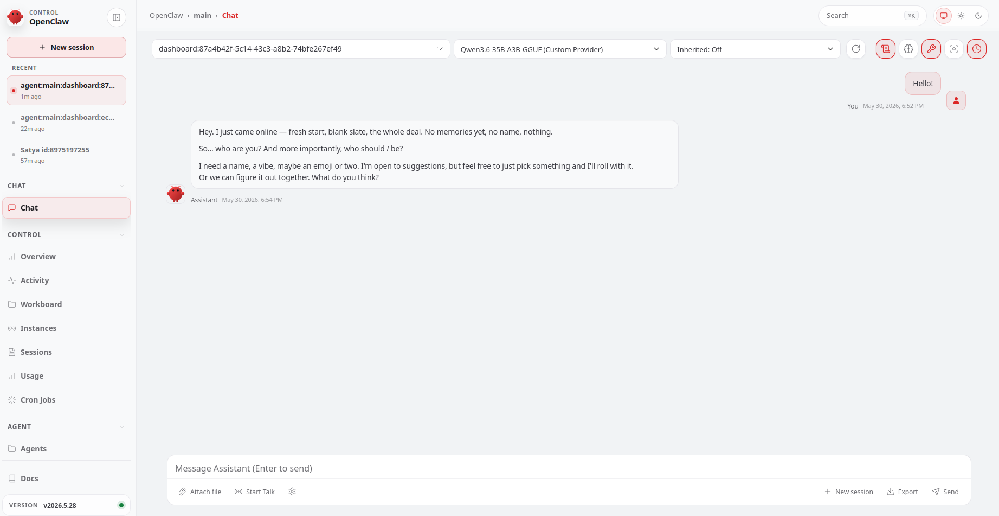
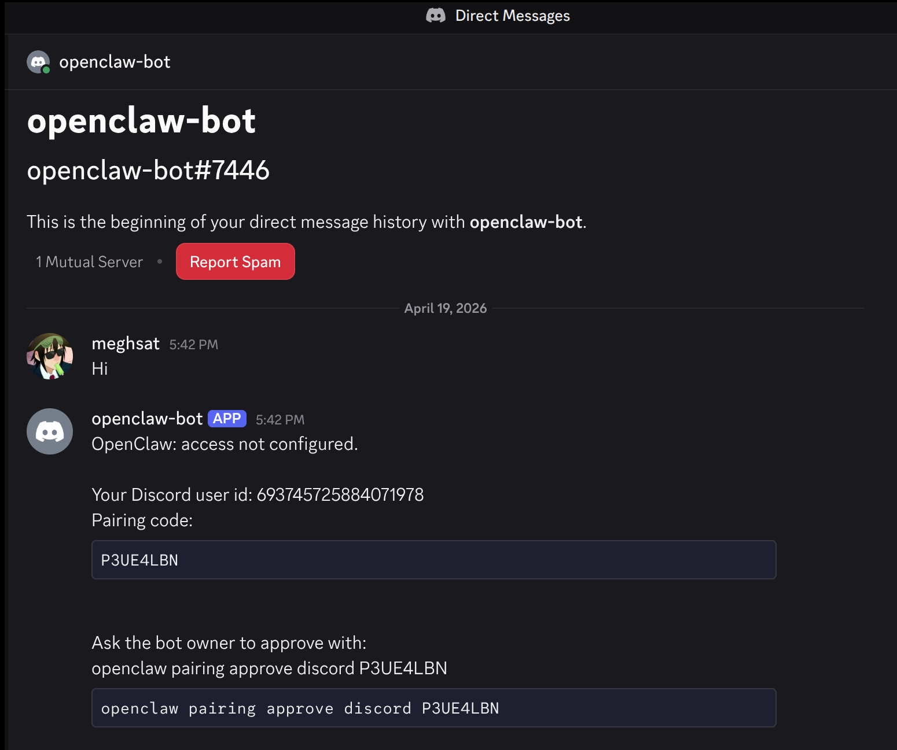
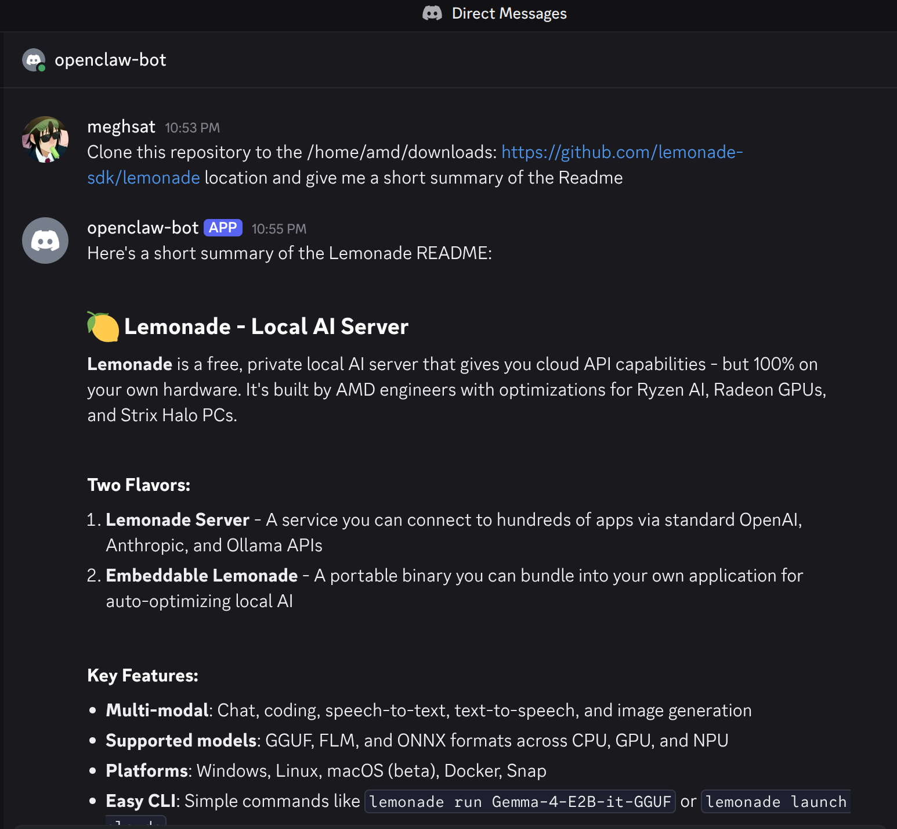

<!--
Copyright Advanced Micro Devices, Inc.
SPDX-License-Identifier: MIT
-->
# Run OpenClaw with Lemonade Server as the backend

## Overview

[**OpenClaw**](https://openclaw.ai/) is an autonomous AI agent that can write and run code, manage files, and work through complex multi-step tasks on your behalf. Unlike a chat assistant that just answers questions, OpenClaw takes real actions on your system, which means it needs a fast, capable AI backend that can keep up with a demanding agent loop.

[**Lemonade Server**](https://lemonade-server.ai/) is that backend. It is an open-source local inference server that runs GenAI models directly on your hardware and exposes them through the industry-standard OpenAI API.

Together, they form a fully local AI agent stack: Lemonade handles model inference, and OpenClaw provides the agent loop that turns model outputs into real actions.

> **Before you continue:** OpenClaw is a highly autonomous AI agent. Giving any AI agent access to your system may result in unpredictable or unintended outcomes. Proceed only if you understand the risks and are comfortable with autonomous software acting on your behalf.

---

## What You'll Learn

By the end of this playbook you will be able to:

- Learn about **Lemonade Server**
- **Install OpenClaw** and **point it at Lemonade Server** as its AI backend.
- **Start the OpenClaw gateway** and confirm your agent is ready to work.
- **Connect a communication channel** (Discord or Telegram) so you can chat with your agent from any device.

---

## Setting the Memory Configuration

<!-- @require:memory-config -->

<!-- @device:halo_box -->
## Check for Software Updates

<!-- @require:software-update -->
<!-- @device:end -->

## Installing Software Prerequisites

<!-- @os:linux -->
- A PC running **Ubuntu 24.04+** or a compatible Debian-based Linux distribution with `apt-get`
- At least **12 GB of RAM** (64 GB+ recommended for larger models)
- [Docker Desktop](https://docs.docker.com/desktop/setup/install/linux/ubuntu/) (Optional, for sandboxing OpenClaw)

- **~10–30 GB of free disk space** for model weights
<!-- @os:end -->
<!-- @os:windows -->
- A PC running **Windows 10/11**
- At least **12 GB of RAM** (64 GB+ recommended for larger models)
- **~10–30 GB of free disk space** for model weights
- [Docker Desktop](https://docs.docker.com/desktop/setup/install/windows-install/) (Optional, for sandboxing OpenClaw)
<!-- @os:end -->

<!-- @require:lemonade -->

<!-- @var:id=openclaw_model value="Qwen3.6-35B-A3B-GGUF" -->

<!-- @test:id=lemonade-version timeout=60 hidden=True -->
```bash
lemonade --version
```
<!-- @test:end -->

---

## Pull and Load the Recommended Model

The recommended model for this playbook is **Qwen3.6-35B-A3B-GGUF** from Unsloth, a strong MoE model with a 263k-token context window that is well-suited to agent workloads. This model uses UD-Q4_K_XL quantization. Pull it now:

```bash
lemonade pull Qwen3.6-35B-A3B-GGUF
```

Then load it with a large context window and save that setting for future runs:

<!-- @test:id=lemonade-model-load timeout=900 -->
```bash
lemonade unload
lemonade load Qwen3.6-35B-A3B-GGUF --ctx-size 262144 --save-options
```
<!-- @test:end --> 

The model has a default context length of 262,144 tokens. If you encounter out-of-memory (OOM) errors, consider reducing the context window. However, because Qwen3.6 leverages extended context for complex tasks, we advise maintaining a context length of at least 128K tokens to preserve thinking capabilities.

> **Tip: Disable thinking for faster agent responses:** Qwen3.6-35B-A3B runs in thinking mode by default, which adds latency before each response. For agent loops this overhead accumulates quickly. The [lemonade-sdk/recipes](https://github.com/lemonade-sdk/recipes/blob/main/coding-agents/Qwen3.6-35B-A3B-NoThinking.json) repo provides a ready-made config that disables thinking. To use it, download the file and import it:
>
> ```bash
> curl -LO https://raw.githubusercontent.com/lemonade-sdk/recipes/main/coding-agents/Qwen3.6-35B-A3B-NoThinking.json
> lemonade import Qwen3.6-35B-A3B-NoThinking.json
> ```

---

<!-- @os:windows -->
<!-- @test:id=lemonade-chat-windows timeout=1200 hidden=True -->
```powershell
$ErrorActionPreference = "Stop"

$modelsJson = $null
for ($i = 0; $i -lt 120; $i++) {
  $modelsJson = curl.exe -s --max-time 2 http://127.0.0.1:13305/api/v1/models
  if ($modelsJson) { break }
  Start-Sleep -Seconds 1
}

if (-not $modelsJson) {throw "Lemonade server not ready on http://127.0.0.1:13305"}
Write-Host "OK: Lemonade server is responding"

$parsed = $modelsJson | ConvertFrom-Json
$entry = $parsed.data | Where-Object { $_.id -eq "${openclaw_model}" } | Select-Object -First 1

if (-not $entry) {throw "Model ${openclaw_model} is not present in Lemonade /api/v1/models."}
if (-not $entry.downloaded) {throw "Model ${openclaw_model} is present but not downloaded in Lemonade. Please download it before running CI."}
Write-Host "OK: ${openclaw_model} model is downloaded in Lemonade"

if ($entry.recipe_options.ctx_size -ne 262144) {
  throw "Model ${openclaw_model} is not saved with ctx_size=262144. Run: lemonade load ${openclaw_model} --ctx-size 262144 --save-options"
}
Write-Host "OK: ${openclaw_model} is saved with ctx_size=262144"

$body = @{
  model = "${openclaw_model}"
  messages = @(
    @{
      role = "user"
      content = "Reply with exactly: OK"
    }
  )
  temperature = 0
  max_tokens = 32
} | ConvertTo-Json -Depth 5

$tmpBody = Join-Path $env:TEMP "openclaw-lemonade-chat-body.json"
[System.IO.File]::WriteAllText($tmpBody, $body, [System.Text.UTF8Encoding]::new($false))

try {
  $out = curl.exe -sS --fail-with-body --max-time 300 http://127.0.0.1:13305/api/v1/chat/completions `
    -H "Content-Type: application/json" `
    --data-binary "@$tmpBody"
  if (-not $out) {throw "Empty response from Lemonade chat/completions"}
  Write-Host "OK: Lemonade chat/completions returned a response"
}
finally {
  Remove-Item $tmpBody -Force -ErrorAction SilentlyContinue
}
```
<!-- @test:end --> 
<!-- @os:end -->

<!-- @os:linux -->
<!-- @test:id=lemonade-chat-linux timeout=1200 hidden=True -->
```bash
set -euo pipefail

models_json=""
for i in $(seq 1 120); do
  models_json="$(curl -s --max-time 2 http://127.0.0.1:13305/api/v1/models || true)"
  if [ -n "$models_json" ]; then
    break
  fi
  sleep 1
done

if [ -z "$models_json" ]; then
  echo "Lemonade server not ready on http://127.0.0.1:13305"
  exit 1
fi
echo "OK: Lemonade server is responding"

export MODELS_JSON="$models_json"

python3 - <<'PY'
import json
import os
import sys

data = json.loads(os.environ["MODELS_JSON"])
model_id = "${openclaw_model}"

entry = None
for item in data.get("data", []):
    if item.get("id") == model_id:
        entry = item
        break

if entry is None:
    print(f"Model {model_id} is not present in Lemonade /api/v1/models.")
    sys.exit(1)

if not entry.get("downloaded", False):
    print(f"Model {model_id} is present but not downloaded in Lemonade. Please download it before running CI.")
    sys.exit(1)

print(f"OK: {model_id} model is downloaded in Lemonade")

ctx_size = entry.get("recipe_options", {}).get("ctx_size")
if ctx_size != 262144:
    print(f"Model {model_id} is not saved with ctx_size=262144. Run: lemonade load {model_id} --ctx-size 262144 --save-options")
    sys.exit(1)
print(f"OK: {model_id} is saved with ctx_size=262144")
PY

body='{
  "model": "${openclaw_model}",
  "messages": [{"role": "user", "content": "Reply with exactly: OK"}],
  "temperature": 0,
  "max_tokens": 32
}'

out="$(curl -sS --fail-with-body --max-time 300 http://127.0.0.1:13305/api/v1/chat/completions \
  -H "Content-Type: application/json" \
  -d "$body")"

if [ -z "$out" ]; then
  echo "Empty response from Lemonade chat/completions"
  exit 1
fi

echo "OK: Lemonade chat/completions returned a response"
```
<!-- @test:end --> 
<!-- @os:end -->

<!-- @os:windows -->

## Set Up WSL

We run OpenClaw inside WSL (Recommended) and connect it to Lemonade running natively on Windows. This gives you a Linux shell environment for OpenClaw while keeping Lemonade's GPU acceleration on the Windows side.

### Install WSL and Ubuntu

Open PowerShell as Administrator and install the WSL kernel:

```powershell
wsl --install --no-distribution
```

Then install Ubuntu:

```powershell
wsl --install -d Ubuntu-24.04
```

### Enable systemd in WSL

Run this inside the Ubuntu terminal:

```bash
sudo tee /etc/wsl.conf > /dev/null <<'EOF'
[boot]
systemd=true
EOF
```

Restart WSL:

```powershell
wsl --shutdown
wsl
```

### Bridge Lemonade from Windows into WSL

WSL2 runs in a virtual network. Lemonade on Windows binds to `127.0.0.1`, which WSL cannot reach directly. A Windows port proxy forwards traffic from the WSL gateway IP to Windows localhost.

**Find your WSL gateway IP** (run inside WSL):

```bash
ip route show default | awk '{print $3}' | head -1
```

**Add the port proxy** (run in PowerShell as Administrator, replacing `<WSL-Gateway-IP>` with your WSL gateway IP):

```powershell
netsh interface portproxy add v4tov4 listenaddress=<WSL-Gateway-IP> listenport=13305 connectaddress=127.0.0.1 connectport=13305
```

**Add a firewall rule** (same elevated PowerShell):

```powershell
New-NetFirewallRule -DisplayName "Lemonade-WSL" -Direction Inbound -Protocol TCP -LocalPort 13305 -Action Allow
```

**Verify from WSL**:

```bash
WINDOWS_HOST=$(ip route show default | awk '{print $3}' | head -1)
curl -s "http://$WINDOWS_HOST:13305/api/v1/models"
```

If you’ve already loaded the Qwen3.6-35B-A3B-GGUF model in the previous step, you should see JSON output like this:

```json
{
  "data": [
    {
      "checkpoint": "unsloth/Qwen3.6-35B-A3B-GGUF:UD-Q4_K_XL",
      "checkpoints": {
        "main": "unsloth/Qwen3.6-35B-A3B-GGUF:UD-Q4_K_XL"
      },
      "mmproj": "unsloth/Qwen3.6-35B-A3B-GGUF:mmproj-F16.gguf",
      ....
    }
  ],
  "object": "list"
}
```

> The `netsh portproxy` rule survives reboots but the WSL gateway IP can change after `wsl --shutdown`. If Lemonade becomes unreachable from WSL after a restart, get the updated gateway IP and update the proxy with this new IP.

<!-- @test:id=wsl-lemonade-bridge-windows timeout=300 hidden=True -->
```powershell
$ErrorActionPreference = "Stop"

$script = @'
set -euo pipefail
export PATH="$HOME/.npm-global/bin:$HOME/.local/bin:/usr/local/sbin:/usr/local/bin:/usr/sbin:/usr/bin:/sbin:/bin:$PATH"
WINDOWS_HOST="$(ip route show default | awk '{print $3}' | head -1)"

if [ -z "$WINDOWS_HOST" ]; then
  echo "Could not determine WSL gateway IP"
  exit 1
fi

echo "WSL gateway IP: $WINDOWS_HOST"

models_json="$(curl -fsS --max-time 5 "http://$WINDOWS_HOST:13305/api/v1/models")"

if [ -z "$models_json" ]; then
  echo "Could not reach Lemonade from WSL at http://$WINDOWS_HOST:13305/api/v1/models"
  echo "Check the Windows netsh portproxy and firewall rule from the README."
  exit 1
fi

echo "$models_json" | python3 -m json.tool >/dev/null
echo "OK: WSL can reach native Windows Lemonade through the bridge"
'@

$script = $script -replace "`r`n", "`n"

$tmp = Join-Path $env:TEMP "wsl-lemonade-bridge-windows.sh"
[System.IO.File]::WriteAllText($tmp, $script, [System.Text.UTF8Encoding]::new($false))

try {
  $full = [System.IO.Path]::GetFullPath($tmp)
  $drive = $full.Substring(0,1).ToLower()
  $rest = $full.Substring(2).Replace('\','/')
  $wslTmp = "/mnt/$drive$rest"

  wsl -d Ubuntu-24.04 -- bash "$wslTmp"

  if ($LASTEXITCODE -ne 0) {
    throw "WSL Lemonade bridge test failed"
  }
}
finally {
  Remove-Item $tmp -Force -ErrorAction SilentlyContinue
}
```
<!-- @test:end --> 

---
<!-- @os:end -->

## Install and Configure OpenClaw

### Install OpenClaw
<!-- @os:windows -->
> Run the commands in this section inside your **WSL terminal**.
<!-- @os:end -->
```bash
curl -fsSL https://openclaw.ai/install.sh | bash -s -- --no-prompt --no-onboard
```

The `--no-onboard` flag skips the interactive setup wizard, you will configure the model backend manually in the next step, which gives you precise control over which model and server are used.

Open a new terminal and confirm the installation:

```bash
openclaw --version
```

> **Tip:** If you see `command not found` after installation, add npm's global bin directory to your PATH:
> ```bash
> export PATH="$HOME/.npm-global/bin:$PATH"
> ```
> To make this permanent, add the line above to your `~/.bashrc` or `~/.zshrc` file.

<!-- @os:linux -->
<!-- @test:id=openclaw-version-linux timeout=120 hidden=True -->
```bash
set -euo pipefail
echo "HOME=$HOME"
echo "PATH=$PATH"
export PATH="$HOME/.npm-global/bin:$HOME/.local/bin:/usr/local/sbin:/usr/local/bin:/usr/sbin:/usr/bin:/sbin:/bin:$PATH"
node -v
npm -v
openclaw --version
```
<!-- @test:end --> 
<!-- @os:end -->

<!-- @os:windows -->
<!-- @test:id=openclaw-version-windows timeout=120 hidden=True -->
```powershell
$ErrorActionPreference = "Stop"

$script = @'
set -euo pipefail
echo "HOME=$HOME"
echo "PATH=$PATH"
export PATH="$HOME/.npm-global/bin:$HOME/.local/bin:/usr/local/sbin:/usr/local/bin:/usr/sbin:/usr/bin:/sbin:/bin:$PATH"
node -v
npm -v
openclaw --version
'@

$script = $script -replace "`r`n", "`n"

$tmp = Join-Path $env:TEMP "openclaw-version-windows.sh"
[System.IO.File]::WriteAllText($tmp, $script, [System.Text.UTF8Encoding]::new($false))

try {
  $full = [System.IO.Path]::GetFullPath($tmp)
  $drive = $full.Substring(0,1).ToLower()
  $rest = $full.Substring(2).Replace('\','/')
  $wslTmp = "/mnt/$drive$rest"

  wsl -d Ubuntu-24.04 -- bash "$wslTmp"

  if ($LASTEXITCODE -ne 0) {
    throw "OpenClaw version check failed inside WSL"
  }
}
finally {
  Remove-Item $tmp -Force -ErrorAction SilentlyContinue
}
```
<!-- @test:end --> 
<!-- @os:end -->


### Configure OpenClaw to Use Lemonade

Run OpenClaw's non-interactive onboarding.
<!-- @os:linux -->
```bash
openclaw onboard \
  --non-interactive \
  --mode local \
  --auth-choice custom-api-key \
  --custom-base-url "http://127.0.0.1:13305/api/v1" \
  --custom-model-id "Qwen3.6-35B-A3B-GGUF" \
  --custom-provider-id "lemonade" \
  --custom-compatibility "openai" \
  --custom-api-key "lemonade" \
  --secret-input-mode plaintext \
  --gateway-port 18789 \
  --gateway-bind loopback \
  --skip-health \
  --accept-risk
```
<!-- @os:end -->
<!-- @os:windows -->
```bash
WINDOWS_HOST=$(ip route show default | awk '{print $3}' | head -1)

openclaw onboard \
  --non-interactive \
  --mode local \
  --auth-choice custom-api-key \
  --custom-base-url "http://$WINDOWS_HOST:13305/api/v1" \
  --custom-model-id "Qwen3.6-35B-A3B-GGUF" \
  --custom-provider-id "lemonade" \
  --custom-compatibility "openai" \
  --custom-api-key "lemonade" \
  --secret-input-mode plaintext \
  --gateway-port 18789 \
  --gateway-bind loopback \
  --skip-health \
  --accept-risk
```
<!-- @os:end -->

This command writes OpenClaw's configuration to `~/.openclaw/openclaw.json`.

> **OpenClaw context window sizing:** OpenClaw's compaction triggers when `contextTokens > contextWindow − reserveTokens`. The default `reserveTokensFloor` is 20,000 tokens, a floor that overrides `reserveTokens` when lower, so any model context below ~37k will trigger an infinite compaction loop. Set a low reserve and disable the floor once in your config and it applies to every model, no per-model tuning needed:
>
> ```json
> "compaction": {
>   "reserveTokens": 4096,
>   "reserveTokensFloor": 0
> }
> ```
>
> `reserveTokensFloor` is a *floor* (minimum guard), not the reserve itself, setting only the floor has no effect. `reserveTokensFloor: 0` disables the guard so the lower `reserveTokens` is accepted.
>
> **When to apply this:** Use this config if your model's effective context window is below ~37k, either because the model is small (e.g. 8k, 16k, 32k) or because you've intentionally capped it to a lower value (e.g. loading a 128k model but setting context to 16k in Lemonade). Without it, OpenClaw enters an infinite compaction loop on startup.
>
> **Large-context models at full context:** You can skip this entirely. The defaults work fine, compaction will kick in well before the window fills and the model has ample room to generate long responses. If you do apply it, be aware that `reserveTokens: 4096` limits response length to ~4k tokens, which may cut off long file generation or detailed plans.
>
> **Where to add this:** Place the `compaction` block inside `agents.defaults` in your `openclaw.json` (usually at `~/.openclaw/openclaw.json`):
>
> ```json
> {
>   "agents": {
>     "defaults": {
>       "workspace": "/home/<you>/.openclaw/workspace",
>       "model": {
>         "primary": "lemonade/<your-model-id>"
>       },
>       "compaction": {
>         "reserveTokens": 4096,
>         "reserveTokensFloor": 0
>       }
>     }
>   }
> }
> ```
>
> The rest of your config (gateway, channels, models, etc.) stays unchanged, only the `compaction` key needs to be added.

### (Recommended) Enable Docker Sandboxing

OpenClaw can route all agent file and code operations through an isolated Docker container rather than running them directly on your host. This limits the blast radius of any unintended action to the sandbox, leaving your host filesystem and network untouched.

Build the sandbox image once (Docker must be installed):

```bash
docker build -t openclaw-sandbox:bookworm-slim - <<'DOCKERFILE'
FROM debian:bookworm-slim
ENV DEBIAN_FRONTEND=noninteractive
RUN apt-get update && apt-get install -y --no-install-recommends \
  bash ca-certificates curl git jq python3 ripgrep \
  && rm -rf /var/lib/apt/lists/*
RUN useradd --create-home --shell /bin/bash sandbox
USER sandbox
WORKDIR /home/sandbox
CMD ["sleep", "infinity"]
DOCKERFILE
```

<!-- @os:linux -->
<!-- @test:id=openclaw-sandbox-image-linux timeout=1800 hidden=True -->
```bash
set -euo pipefail

docker version

docker build -t openclaw-sandbox:bookworm-slim - <<'DOCKERFILE'
FROM debian:bookworm-slim
ENV DEBIAN_FRONTEND=noninteractive
RUN apt-get update && apt-get install -y --no-install-recommends \
  bash ca-certificates curl git jq python3 ripgrep \
  && rm -rf /var/lib/apt/lists/*
RUN useradd --create-home --shell /bin/bash sandbox
USER sandbox
WORKDIR /home/sandbox
CMD ["sleep", "infinity"]
DOCKERFILE

docker image inspect openclaw-sandbox:bookworm-slim >/dev/null

echo "OK: OpenClaw sandbox Docker image is available"
```
<!-- @test:end -->
<!-- @os:end -->

<!-- @os:windows -->
<!-- @test:id=openclaw-sandbox-image-windows timeout=1800 hidden=True -->
```powershell
$ErrorActionPreference = "Stop"

$script = @'
set -euo pipefail

export PATH="/mnt/wsl/docker-desktop/cli-tools/usr/bin:$HOME/.npm-global/bin:$HOME/.local/bin:/usr/local/sbin:/usr/local/bin:/usr/sbin:/usr/bin:/sbin:/bin:$PATH"

docker_config="$(mktemp -d)"
cleanup() {
  rm -rf "$docker_config"
}
trap cleanup EXIT
export DOCKER_CONFIG="$docker_config"
printf '{ "auths": {} }\n' > "$DOCKER_CONFIG/config.json"

docker version

docker build -t openclaw-sandbox:bookworm-slim - <<'DOCKERFILE'
FROM debian:bookworm-slim
ENV DEBIAN_FRONTEND=noninteractive
RUN apt-get update && apt-get install -y --no-install-recommends \
  bash ca-certificates curl git jq python3 ripgrep \
  && rm -rf /var/lib/apt/lists/*
RUN useradd --create-home --shell /bin/bash sandbox
USER sandbox
WORKDIR /home/sandbox
CMD ["sleep", "infinity"]
DOCKERFILE

docker image inspect openclaw-sandbox:bookworm-slim >/dev/null

echo "OK: OpenClaw sandbox Docker image is available inside WSL"
'@

$script = $script -replace "`r`n", "`n"

$tmp = Join-Path $env:TEMP "openclaw-sandbox-image-windows.sh"
[System.IO.File]::WriteAllText($tmp, $script, [System.Text.UTF8Encoding]::new($false))

try {
  $full = [System.IO.Path]::GetFullPath($tmp)
  $drive = $full.Substring(0,1).ToLower()
  $rest = $full.Substring(2).Replace('\','/')
  $wslTmp = "/mnt/$drive$rest"

  wsl -d Ubuntu-24.04 -- bash "$wslTmp"
  if ($LASTEXITCODE -ne 0) { throw "OpenClaw sandbox image build failed inside WSL" }
}
finally {
  Remove-Item $tmp -Force -ErrorAction SilentlyContinue
}
```
<!-- @test:end -->
<!-- @os:end -->

Run this to add the `sandbox` key inside the existing `agents.defaults` block in `~/.openclaw/openclaw.json`:

```bash
cat > sandbox.patch.json5 <<JSON5
{
  agents: {
    defaults: {
      sandbox: {
        mode: "non-main",
        scope: "session",
        workspaceAccess: "none"
      }
    }
  }
}
JSON5
openclaw config patch --file ./sandbox.patch.json5
```

Sandbox containers have **no network access** by default. See the [sandboxing reference](https://docs.openclaw.ai/gateway/sandboxing) for bind mounts and network overrides.

> #### Troubleshooting: Docker Permission Denied
> 
> If you get "permission denied" when running Docker commands:
> 
> **Step 1: Add your user to the docker group**
> 
> ```bash
> sudo groupadd docker                    # Create group if needed
> sudo usermod -aG docker $USER           # Add yourself to the group
> newgrp docker                           # Activate the change
> docker run hello-world                  # Test it
> ```
> 
> **Step 2: If the error persists, apply the permanent fix**
> 
> ```bash
> sudo chgrp docker /lib/systemd/system/docker.socket
> sudo chmod g+w /lib/systemd/system/docker.socket
> ```
> 
> Then **reboot** your system.
> 
> **Quick temporary fix** (resets after reboot):
> ```bash
> sudo chmod 666 /var/run/docker.sock
> ```

<!-- @os:linux -->
<!-- @test:id=openclaw-onboard-linux timeout=300 hidden=True -->
```bash
set -euo pipefail

export PATH="$HOME/.npm-global/bin:$HOME/.local/bin:/usr/local/sbin:/usr/local/bin:/usr/sbin:/usr/bin:/sbin:/bin:$PATH"

mkdir -p "$HOME/.openclaw"
rm -f "$HOME/.openclaw/openclaw.json"

openclaw onboard \
  --non-interactive \
  --mode local \
  --auth-choice custom-api-key \
  --custom-base-url "http://127.0.0.1:13305/api/v1" \
  --custom-model-id "${openclaw_model}" \
  --custom-provider-id "lemonade" \
  --custom-compatibility "openai" \
  --custom-api-key "lemonade" \
  --secret-input-mode plaintext \
  --gateway-port 18789 \
  --gateway-bind loopback \
  --skip-health \
  --accept-risk

config="$HOME/.openclaw/openclaw.json"
test -f "$config"

grep -q "lemonade" "$config"
grep -q "${openclaw_model}" "$config"
grep -q "127.0.0.1:13305" "$config"

echo "OK: OpenClaw onboarding wrote Lemonade configuration"
```
<!-- @test:end --> 
<!-- @os:end -->

<!-- @os:linux -->
<!-- @test:id=openclaw-sandbox-config-linux timeout=120 hidden=True -->
```bash
set -euo pipefail

export PATH="$HOME/.npm-global/bin:$HOME/.local/bin:/usr/local/sbin:/usr/local/bin:/usr/sbin:/usr/bin:/sbin:/bin:$PATH"
config="$HOME/.openclaw/openclaw.json"

if [ ! -f "$config" ]; then
  echo "Missing $config. Run the OpenClaw onboarding test first."
  exit 1
fi

docker image inspect openclaw-sandbox:bookworm-slim >/dev/null

cat > sandbox.patch.json5 <<JSON5
{
  agents: {
    defaults: {
      sandbox: {
        mode: "non-main",
        scope: "session",
        workspaceAccess: "none"
      }
    }
  }
}
JSON5

openclaw config patch --file ./sandbox.patch.json5

grep -q '"sandbox"' "$config"
grep -Eq '"mode"[[:space:]]*:[[:space:]]*"non-main"' "$config"
grep -Eq '"scope"[[:space:]]*:[[:space:]]*"session"' "$config"
grep -Eq '"workspaceAccess"[[:space:]]*:[[:space:]]*"none"' "$config"

echo "OK: OpenClaw sandbox configuration was written"
```
<!-- @test:end --> 
<!-- @os:end -->


<!-- @os:windows -->
<!-- @test:id=openclaw-onboard-windows timeout=300 hidden=True -->
```powershell
$ErrorActionPreference = "Stop"

$script = @'
set -euo pipefail

export PATH="$HOME/.npm-global/bin:$HOME/.local/bin:/usr/local/sbin:/usr/local/bin:/usr/sbin:/usr/bin:/sbin:/bin:$PATH"

mkdir -p "$HOME/.openclaw"
rm -f "$HOME/.openclaw/openclaw.json"

WINDOWS_HOST="$(ip route show default | awk '{print $3}' | head -1)"

if [ -z "$WINDOWS_HOST" ]; then
  echo "Could not determine WSL gateway IP"
  exit 1
fi

openclaw onboard \
  --non-interactive \
  --mode local \
  --auth-choice custom-api-key \
  --custom-base-url "http://$WINDOWS_HOST:13305/api/v1" \
  --custom-model-id "${openclaw_model}" \
  --custom-provider-id "lemonade" \
  --custom-compatibility "openai" \
  --custom-api-key "lemonade" \
  --secret-input-mode plaintext \
  --gateway-port 18789 \
  --gateway-bind loopback \
  --skip-health \
  --accept-risk

config="$HOME/.openclaw/openclaw.json"
test -f "$config"

grep -q "lemonade" "$config"
grep -q "${openclaw_model}" "$config"
grep -q "$WINDOWS_HOST:13305" "$config"

echo "OK: OpenClaw onboarding wrote Lemonade configuration inside WSL"
'@

$script = $script -replace "`r`n", "`n"

$tmp = Join-Path $env:TEMP "openclaw-onboard-windows.sh"
[System.IO.File]::WriteAllText($tmp, $script, [System.Text.UTF8Encoding]::new($false))

try {
  $full = [System.IO.Path]::GetFullPath($tmp)
  $drive = $full.Substring(0,1).ToLower()
  $rest = $full.Substring(2).Replace('\','/')
  $wslTmp = "/mnt/$drive$rest"

  wsl -d Ubuntu-24.04 -- bash "$wslTmp"

  if ($LASTEXITCODE -ne 0) {
    throw "OpenClaw onboarding failed inside WSL"
  }
}
finally {
  Remove-Item $tmp -Force -ErrorAction SilentlyContinue
}
```
<!-- @test:end --> 
<!-- @os:end -->


<!-- @os:windows -->
<!-- @test:id=openclaw-sandbox-config-windows timeout=120 hidden=True -->
```powershell
$ErrorActionPreference = "Stop"

$script = @'
set -euo pipefail

export PATH="/mnt/wsl/docker-desktop/cli-tools/usr/bin:$HOME/.npm-global/bin:$HOME/.local/bin:/usr/local/sbin:/usr/local/bin:/usr/sbin:/usr/bin:/sbin:/bin:$PATH"

docker_config="$(mktemp -d)"
cleanup() {
  rm -rf "$docker_config"
}
trap cleanup EXIT
export DOCKER_CONFIG="$docker_config"
printf '{ "auths": {} }\n' > "$DOCKER_CONFIG/config.json"

config="$HOME/.openclaw/openclaw.json"

if [ ! -f "$config" ]; then
  echo "Missing $config. Run the OpenClaw onboarding test first."
  exit 1
fi

docker image inspect openclaw-sandbox:bookworm-slim >/dev/null

cat > sandbox.patch.json5 <<JSON5
{
  agents: {
    defaults: {
      sandbox: {
        mode: "non-main",
        scope: "session",
        workspaceAccess: "none"
      }
    }
  }
}
JSON5

openclaw config patch --file ./sandbox.patch.json5

grep -q '"sandbox"' "$config"
grep -Eq '"mode"[[:space:]]*:[[:space:]]*"non-main"' "$config"
grep -Eq '"scope"[[:space:]]*:[[:space:]]*"session"' "$config"
grep -Eq '"workspaceAccess"[[:space:]]*:[[:space:]]*"none"' "$config"

echo "OK: OpenClaw sandbox configuration was written inside WSL"
'@

$script = $script -replace "`r`n", "`n"
$tmp = Join-Path $env:TEMP "openclaw-sandbox-config-windows.sh"
[System.IO.File]::WriteAllText($tmp, $script, [System.Text.UTF8Encoding]::new($false))

try {
  $full = [System.IO.Path]::GetFullPath($tmp)
  $drive = $full.Substring(0,1).ToLower()
  $rest = $full.Substring(2).Replace('\','/')
  $wslTmp = "/mnt/$drive$rest"

  wsl -d Ubuntu-24.04 -- bash "$wslTmp"
  if ($LASTEXITCODE -ne 0) { throw "OpenClaw sandbox config patch failed inside WSL" }
}
finally {
  Remove-Item $tmp -Force -ErrorAction SilentlyContinue
}
```
<!-- @test:end --> 
<!-- @os:end -->

### Start the OpenClaw Gateway

The gateway is the OpenClaw process that manages the agent loop and serves the dashboard:

```bash
openclaw gateway run --bind loopback --port 18789
```

<!-- @os:linux -->
<!-- @test:id=openclaw-gateway-linux timeout=300 hidden=True -->
```bash
set -euo pipefail

export PATH="$HOME/.npm-global/bin:$HOME/.local/bin:/usr/local/sbin:/usr/local/bin:/usr/sbin:/usr/bin:/sbin:/bin:$PATH"

config="$HOME/.openclaw/openclaw.json"
if [ ! -f "$config" ]; then
  echo "Missing $config. Run the OpenClaw onboarding test first."
  exit 1
fi
log="/tmp/openclaw-gateway-ci.log"

cleanup() {
  if [ -n "${gateway_pid:-}" ] && kill -0 "$gateway_pid" 2>/dev/null; then
    kill "$gateway_pid" 2>/dev/null || true
    sleep 2
    kill -9 "$gateway_pid" 2>/dev/null || true
  fi
}
trap cleanup EXIT

rm -f "$log"

openclaw gateway run --bind loopback --port 18789 >"$log" 2>&1 &
gateway_pid=$!

ok=false
for i in $(seq 1 120); do
  code="$(curl -s -o /dev/null -w "%{http_code}" --max-time 2 http://127.0.0.1:18789/ || true)"
  if [ "$code" = "200" ]; then
    ok=true
    break
  fi
  sleep 1
done

if [ "$ok" != "true" ]; then
  echo "OpenClaw gateway did not start"
  echo "---- Gateway log ----"
  cat "$log" || true
  exit 1
fi

echo "OK: OpenClaw gateway is reachable"
```
<!-- @test:end --> 
<!-- @os:end -->

<!-- @os:windows -->
<!-- @test:id=openclaw-gateway-windows timeout=300 hidden=True -->
```powershell
$ErrorActionPreference = "Stop"

$script = @'
set -euo pipefail

export PATH="$HOME/.npm-global/bin:$HOME/.local/bin:/usr/local/sbin:/usr/local/bin:/usr/sbin:/usr/bin:/sbin:/bin:$PATH"

config="$HOME/.openclaw/openclaw.json"
if [ ! -f "$config" ]; then
  echo "Missing $config. Run the OpenClaw onboarding test first."
  exit 1
fi
log="/tmp/openclaw-gateway-ci.log"

cleanup() {
  if [ -n "${gateway_pid:-}" ] && kill -0 "$gateway_pid" 2>/dev/null; then
    kill "$gateway_pid" 2>/dev/null || true
    sleep 2
    kill -9 "$gateway_pid" 2>/dev/null || true
  fi
}
trap cleanup EXIT

rm -f "$log"

openclaw gateway run --bind loopback --port 18789 >"$log" 2>&1 &
gateway_pid=$!

ok=false
for i in $(seq 1 120); do
  code="$(curl -s -o /dev/null -w "%{http_code}" --max-time 2 http://127.0.0.1:18789/ || true)"
  if [ "$code" = "200" ]; then
    ok=true
    break
  fi
  sleep 1
done

if [ "$ok" != "true" ]; then
  echo "OpenClaw gateway did not start"
  echo "---- Gateway log ----"
  cat "$log" || true
  exit 1
fi

echo "OK: OpenClaw gateway is reachable inside WSL"
'@

$script = $script -replace "`r`n", "`n"

$tmp = Join-Path $env:TEMP "openclaw-gateway-windows.sh"
[System.IO.File]::WriteAllText($tmp, $script, [System.Text.UTF8Encoding]::new($false))

try {
  $full = [System.IO.Path]::GetFullPath($tmp)
  $drive = $full.Substring(0,1).ToLower()
  $rest = $full.Substring(2).Replace('\','/')
  $wslTmp = "/mnt/$drive$rest"

  wsl -d Ubuntu-24.04 -- bash "$wslTmp"

  if ($LASTEXITCODE -ne 0) {
    throw "OpenClaw gateway test failed inside WSL"
  }
}
finally {
  Remove-Item $tmp -Force -ErrorAction SilentlyContinue
}
```
<!-- @test:end --> 
<!-- @os:end -->

To open the dashboard, run this in a second terminal while the gateway is still running:

```bash
openclaw dashboard
```

Because the gateway binds to loopback, the dashboard auto-authenticates when opened from the same machine, no token entry or device approval is needed for local access. You should see the OpenClaw dashboard with your Lemonade model listed as the active backend.

> If you’ve enabled sandboxing, you can verify it by asking the agent to `run hostname` from the dashboard. If you see a short container ID instead of your machine’s hostname, the sandbox is working.

**Congratulations, you've built a fully local AI agent stack from scratch.**

> **Need the gateway token?** Run `openclaw dashboard --no-open` to print the dashboard URL with the token embedded (it also attempts to copy it to your clipboard). Alternatively, the token is at `gateway.auth.token` in `~/.openclaw/openclaw.json`.
>
> **Approving a remote device:** When you open the dashboard from a second machine or phone, the browser displays a request ID. Back on the machine running the gateway, run:
> ```bash
> openclaw devices approve <requestId>
> ```
> This is only needed for remote or secondary devices, loopback access from the same machine auto-authenticates.

<p align="center">
  
</p>

---

## Optional: Connect a Communication Channel

Once the gateway is running you can reach your local agent from any device. Pick the option that fits your setup. OpenClaw supports [Discord](https://docs.openclaw.ai/channels/discord), [Telegram](https://docs.openclaw.ai/channels/telegram), and other channels, see the full list at [docs.openclaw.ai](https://docs.openclaw.ai).

---

### Option A: Discord

Discord requires a server where **you have administrator access** to add a bot. If you share servers but don't own one, use Option B (Telegram) instead.

#### Create a Discord account and server

If you do not have a Discord account, sign up at [discord.com](https://discord.com). You also need a server where you are administrator, create one by clicking the **+** icon in the Discord sidebar and selecting **Create My Own**. A private server is fine.

#### Create a Discord application and bot

1. Go to the [Discord Developer Portal](https://discord.com/developers/applications) and click **New Application**. Give it a name (e.g. "openclaw-bot").
2. In the sidebar, click **Bot**. Set a username for the bot.
3. Still on the Bot page, scroll to **Privileged Gateway Intents** and enable:
   - **Message Content Intent** (required)
   - **Server Members Intent** (recommended)
4. Scroll back up and click **Reset Token** to generate your bot token. Copy it.

#### Add the bot to your server

1. In the sidebar, click **OAuth2/ URL Generator**.
2. Under **Scopes**, enable `bot` and `applications.commands`.
3. Under **Bot Permissions**, enable: View Channels, Send Messages, Read Message History, Embed Links, Attach Files.
4. Copy the generated URL, paste it in your browser, select your server, and confirm. The bot should now appear in your server's member list.

#### Collect your IDs

Enable Developer Mode in Discord (**User Settings/ Advanced/ Developer Mode**), then:
- Right-click your server icon: **Copy Server ID**
- Right-click your own avatar: **Copy User ID**

#### Allow DMs from server members

Right-click your server icon/ **Privacy Settings**/ toggle on **Direct Messages**. This allows the bot to DM you, which is required for the pairing step.

#### Configure OpenClaw for Discord

Store your bot token as an environment variable, then create a single patch file that enables Discord, references the token, and allowlists your server. Replace `<server_id>` and `<user_id>` with the IDs collected above.

```bash
export DISCORD_BOT_TOKEN="YOUR_BOT_TOKEN"

cat > discord.patch.json5 <<JSON5
{
  channels: {
    discord: {
      enabled: true,
      token: { source: "env", provider: "default", id: "DISCORD_BOT_TOKEN" },
      dmPolicy: "pairing",
      groupPolicy: "allowlist",
      guilds: {
        "<server_id>": {
          requireMention: false,
          users: ["<user_id>"],
        },
      },
    },
  },
}
JSON5
openclaw config patch --file ./discord.patch.json5
```

> **Do not rely on asking the agent to configure this.** When sandboxing is enabled, the agent cannot write to `~/.openclaw/openclaw.json` from inside the sandbox, use the CLI commands above on the host instead.

Restart the gateway so it picks up the new channel config:

```bash
openclaw gateway run --bind loopback --port 18789
```

You should see `logged in to discord as <bot-name>` in the gateway output within a few seconds.

#### Pair your Discord account

DM the bot in Discord. It will reply with a short pairing code.

<p align="center">
  
</p>

Approve it on the machine running OpenClaw:
```bash
openclaw pairing approve discord <CODE>
```

> Pairing codes expire after one hour.

You can now chat with your agent directly from Discord and offload tasks to your local hardware.

<p align="center">
  
</p>

---

### Option B: Telegram

Telegram is simpler than Discord for most users, it requires no server and no admin access.

#### Create a Telegram bot

1. Open Telegram and message **@BotFather**.
2. Send `/newbot` and follow the prompts. Save the bot token it gives you.

#### Configure OpenClaw for Telegram

Store the token as an environment variable:

```bash
export TELEGRAM_BOT_TOKEN="YOUR_BOT_TOKEN"
```

Add the channel configuration to `~/.openclaw/openclaw.json` (or patch it via the dashboard):

```json
{
  "channels": {
    "telegram": {
      "enabled": true,
      "botToken": "YOUR_BOT_TOKEN",
      "dmPolicy": "pairing"
    }
  }
}
```

Restart the gateway, then send your bot any message in Telegram. Approve the pairing:

```bash
openclaw pairing list telegram
openclaw pairing approve telegram <CODE>
```

Pairing codes expire after one hour. You can now chat with your agent via Telegram DM.

---

## Next Steps

Now that your agent can receive commands from your phone and act on your local machine, here are three directions worth exploring:

1. **Stock market summarizer**: Schedule OpenClaw to fetch data from financial APIs on a fixed interval, summarize the day's movements with your local model, and push a digest to your phone each morning via your chosen channel.

2. **Fine-tuning monitor**: Kick off a training job remotely via Telegram or Discord, then have the agent tail the training log and report periodic loss values, GPU utilization, and disk usage back to your phone. If the run stalls or VRAM spikes, you find out immediately without needing to be at the machine.

3. **IOT with a local VLM**: Point a camera at your front door, run a vision model on Lemonade, and have OpenClaw analyze frames on demand or on a trigger. Ask "did any packages arrive today?" from your phone and get a straight answer from your own hardware.
