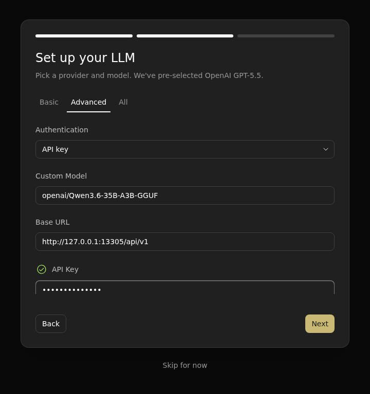
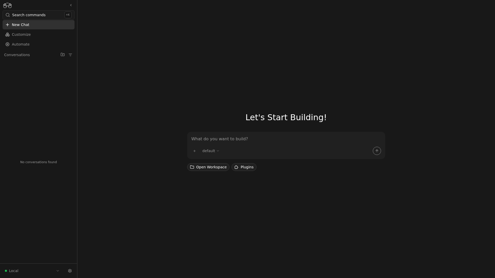

<!--
Copyright Advanced Micro Devices, Inc.

SPDX-License-Identifier: MIT
-->

<!-- @github-only -->
> [!IMPORTANT]
> This playbook uses AMD Playbooks comment tags that are interpreted by the
> AMD Playbooks site. GitHub renders the Markdown content, but not the device,
> OS, variable, or hidden-test directives.
<!-- @github-only:end -->

## Overview

[OpenHands](https://github.com/All-Hands-AI/OpenHands) is an AI software agent
that can write code, run commands, browse the web, and edit files in a real
workspace. Instead of copying suggestions out of a chat window, you point the
agent at a project folder and let it do the work: implement a feature, fix a
bug, write tests, or explain a codebase.

[Agent Canvas](https://github.com/OpenHands/agent-canvas) is the recommended
browser UI for running OpenHands. A single `agent-canvas` command starts the
agent server, the automation backend, and the web frontend together, so you can
drive a conversation with the agent from your browser.

To keep everything on your AMD system, the agent talks to a local model served
by Lemonade Server. Lemonade exposes that model through an OpenAI-compatible
API, so Agent Canvas can configure it like any other OpenAI-style endpoint
while the model, your code, and the conversation context all stay on your
machine.

In this playbook, you will start a local model, launch Agent Canvas, point it
at that model, and run your first coding task against a real project folder.

## What You'll Learn

- How to start Lemonade Server and confirm a local model answers chat requests
- How to install and launch Agent Canvas from the npm package
- How to configure Agent Canvas to use a local Lemonade model as the LLM
- How to start an OpenHands conversation and watch the agent edit files and run
  commands in a workspace
- How to review what the agent changed and steer it with follow-up messages

## Core Concepts

| Concept | What it is | Where it fits in this playbook |
| --- | --- | --- |
| Lemonade Server | A local LLM serving platform built for AMD hardware that exposes an OpenAI-compatible API. Your data never leaves your machine. | Runs the model that powers the agent. |
| OpenHands | An AI software agent that reads and edits files, runs shell commands, and browses the web inside a workspace. | The agent you drive from the chat. |
| Agent Canvas | The browser UI and backend that runs OpenHands conversations and shows tool calls and file changes. | Launches the stack and hosts your conversation. |
| Workspace | The project folder the agent is allowed to read and modify. | The target of the agent's edits and commands. |

<!-- @device:stx,krk -->
> [!NOTE]
> Coding-agent workflows benefit from a larger model and context window. Use at
> least 32 GB of system memory, and prefer 64 GB or more for larger GGUF models.
<!-- @device:end -->

## Prerequisites

<!-- @os:linux -->
<!-- @require:lemonade,nodejs -->
<!-- @os:end -->

<!-- @os:windows -->
<!-- @require:lemonade,nodejs -->
<!-- @os:end -->

You need:

- Lemonade Server installed and able to serve the model below.
- Node.js 22.12 or later and `npm` (used by the `agent-canvas` CLI).
- `uv`, the Python package manager that Agent Canvas uses to manage the agent
  server environment. If your system does not already have it, install it from
  the [uv installation guide](https://docs.astral.sh/uv/getting-started/installation/)
  before launching Agent Canvas.
- A project folder to work in. This can be any local git repository or code
  directory you want the agent to work on.

<!-- @device:halo,halo_box,stx,krk,rx7900xt,rx9070xt,r9700 -->
<!-- @var:id=lemonade_model value="Qwen3.6-35B-A3B-GGUF" -->
<!-- @device:end -->

## 1. Start Lemonade Server

Start the model from the Lemonade CLI:

```bash
lemonade config set llamacpp.backend=vulkan
lemonade config set ctx_size=65536
lemonade run "Qwen3.6-35B-A3B-GGUF"
```

Lemonade exposes an OpenAI-compatible API at:

```text
http://127.0.0.1:13305/api/v1
```


## 2. Verify the Local Model

Confirm Lemonade can serve the selected model:

```bash
curl -s "http://127.0.0.1:13305/api/v1/models" | python3 -m json.tool
```

Then send a small chat request:

```bash
curl -sS "http://127.0.0.1:13305/api/v1/chat/completions" \
  -H "Content-Type: application/json" \
  -d '{
    "model": "Qwen3.6-35B-A3B-GGUF",
    "messages": [
      {"role": "user", "content": "Reply with exactly: OK"}
    ],
    "temperature": 0,
    "max_tokens": 64
  }' | python3 -m json.tool
```

If this returns a `choices` array, Lemonade is ready for Agent Canvas.

## 3. Install and Launch Agent Canvas

Install the published Agent Canvas package globally:

```bash
npm install -g @openhands/agent-canvas
```

Then start the full stack from a terminal:

```bash
agent-canvas
```

By default, Agent Canvas starts on `http://localhost:8000`. Open that URL in
your browser. If port 8000 is already in use, pass `--port` (or `-p`) when you
launch Agent Canvas:

```bash
agent-canvas --port 3000
```

The same command works in PowerShell on Windows. Then open
`http://localhost:3000` instead. The default local backend should show as
healthy on the home screen.

The `agent-canvas` command starts the agent server, the automation backend, and
the web frontend together. You only need this one command to run OpenHands
locally.

## 4. Configure the Local LLM

On first launch, Agent Canvas opens an onboarding flow. In that flow:

1. Keep **OpenHands** selected as the agent and click **Next**.
2. On **Set up your LLM**, select **Advanced**.
3. Keep **Authentication** set to **API key**.
4. Set **Custom Model** to `openai/Qwen3.6-35B-A3B-GGUF`.
5. Set **Base URL** to `http://127.0.0.1:13305/api/v1`.
6. For **API Key**, enter any non-empty placeholder such as `lemonade-local`.
   Lemonade does not require a real key, but the OpenHands client needs a value
   to send.
7. Click **Next**.

The completed Advanced settings should look like this. The API key field is
masked by the UI.



Agent Canvas saves these values as an LLM profile. If your version asks you to
name that profile, use a no-space name such as `lemonade-local`. If you change
models later, open **Settings > LLM** and update the same Advanced fields. You
can switch saved profiles from the chat input with the `/model` command.

## 5. Open a Workspace

The agent can only read and modify files inside a workspace you choose. Before
starting a task, point Agent Canvas at your project folder:

1. From the home screen, choose **Open Workspace**.
2. Select the folder that contains your project (for example, a git repository
   you want the agent to work on).
3. Start a new conversation in that workspace.

Everything the agent does—reading files, running commands, editing code—is
scoped to that workspace.



## 6. Run Your First Coding Task

With the workspace open and the local LLM selected, type a concrete task into
the chat. A good first task is small and verifiable, for example:

```text
Create a new file called hello.py that defines a function greet(name) that
returns "Hello, {name}!", and add a small test that prints greet("World")
when run as a script.
```

Watch the conversation timeline. OpenHands will:

- Read the workspace to understand the layout.
- Create `hello.py` with the requested function and test block.
- Optionally run `python3 hello.py` to verify the output.
- Report what it did and any command output in the chat.

You should see the new file appear in the workspace, and the agent's final
message should describe the change it made. This is the payoff moment: the
agent wrote and ran real code in your project folder.

## 7. Review and Steer the Agent

After the agent finishes a step, review its work before accepting the next one:

- **File changes**: use the workspace file browser or the agent's diff view to
  see exactly what was added, changed, or deleted.
- **Command output**: expand any command the agent ran to see stdout, stderr,
  and the exit code.
- **Follow-ups**: if the result is not what you wanted, reply in the same
  conversation with a correction. The agent keeps the prior context and
  iterates on the same files.

For example, if the test did not print the expected greeting, reply:

```text
The script did not print anything. Run python3 hello.py and fix it so the
greet("World") test prints to stdout.
```

The agent will re-read the file, run the command, diagnose the issue, and edit
the file again—all in the same conversation.

## Troubleshooting

- **`agent-canvas` is not on PATH:** reinstall with
  `npm install -g @openhands/agent-canvas` and confirm the npm global binary
  directory is on your PATH. On Windows, run `npm config get prefix`; the
  returned directory, often `%APPDATA%\npm` or `%USERPROFILE%\.npm-global`,
  must be on your user PATH before `agent-canvas` can be launched from a new
  terminal.
- **`npm install -g` fails with a permissions error:** configure a user-owned
  global npm directory, then reopen the terminal and install Agent Canvas again.

  <!-- @os:linux -->
  ```bash
  mkdir -p ~/.npm-global
  npm config set prefix ~/.npm-global
  echo 'export PATH="$HOME/.npm-global/bin:$PATH"' >> ~/.profile
  . ~/.profile
  npm install -g @openhands/agent-canvas
  ```
  <!-- @os:end -->

  <!-- @os:windows -->
  ```powershell
  New-Item -ItemType Directory -Force "$env:USERPROFILE\.npm-global"
  npm config set prefix "$env:USERPROFILE\.npm-global"
  $env:Path = "$env:USERPROFILE\.npm-global;$env:Path"
  npm install -g @openhands/agent-canvas
  ```

  To make the Windows PATH change permanent, add `%USERPROFILE%\.npm-global` to
  your user PATH from **Settings > System > About > Advanced system settings >
  Environment Variables**, and open a new terminal.
  <!-- @os:end -->
- **The UI loads but the backend shows unhealthy:** wait a few seconds for the
  agent server to finish starting, then refresh. If it stays unhealthy, restart
  `agent-canvas` and check the terminal output for errors.
- **Lemonade chat requests fail with a connection error:** confirm
  `curl -fsS "http://127.0.0.1:13305/api/v1/health"` succeeds and that
  Lemonade is still serving the model with `lemonade status`.
- **The agent errors with a context-length or token-limit message:** restart
  Lemonade with a larger `ctx_size` (for example `ctx_size=65536`), and start a
  fresh conversation so the agent does not carry an oversized history.
- **The agent produces low-quality or incomplete edits:** switch to a larger
  model in Lemonade, or give the agent a smaller, more concrete task and let it
  finish before asking for the next change.
- **`uv` is missing:** install it from
  [the uv installation guide](https://docs.astral.sh/uv/getting-started/installation/).
  Agent Canvas uses `uv` to manage the agent server Python environment.

## Next Steps

- Try a larger task in the same workspace, such as adding a unit test file or
  fixing a known bug, and review the agent's diff before keeping the change.
- Connect an MCP server such as GitHub or Slack under **Customize** so the
  agent can read issues or post updates while it works.
- Save several LLM profiles (a fast small model and a stronger large model) and
  switch between them with `/model` mid-conversation.
- Move on to [OpenHands automations](https://docs.openhands.dev/openhands/usage/automations/overview) to
  turn recurring development loops into scheduled or event-triggered agent runs.

## Resources

- [OpenHands documentation](https://docs.openhands.dev/)
- [Agent Canvas overview](https://docs.openhands.dev/openhands/usage/agent-canvas/overview)
- [Agent Canvas setup](https://docs.openhands.dev/openhands/usage/agent-canvas/setup)
- [LLM profiles and model configuration](https://docs.openhands.dev/openhands/usage/agent-canvas/llm-profiles)
- [Lemonade Server documentation](https://lemonade-server.ai/docs)
