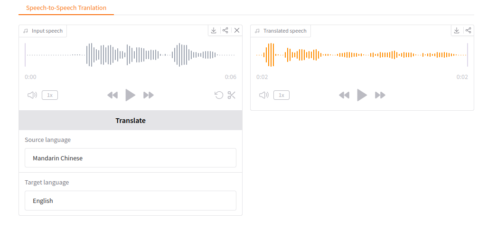

<!--
Copyright Advanced Micro Devices, Inc.

SPDX-License-Identifier: MIT
-->

<!-- @github-only -->
> [!IMPORTANT]
> This playbook uses special tags that GitHub cannot render. Please visit [amd.com/playbooks](https://amd.com/playbooks) to correctly preview this content.
<!-- @github-only:end -->

## Overview

The AMD ROCm™ software and PyTorch stack create a unified ecosystem for on-device AI. It works for both Windows and Linux with official support for a wide range of devices including Ryzen™ AI APUs and Radeon™ GPUs.

This playbook will teach you how to run low-latency, expressive, and private speech-to-speech translation entirely on the edge.

## What You'll Learn

- How to set up speech-to-speech environment
- How to write Python code to load and use speech-speech models
- How to run and experiment with the Gradio UI

## Why use real-time speech-to-speech translation?

- Removes friction between translation and language barriers
- Conveys tone, emotion, and intent without awkward pauses
- Enables global collaboration and faster decision-making

## Setting the Memory Configuration

<!-- @require:memory-config -->

<!-- @device:halo_box -->
## Check for Software Updates
> **Note**: If VS Code is not installed, you can install it with Ryzen AI Developer Center.

<!-- @require:software-update -->
<!-- @device:end -->

## Installing Software Prerequisites

### Create a Virtual Environment

<!-- @os:linux -->
<!-- @device:halo_box -->
On Linux, open a terminal and run the following prompt to create a venv with ROCm+Pytorch already installed:

<!-- @test:id=create-venv timeout=120 -->
```bash
sudo apt update
sudo apt install -y python3-venv
python3 -m venv s2st-env --system-site-packages
source s2st-env/bin/activate
```
<!-- @test:end -->
<!-- @setup:id=activate-venv command="source s2st-env/bin/activate" -->
<!-- @device:end -->

<!-- @device:halo,stx,krk,rx7900xt,rx9070xt,r9700 -->
**Grant your user access to GPU devices** (log out and back in for this to take effect):

```bash
sudo usermod -aG render,video $LOGNAME
```

On Linux, open a terminal and run the following prompt to create a venv:

<!-- @test:id=create-venv timeout=120 -->
```bash
sudo apt update
sudo apt install -y python3-venv
python3 -m venv s2st-env
source s2st-env/bin/activate
```
<!-- @test:end -->
<!-- @setup:id=activate-venv command="source s2st-env/bin/activate" -->
<!-- @device:end -->
<!-- @os:end -->

<!-- @os:windows -->
<!-- @device:halo_box -->
On Windows, open a terminal in the directory of your choice and follow the commands to create a venv with ROCm+Pytorch already installed:

<!-- @test:id=create-venv timeout=60 -->
```bash
python -m venv s2st-env --system-site-packages
s2st-env\Scripts\activate
```
<!-- @test:end -->
<!-- @setup:id=activate-venv command="s2st-env\Scripts\activate" -->

> **Tip**: Windows users may need to modify their PowerShell Execution Policy (e.g.
> setting it to RemoteSigned or Unrestricted) before running some Powershell commands.

<!-- @device:end -->

<!-- @device:halo,stx,krk,rx7900xt,rx9070xt,r9700 -->
On Windows, open a terminal in the directory of your choice and follow the commands to create a venv:

<!-- @test:id=create-venv timeout=60 -->
```bash
python -m venv s2st-env
s2st-env\Scripts\activate
```
<!-- @test:end -->
<!-- @setup:id=activate-venv command="s2st-env\Scripts\activate" -->

> **Tip**: Windows users may need to modify their PowerShell Execution Policy (e.g.
> setting it to RemoteSigned or Unrestricted) before running some Powershell commands.

<!-- @device:end -->
<!-- @os:end -->

### Installing Basic Dependencies

<!-- @device:rx7900xt,rx9070xt,r9700 -->
<!-- @require:driver -->
<!-- @device:end -->

<!-- @require:pytorch -->

### Additional Dependencies

Install m4t dependencies using pip:
<!-- @test:id=install-deps timeout=300 setup=activate-venv -->
```bash
pip install transformers==4.57.1 safetensors==0.6.2 tiktoken==0.9.0 accelerate soundfile==0.13.1 sentencepiece protobuf gradio scipy==1.15.3 
```
<!-- @test:end -->

<!-- @test:id=verify-imports timeout=300 setup=activate-venv hidden=True -->
```python
import importlib
import os
import sys

# Ensure local assets directory is importable
sys.path.insert(0, os.getcwd())

modules = [
    "torch",
    "torchaudio",
    "scipy",
    "soundfile",
    "gradio",
    "transformers",
    "safetensors",
    "sentencepiece",
    "accelerate",
    "tiktoken",
]

for module in modules:
    importlib.import_module(module)
    print(f"PASS: imported {module}")

from transformers import AutoProcessor, SeamlessM4Tv2Model
import lang_list
from lang_list import LANGUAGE_NAME_TO_CODE, ASR_TARGET_LANGUAGE_NAMES, S2ST_TARGET_LANGUAGE_NAMES

assert "English" in LANGUAGE_NAME_TO_CODE, "FAIL: English missing in LANGUAGE_NAME_TO_CODE"
assert len(S2ST_TARGET_LANGUAGE_NAMES) > 0, "FAIL: S2ST_TARGET_LANGUAGE_NAMES is empty"

print("PASS: imported local module lang_list")
print("PASS: key speech2speech imports work")
```
<!-- @test:end -->

<!-- @test:id=verify-scripts timeout=60 hidden=True -->
```python
import ast
import os
import sys

required_files = [
    "infer.py",
    "gradio_demo.py",
    "lang_list.py",
    "input1.wav",
]

missing = [f for f in required_files if not os.path.exists(f)]
if missing:
    print(f"FAIL: Missing required files: {missing}")
    sys.exit(1)

print("PASS: All required files exist")

for script in ["infer.py", "gradio_demo.py", "lang_list.py"]:
    with open(script, "r", encoding="utf-8") as f:
        ast.parse(f.read(), filename=script)
    print(f"PASS: {script} has valid syntax")
```
<!-- @test:end -->


## Set up the speech-to-speech demo

#### Learn about seamless-m4t-v2

Check out the [model card](https://huggingface.co/facebook/seamless-m4t-v2-large/tree/main) on Hugging Face for more information.
This is the technical architecture of the speech-speech models:
<p align="center">
  
</p>

#### Download Scripts

This playbook includes ready-to-use scripts. Please download all of them to the same directory as the environment you created.

| Script | Description | Usage |
|--------|-------------|-------|
| [infer.py](assets/infer.py) | Basic LLM text generation | `python infer.py` |
| [input1.wav](assets/input1.wav) | Example Audio file | N/A |
| [lang_list.py](assets/lang_list.py) | Language Support File | N/A |
| [gradio_demo.py](assets/gradio_demo.py) | Intuitive UI for Speech Translation | `python gradio_demo.py --no-share` |


### Starting with infer.py

To execute the script, run 
```bash
python infer.py
```
> **Note**: You may see some warnings. This is expected.
 
  
#### Explaining the Code
**Snippet 1: Importing the necessary dependencies**

```python 
import os
os.environ["HIP_VISIBLE_DEVICES"] = "0"

import time
import numpy as np
import scipy.io.wavfile
import soundfile as sf
import torch
import torchaudio

from transformers import AutoProcessor, SeamlessM4Tv2Model

# ============ Configuration ============
DEFAULT_TARGET_LANGUAGE = "eng"

INPUT_AUDIO_PATH = "./input1.wav"
OUTPUT_AUDIO_PATH = "./out1.wav"

# Automatically downloads + caches via Hugging Face
MODEL_ID = "facebook/seamless-m4t-v2-large"

TARGET_SAMPLE_RATE = 16_000
```

**Snippet 2: Loading the models from HuggingFace**

This function takes in a model ID and downloads the model if not already downloaded. It then returns the processor and model for the next function to use.
```python
def load_model(model_id: str, device: torch.device):
    start = time.time()

    print("Loading model (downloads automatically on first run)...")

    processor = AutoProcessor.from_pretrained(model_id)

    dtype = torch.float16 if device.type == "cuda" else torch.float32

    model = SeamlessM4Tv2Model.from_pretrained(model_id, torch_dtype=dtype).to(device)

    elapsed = time.time() - start
    print(f"Model loading duration: {elapsed:.2f} seconds")

    return processor, model
```

**Snippet 3: Input audio clip .wav file and preprocess it**

This function loads the audio clip and resamples it to the target rate.
```python
def preprocess_audio(audio_path: str, target_sr: int = TARGET_SAMPLE_RATE) -> torch.Tensor:

    audio_np, orig_freq = sf.read(audio_path, dtype="float32", always_2d=True)

    # Convert to tensor [channels, samples]
    audio = torch.from_numpy(audio_np.T)

    # Resample if needed
    if orig_freq != target_sr:
        audio = torchaudio.functional.resample(audio, orig_freq=orig_freq, new_freq=target_sr)

    # Convert stereo -> mono
    if audio.shape[0] > 1:
        audio = torch.mean(audio, dim=0, keepdim=True)

    return audio
```

**Snippet 4: Run inference**

This function runs inference with the model and returns the generated output.
```python
def run_inference(model, processor, audio: torch.Tensor, device: torch.device, target_lang: str = DEFAULT_TARGET_LANGUAGE):

    start = time.time()

    audio_inputs = processor(
        audio=audio.squeeze(0).cpu().numpy(),
        sampling_rate=TARGET_SAMPLE_RATE,
        return_tensors="pt",
    )

    audio_inputs = {
        k: v.to(device) if isinstance(v, torch.Tensor) else v
        for k, v in audio_inputs.items()
    }

    with torch.inference_mode():
        output = model.generate(**audio_inputs, tgt_lang=target_lang)[0]

    audio_array = output.float().cpu().numpy().squeeze()

    elapsed = time.time() - start
    print(f"Inference duration: {elapsed:.2f} seconds")

    return audio_array, elapsed
```

**Snippet 5: Save the translated file**

This function saves the audio array to a .WAV file. 
```python
def save_audio(audio_array: np.ndarray, output_path: str, sample_rate: int):
    if np.issubdtype(audio_array.dtype, np.floating):
        max_abs = np.max(np.abs(audio_array)) if audio_array.size else 0.0

        if max_abs > 1.0:
            audio_array = audio_array / max_abs

        audio_array = (audio_array * 32767.0).clip(-32768, 32767).astype(np.int16)

    scipy.io.wavfile.write(output_path, rate=sample_rate, data=audio_array)

    print(f"Output saved to: {output_path}")
```

<!-- @os:windows -->
<!-- @test:id=infer-smoke-windows timeout=1800 setup=activate-venv hidden=True -->
```powershell
$ErrorActionPreference = "Stop"
Remove-Item .\out1.wav -Force -ErrorAction SilentlyContinue

if (-not (Test-Path .\input1.wav)) { throw "FAIL: input1.wav not found in current directory" }

python .\infer.py
if ($LASTEXITCODE -ne 0) { throw "infer.py failed" }

if (-not (Test-Path .\out1.wav)) { throw "FAIL: out1.wav was not created" }
$file = Get-Item .\out1.wav
if ($file.Length -le 0) { throw "FAIL: out1.wav is empty" }

Write-Host "PASS: infer.py created out1.wav successfully"
```
<!-- @test:end --> 
<!-- @os:end -->

<!-- @os:linux -->
<!-- @test:id=infer-smoke-linux timeout=1800 setup=activate-venv hidden=True -->
```bash
set -euo pipefail
rm -f ./out1.wav

if [ ! -f ./input1.wav ]; then
  echo "FAIL: input1.wav not found in current directory"
  exit 1
fi

python ./infer.py

if [ ! -f ./out1.wav ]; then
  echo "FAIL: out1.wav was not created"
  exit 1
fi
if [ ! -s ./out1.wav ]; then
  echo "FAIL: out1.wav is empty"
  exit 1
fi

echo "PASS: infer.py created out1.wav successfully"
```
<!-- @test:end --> 
<!-- @os:end -->

### Running the Gradio UI demo:

Now that you have run a basic script example, the following instructions provide a helpful UI that builds upon the code we have written and makes live speech-speech translation easy.

#### Run Gradio Locally

```bash
python ./gradio_demo.py --no-share
```
Then, open your web browser at `http://127.0.0.1:7860` to access the UI.


### Gradio UI example:

<p align="center">
  
</p>

<!-- @os:windows -->
<!-- @test:id=gradio-ui-smoke-windows timeout=1800 setup=activate-venv hidden=True -->
```powershell
$ErrorActionPreference = "Stop"

$script = @'
import os
import sys
import gradio as gr

# Ensure current directory is importable so lang_list.py can be imported
sys.path.insert(0, os.getcwd())

import gradio_demo

called = {}

def fake_launch(self, *args, **kwargs):
    called["args"] = args
    called["kwargs"] = kwargs
    print(f"PASS: launch called with kwargs={kwargs}")
    return self

orig_launch = gr.Blocks.launch

def fake_runner(input_audio, target_language):
    return None, "OK"

try:
    demo = gradio_demo.build_ui(fake_runner)
    print(f"PASS: build_ui(fake_runner) returned {type(demo).__name__}")

    gr.Blocks.launch = fake_launch
    sys.argv = ["gradio_demo.py", "--no-share"]
    gradio_demo.main()

    kwargs = called.get("kwargs", {})
    assert kwargs.get("server_name") == "127.0.0.1", "FAIL: unexpected server_name"
    assert kwargs.get("server_port") == 7860, "FAIL: unexpected server_port"
    assert kwargs.get("share") is False, "FAIL: expected share=False by default/--no-share"

    print("PASS: gradio_demo main() reached launch() with expected settings")
finally:
    gr.Blocks.launch = orig_launch
'@

$tempPy = Join-Path $env:TEMP "gradio_ui_smoke_ci.py"
Set-Content -Path $tempPy -Value $script -Encoding UTF8

python $tempPy

if ($LASTEXITCODE -ne 0) {
  Remove-Item $tempPy -Force -ErrorAction SilentlyContinue
  throw "gradio UI smoke test failed"
}

Remove-Item $tempPy -Force -ErrorAction SilentlyContinue
```
<!-- @test:end --> 
<!-- @os:end -->

<!-- @os:linux -->
<!-- @test:id=gradio-ui-smoke-linux timeout=1800 setup=activate-venv hidden=True -->
```bash
set -euo pipefail

python - <<'PY'
import os
import sys
import gradio as gr

# Ensure current directory is importable so lang_list.py can be imported
sys.path.insert(0, os.getcwd())

import gradio_demo

called = {}

def fake_launch(self, *args, **kwargs):
    called["args"] = args
    called["kwargs"] = kwargs
    print(f"PASS: launch called with kwargs={kwargs}")
    return self

orig_launch = gr.Blocks.launch

def fake_runner(input_audio, target_language):
    return None, "OK"

try:
    demo = gradio_demo.build_ui(fake_runner)
    print(f"PASS: build_ui(fake_runner) returned {type(demo).__name__}")

    gr.Blocks.launch = fake_launch
    sys.argv = ["gradio_demo.py", "--no-share"]
    gradio_demo.main()

    kwargs = called.get("kwargs", {})
    assert kwargs.get("server_name") == "127.0.0.1", "FAIL: unexpected server_name"
    assert kwargs.get("server_port") == 7860, "FAIL: unexpected server_port"
    assert kwargs.get("share") is False, "FAIL: expected share=False by default/--no-share"

    print("PASS: gradio_demo main() reached launch() with expected settings")
finally:
    gr.Blocks.launch = orig_launch
PY
```
<!-- @test:end --> 
<!-- @os:end -->


## Next Steps

- Mix and match between dozens of languages for quick translation. 
- Share your demo with others: Add --share to create a public link that anyone can access remotely, or deploy permanently using Hugging Face Spaces

## Resources

Below are some additional resources to learn more about speech-to-speech translation:  
* The repo is here https://huggingface.co/facebook/seamless-m4t-v2-large 
* Research academia related to "Seamless: Multilingual Expressive and Streaming Speech Translation"
* Gradio sharing and deployment: [Sharing Your App Guide](https://www.gradio.app/guides/sharing-your-app) and [Deploy to Hugging Face Spaces](https://shafiqulai.github.io/blogs/blog_5.html)